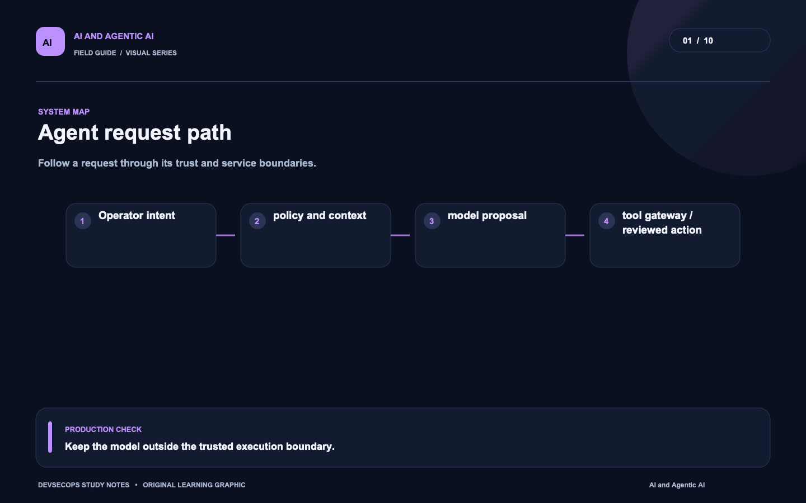
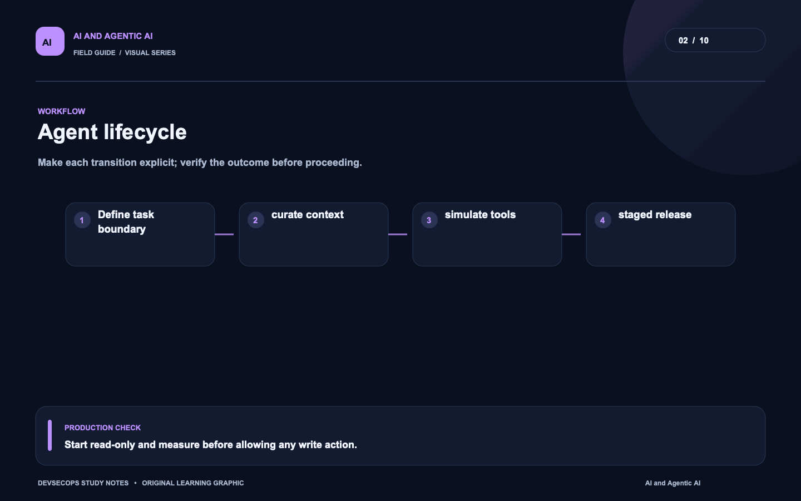
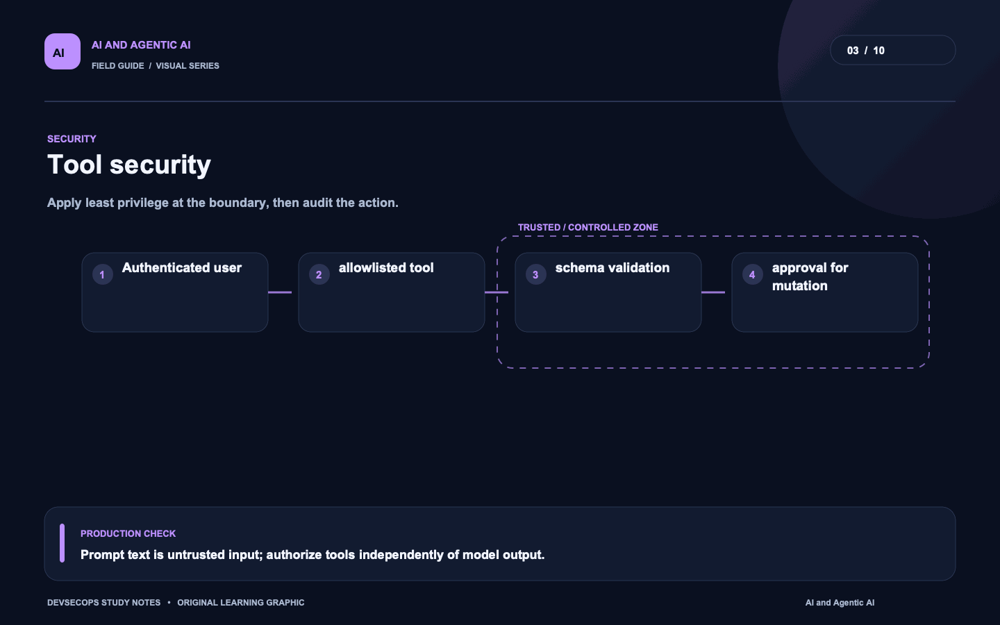
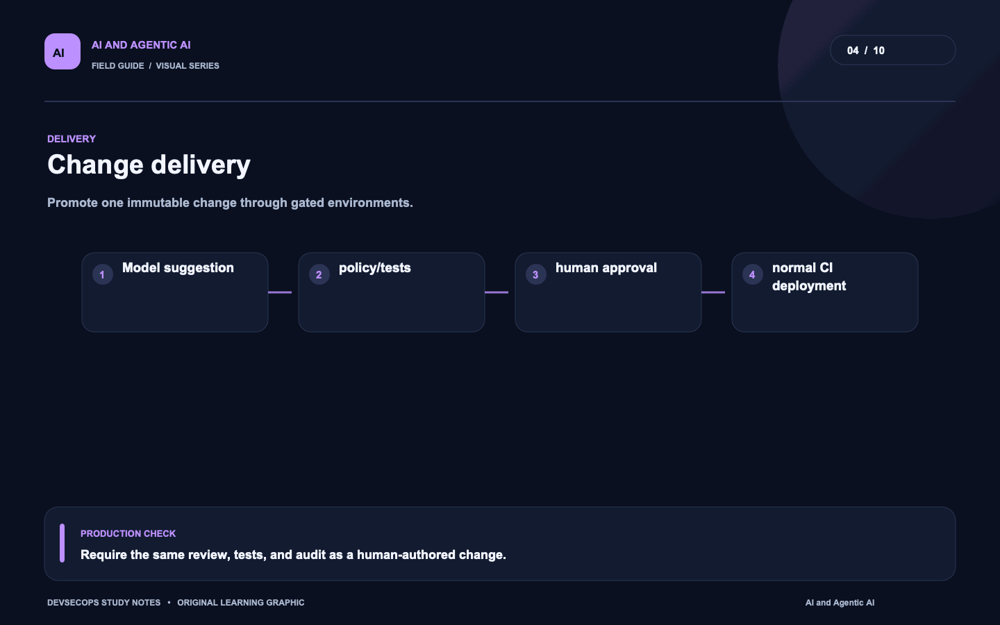
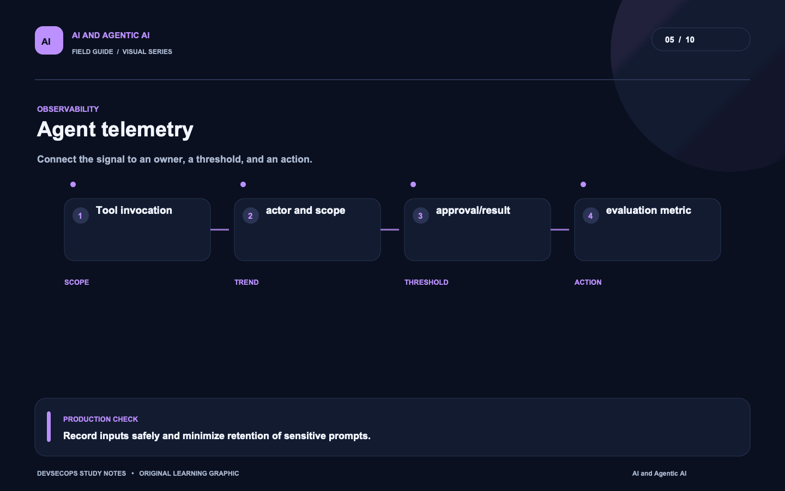
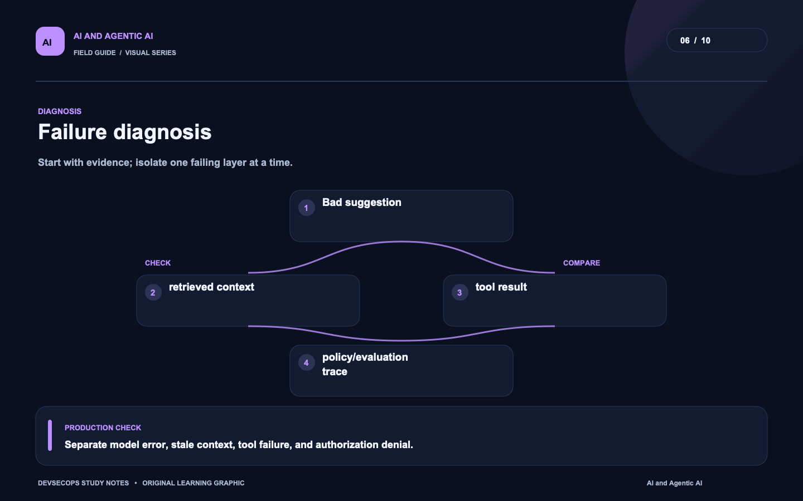
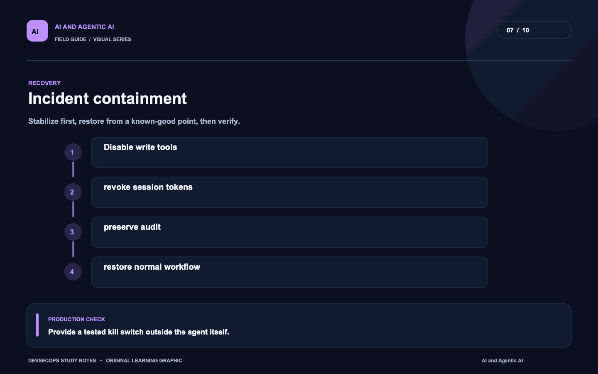
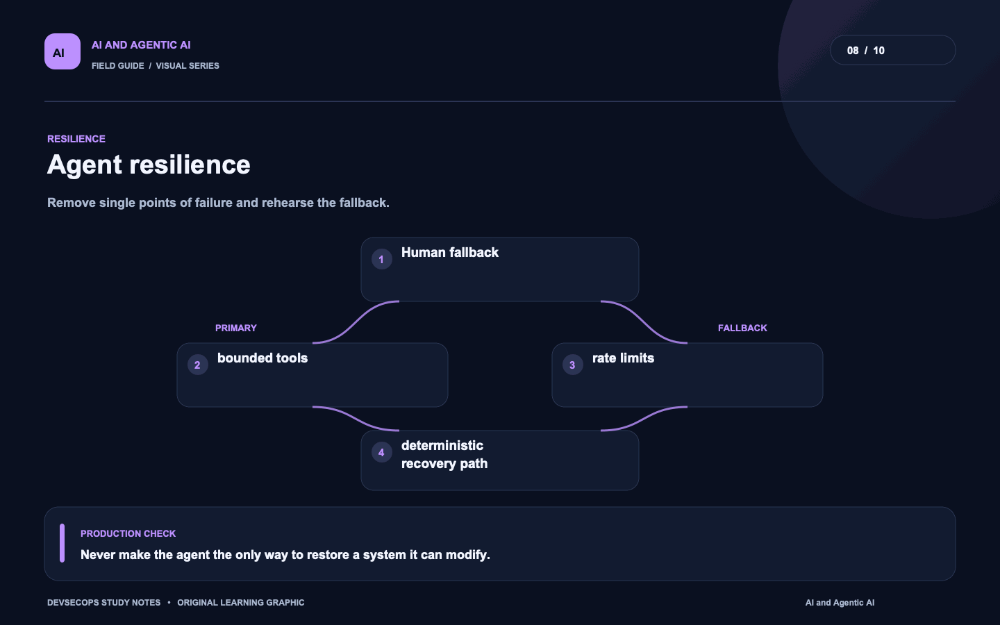
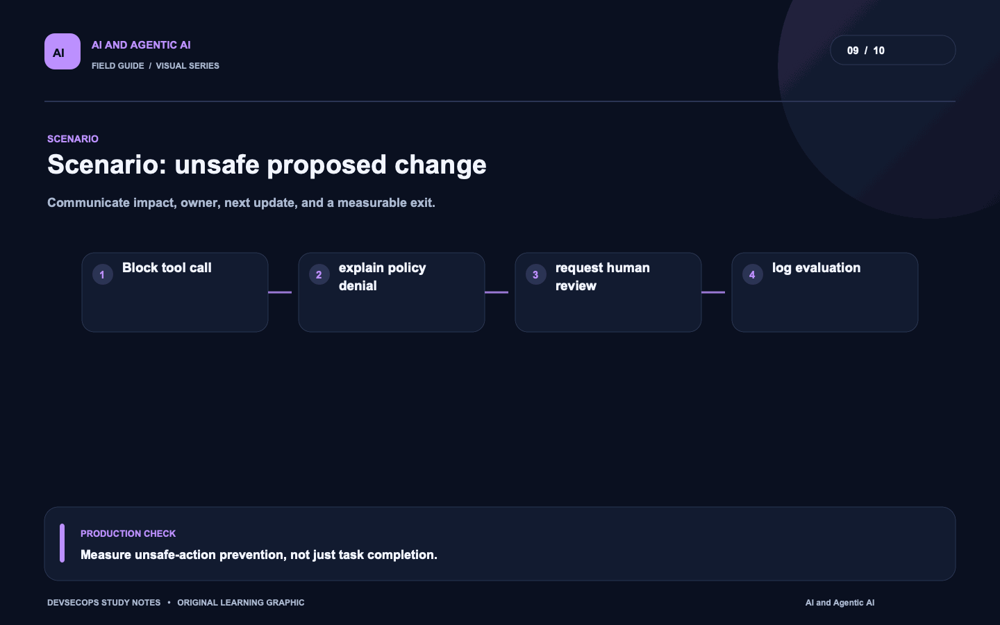
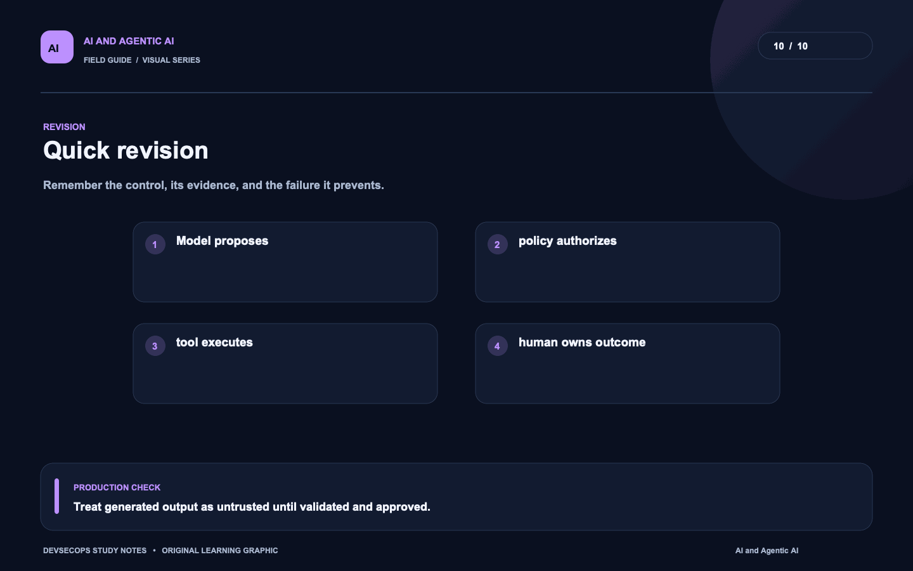

# Visual study cards

Ten original visuals for the [AI and Agentic AI guide](../README.md). Open the SVG for a crisp, scalable version; use PNG for slides and quick viewing.

## 01. Agent request path

[SVG source](01-agent-request-path.svg) · [PNG image](01-agent-request-path.png)

## 02. Agent lifecycle

[SVG source](02-agent-lifecycle.svg) · [PNG image](02-agent-lifecycle.png)

## 03. Tool security

[SVG source](03-tool-security.svg) · [PNG image](03-tool-security.png)

## 04. Change delivery

[SVG source](04-change-delivery.svg) · [PNG image](04-change-delivery.png)

## 05. Agent telemetry

[SVG source](05-agent-telemetry.svg) · [PNG image](05-agent-telemetry.png)

## 06. Failure diagnosis

[SVG source](06-failure-diagnosis.svg) · [PNG image](06-failure-diagnosis.png)

## 07. Incident containment

[SVG source](07-incident-containment.svg) · [PNG image](07-incident-containment.png)

## 08. Agent resilience

[SVG source](08-agent-resilience.svg) · [PNG image](08-agent-resilience.png)

## 09. Scenario: unsafe proposed change

[SVG source](09-scenario-unsafe-proposed-change.svg) · [PNG image](09-scenario-unsafe-proposed-change.png)

## 10. Quick revision

[SVG source](10-quick-revision.svg) · [PNG image](10-quick-revision.png)
