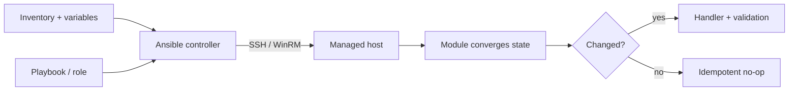

# Ansible automation

## Mental model

Ansible describes desired operations in YAML playbooks and usually connects to managed nodes over SSH (or WinRM). An inventory identifies hosts and groups; variables specialize behavior; modules perform tasks. Most modules aim for idempotency: repeating a play should converge to the same state rather than duplicate side effects.

## Organizing a playbook

Separate inventory, roles, templates, handlers, and environment-specific variables. Use modules (`package`, `service`, `copy`, `template`) rather than shell commands when a module models the task. Notify handlers when configuration changes so a service restarts only when needed. Use tags for controlled subsets, but ensure partial runs do not leave unsafe intermediate state. Test changes with check mode where supported and validate rendered configuration.

## Security

Keep secrets in an approved secret manager or Ansible Vault; vault encrypts stored values but does not prevent accidental disclosure after decryption. Limit become/sudo, inventory access, and control-node credentials. Validate host key checking rather than disabling it globally. Review dynamic inventory scripts and collections as executable dependencies.

## Operations

Pin tested collection/Ansible versions, lint playbooks, and run them first against disposable or staging hosts. Use serial batches for risky changes, explicit failure thresholds, and handlers/health checks for safe rollout. Record which inventory and revision ran.

## Practice

Write a role that installs and configures a web server, validates the config, restarts only on change, and creates a health check. Run it twice and confirm the second run is unchanged.

## Further reading

[Ansible documentation](https://docs.ansible.com/)

## Topic roadmap and playbook example



**Execution model:** controller loads inventory, variables, roles, and playbooks; tasks invoke modules on managed nodes; facts provide discovered host data; handlers run on notification. Precedence can make variables hard to reason about—keep sources explicit and avoid unnecessary overrides. Static/dynamic inventories should be reviewed as code.

```yaml
- hosts: web
  become: true
  tasks:
    - name: Ensure web package is installed
      ansible.builtin.package:
        name: nginx
        state: present
    - name: Install validated configuration
      ansible.builtin.template:
        src: nginx.conf.j2
        dest: /etc/nginx/nginx.conf
        mode: "0644"
      notify: Restart nginx after configuration change
  handlers:
    - name: Restart nginx after configuration change
      ansible.builtin.service:
      name: nginx
      state: reloaded
```

Validate configuration before reload in real deployments (for example, with a module's `validate` option or an explicit validation task); use serial batches and health checks. Roles organize defaults, tasks, handlers, templates, files, and metadata. Collections are versioned dependencies; pin and review them.

**Troubleshooting:** unreachable—SSH user/key, route, host-key and Python runtime; undefined variable—inventory/group precedence and spelling; task reports changed every run—use the correct module/state or command `creates`/`changed_when`; handler did not run—confirm task changed and handler name notification matches.

**Revision:** inventory selects hosts; modules express state; playbooks orchestrate; roles package; handlers react to change; Vault protects at rest, not after decryption; check mode support is module-specific; idempotency must be verified by a second run.

## Production web-server role example

See [`examples/`](examples/) for an inventory-free playbook and template. The example is Debian-family specific and intentionally targets a lab host group. First inspect with `--check --diff`; use a disposable VM, then validate the rendered NGINX config before enabling the service. For production, pin Ansible/collection versions, use controlled inventory, SSH host-key verification, and an approved secret manager.

## End-to-end configuration rollout

See [`process.md`](process.md) for inventory/credential setup, idempotent role development, staged rollout, drift verification, rollback, and secret-safe operation.
