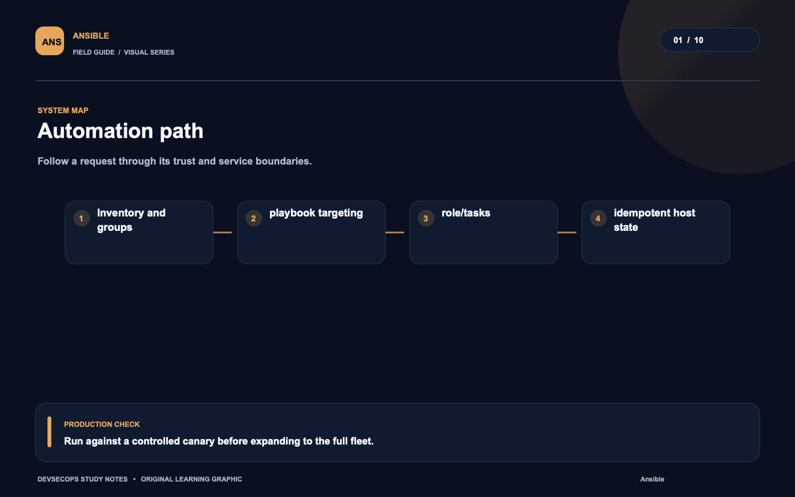
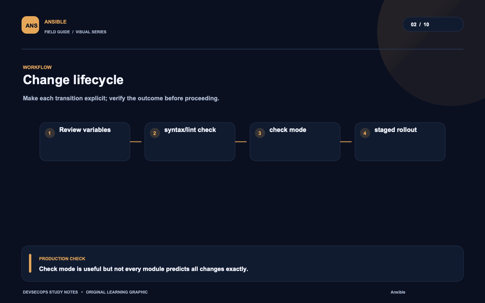
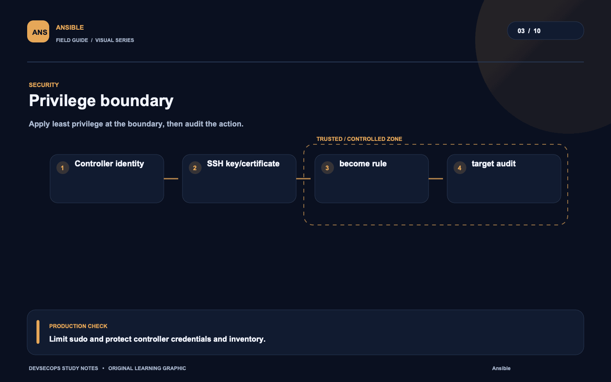
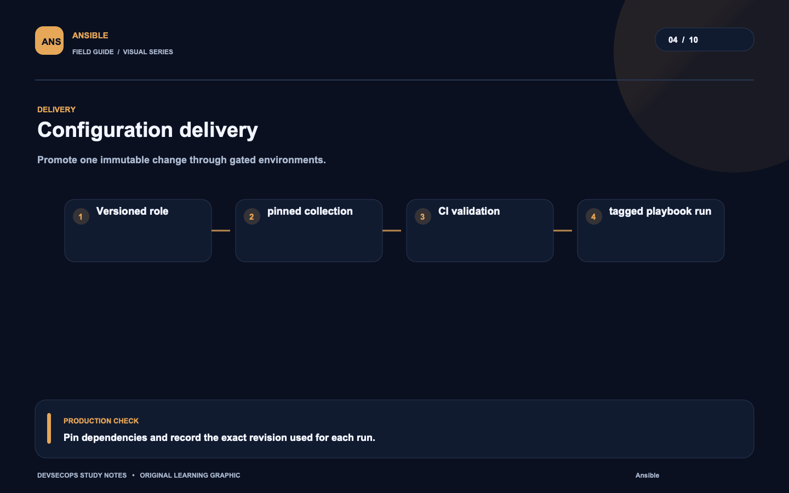
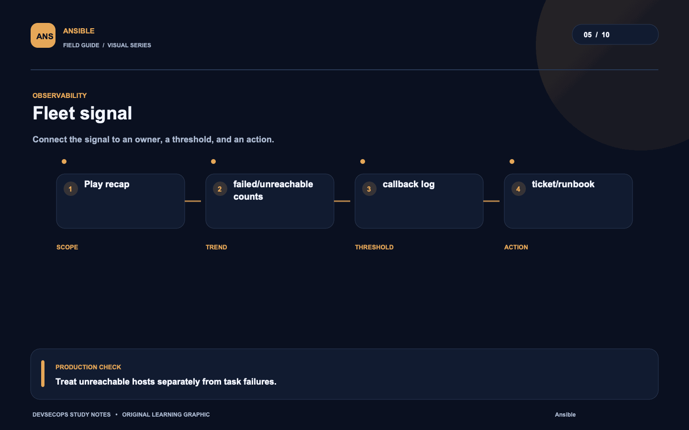
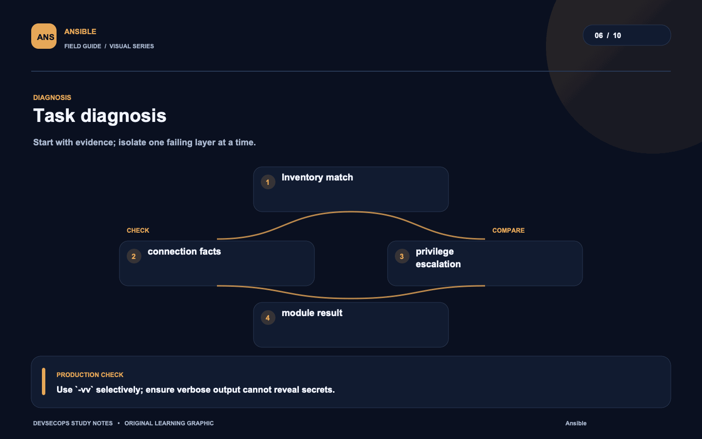
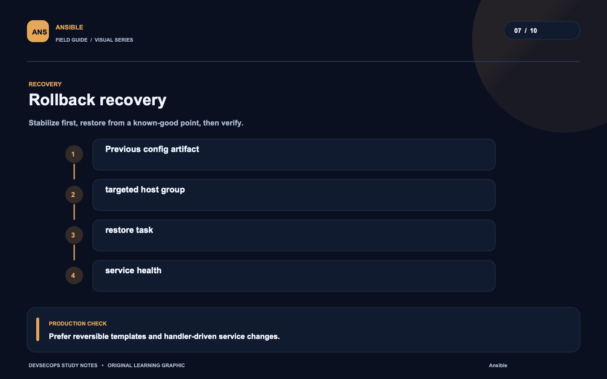
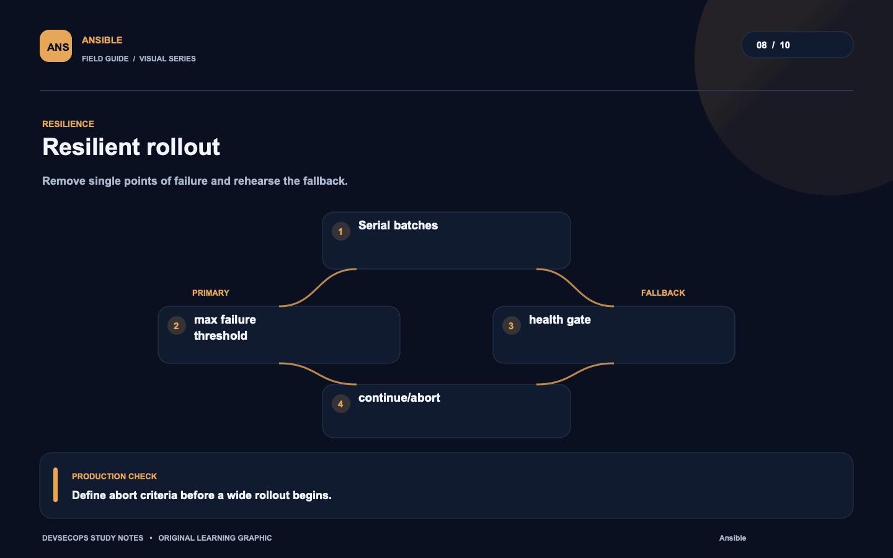
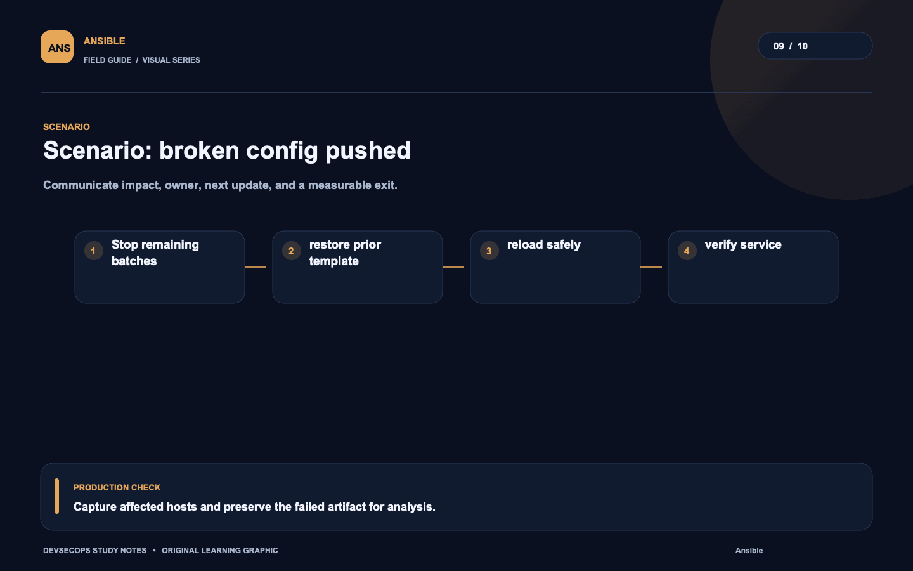
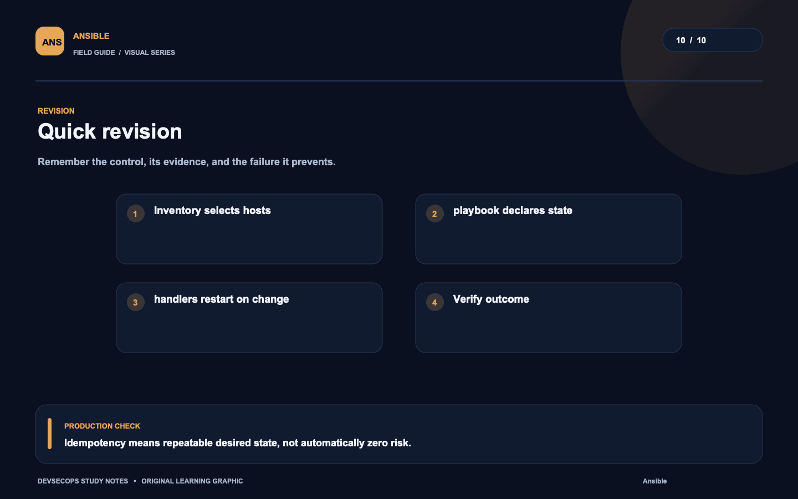

# Visual study cards

Ten original visuals for the [Ansible guide](../README.md). Open the SVG for a crisp, scalable version; use PNG for slides and quick viewing.

## 01. Automation path

[SVG source](01-automation-path.svg) · [PNG image](01-automation-path.png)

## 02. Change lifecycle

[SVG source](02-change-lifecycle.svg) · [PNG image](02-change-lifecycle.png)

## 03. Privilege boundary

[SVG source](03-privilege-boundary.svg) · [PNG image](03-privilege-boundary.png)

## 04. Configuration delivery

[SVG source](04-configuration-delivery.svg) · [PNG image](04-configuration-delivery.png)

## 05. Fleet signal

[SVG source](05-fleet-signal.svg) · [PNG image](05-fleet-signal.png)

## 06. Task diagnosis

[SVG source](06-task-diagnosis.svg) · [PNG image](06-task-diagnosis.png)

## 07. Rollback recovery

[SVG source](07-rollback-recovery.svg) · [PNG image](07-rollback-recovery.png)

## 08. Resilient rollout

[SVG source](08-resilient-rollout.svg) · [PNG image](08-resilient-rollout.png)

## 09. Scenario: broken config pushed

[SVG source](09-scenario-broken-config-pushed.svg) · [PNG image](09-scenario-broken-config-pushed.png)

## 10. Quick revision

[SVG source](10-quick-revision.svg) · [PNG image](10-quick-revision.png)
