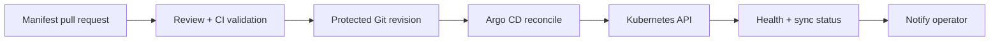

# Argo CD and GitOps

## Mental model

Argo CD continuously compares desired Kubernetes state in Git with live cluster state. An Application describes the source and destination; a controller renders manifests and tracks synchronization and health. Git is the reviewed source of truth, while Argo CD reports and reconciles drift.

## Operating workflow

Store environment-specific manifests or Helm/Kustomize configuration in version control. A change is proposed through review, validated in CI, then merged; Argo CD detects it and synchronizes according to policy. Start with manual sync or tightly scoped auto-sync, pruning, and self-heal settings until ownership and rollback practices are clear. Use projects to constrain allowed repositories, destinations, and resource kinds.

## Security and reliability

Treat the Argo CD control plane and repo credentials as privileged. Use SSO/RBAC, least-privilege project roles, protected repositories, and short-lived credentials where possible. Avoid putting secrets in plaintext Git; use an approved secret-management integration. Restrict cluster credentials and network access. Configure health checks and sync waves carefully; ordering cannot replace robust application readiness.

Git revert is usually the clearest rollback because it restores an auditable desired state. Beware controllers that continuously reapply a bad commit. Monitor sync status, health, reconciliation errors, and repo-server/controller capacity. Test cluster bootstrap and disaster recovery.

## Practice

Deploy a sample app from Git, make an intentional live drift, and observe reconciliation. Revert a bad change through Git, and configure a project that cannot deploy outside its allowed namespace.

## Further reading

[Argo CD documentation](https://argo-cd.readthedocs.io/en/stable/)

## Topic roadmap and GitOps example

**Core resources:** Application identifies repo/path/revision and destination; AppProject restricts allowed sources, destinations, and resource kinds; repo-server renders manifests; application controller compares desired and live state; sync applies changes; health assessment reports resource status. App-of-apps and ApplicationSets scale fleet configuration but increase the importance of safe source governance.

**Sync and drift:** automated sync, prune, and self-heal are separate decisions. Prune can delete resources; enable it only with ownership and deletion safeguards. Sync waves/hooks support ordering but should not replace readiness and rollback design. Secrets need encryption/secret-manager integration; do not commit cleartext.

**Troubleshooting:** `OutOfSync`—compare rendered desired and live diff, check ignored fields/controllers; `Unknown`—repo rendering, API/RBAC, or connectivity; `Healthy` but app broken—health checks may not capture user SLO; repeated sync failure—inspect admission errors, ownership conflicts, immutable fields, and sync permissions.

**Revision:** Git defines desired state; controller reconciles; sync status is not health; health is not an SLO; prune is destructive; revert Git for auditable rollback; protect the repo and Argo control plane as deployment authorities.

## Minimal staged Application example

See [`examples/application.yaml`](examples/application.yaml). It is a template with a reserved example repository URL; replace the repository, path, revision, project, and destination after creating a restrictive AppProject. Auto-sync is enabled but prune is disabled intentionally. Review all rendered manifests and test in staging before enabling any destructive reconciliation.
