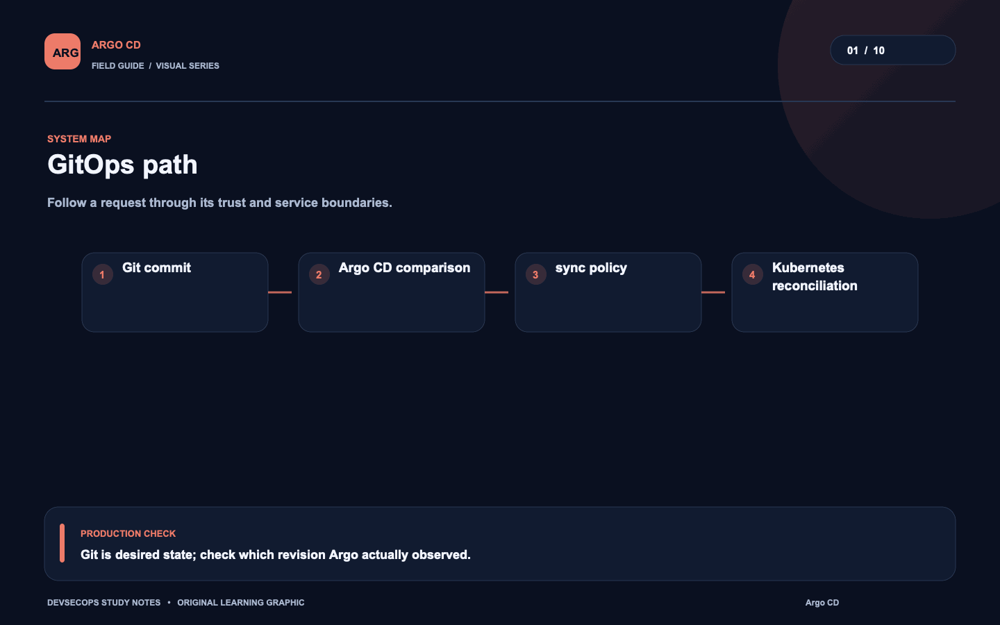
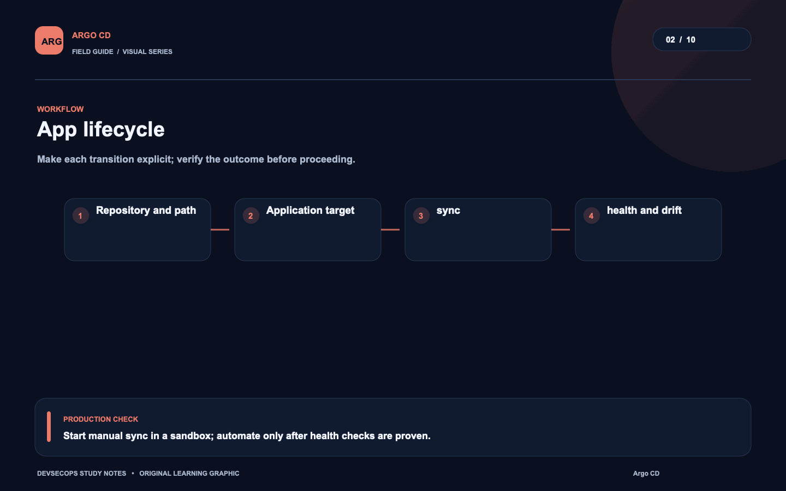
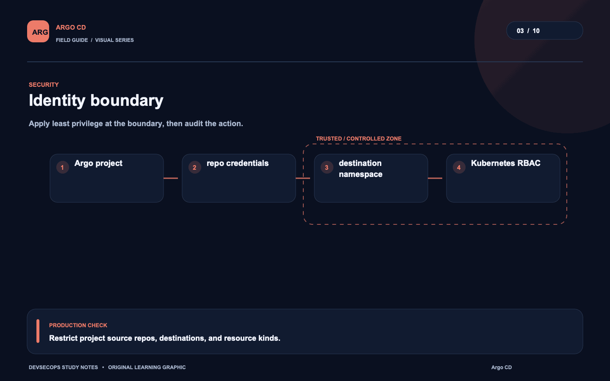
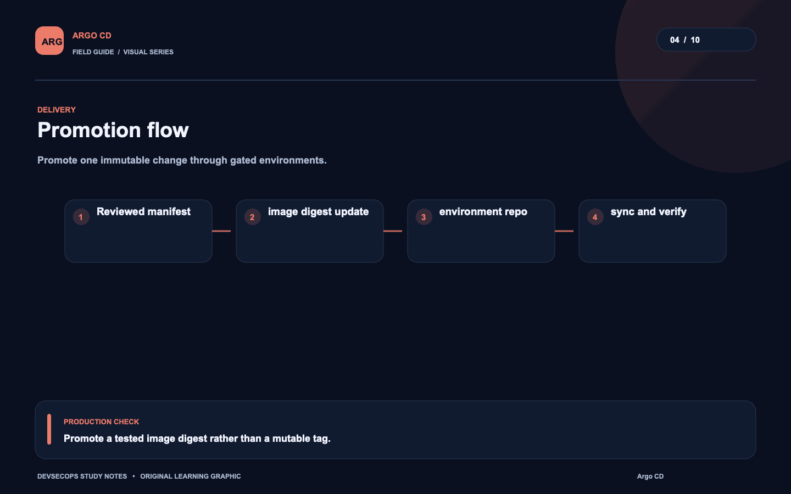
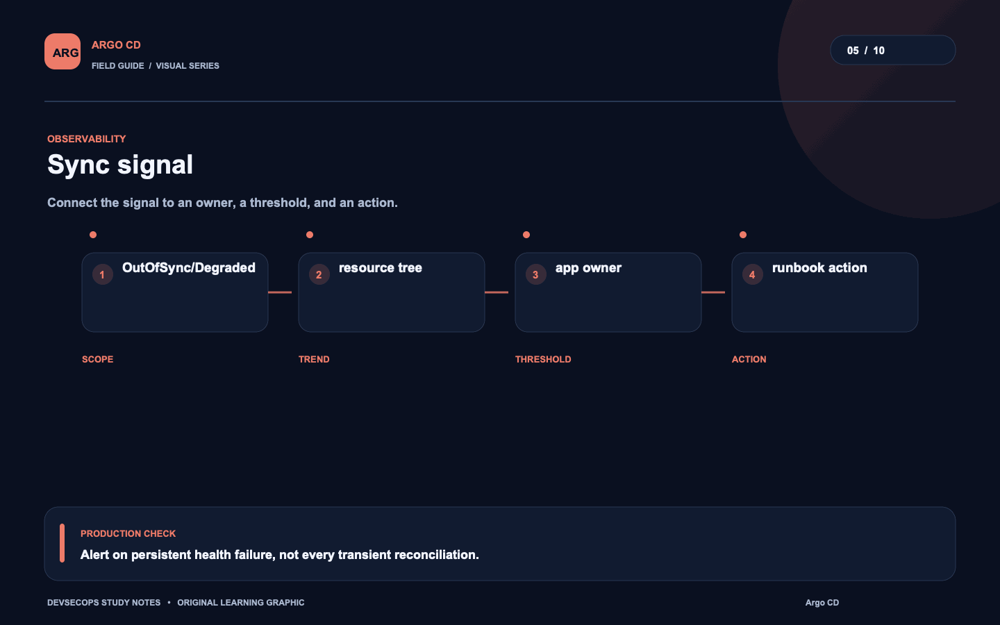
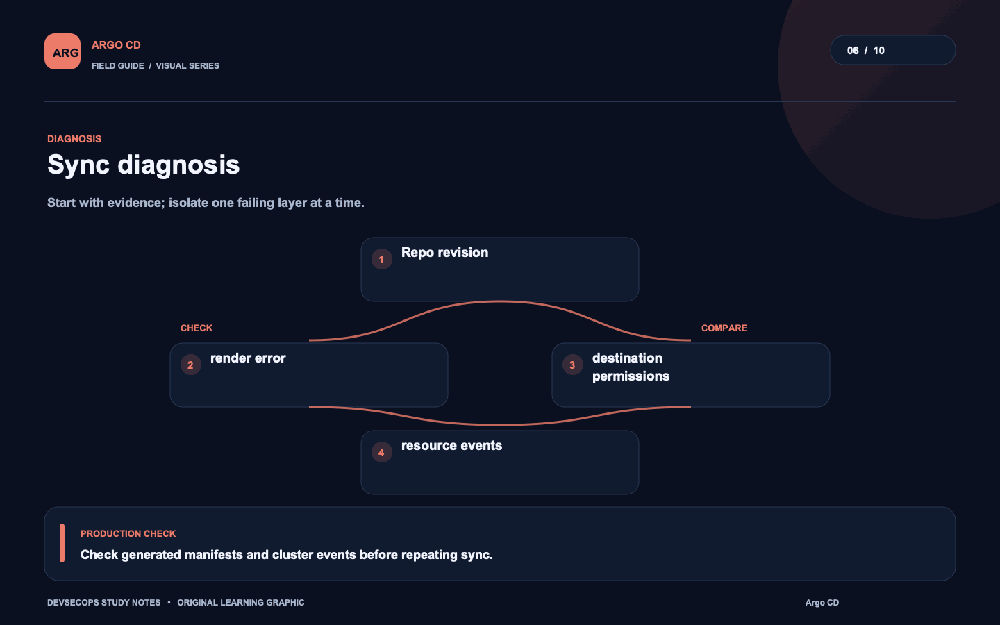
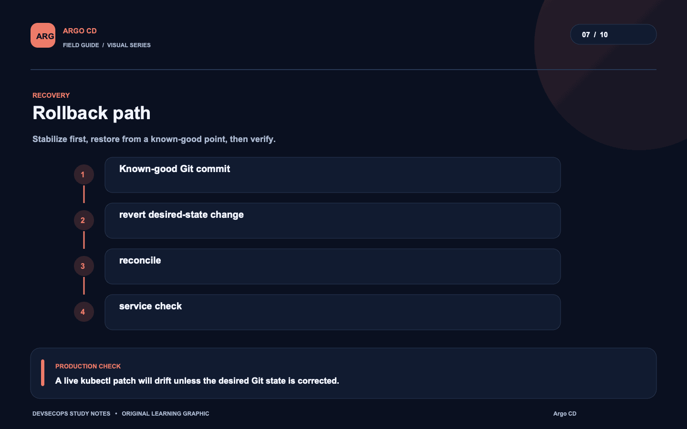
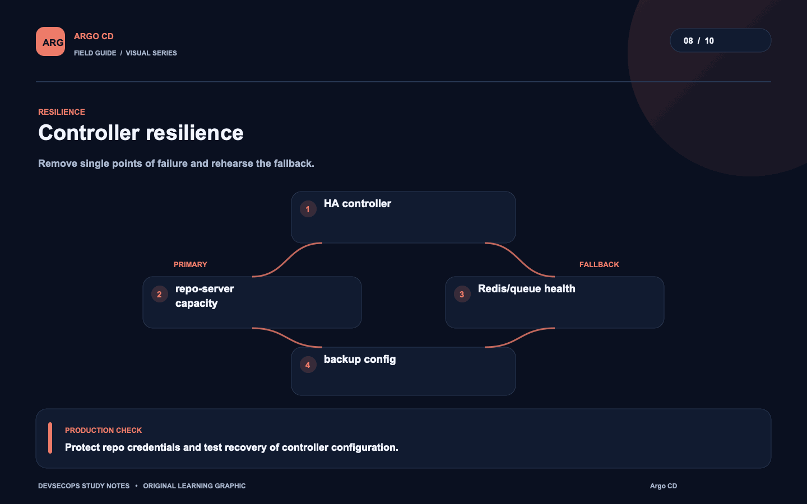
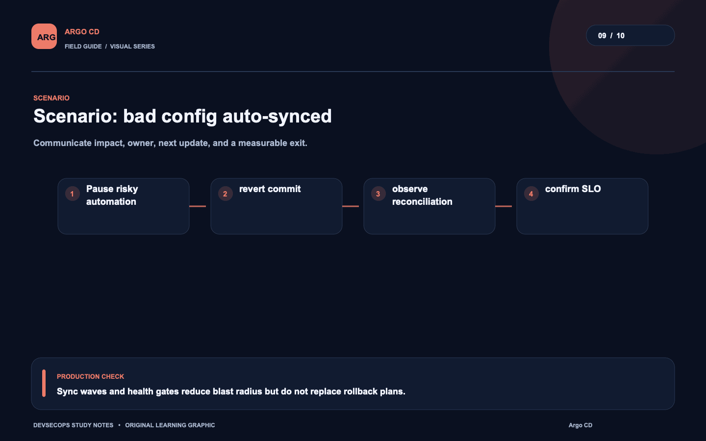
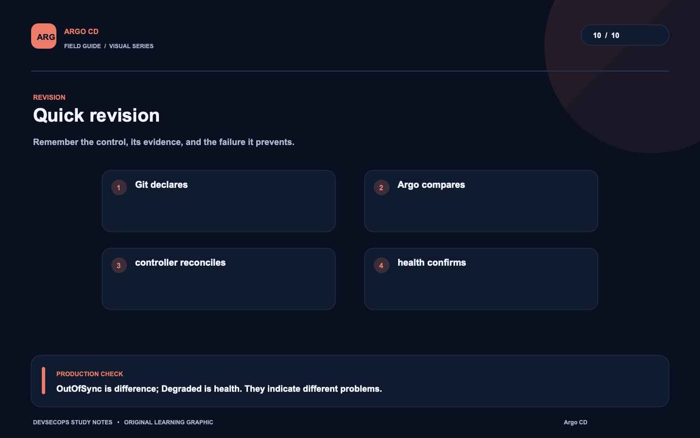

# Visual study cards

Ten original visuals for the [Argo CD guide](../README.md). Open the SVG for a crisp, scalable version; use PNG for slides and quick viewing.

## 01. GitOps path

[SVG source](01-gitops-path.svg) · [PNG image](01-gitops-path.png)

## 02. App lifecycle

[SVG source](02-app-lifecycle.svg) · [PNG image](02-app-lifecycle.png)

## 03. Identity boundary

[SVG source](03-identity-boundary.svg) · [PNG image](03-identity-boundary.png)

## 04. Promotion flow

[SVG source](04-promotion-flow.svg) · [PNG image](04-promotion-flow.png)

## 05. Sync signal

[SVG source](05-sync-signal.svg) · [PNG image](05-sync-signal.png)

## 06. Sync diagnosis

[SVG source](06-sync-diagnosis.svg) · [PNG image](06-sync-diagnosis.png)

## 07. Rollback path

[SVG source](07-rollback-path.svg) · [PNG image](07-rollback-path.png)

## 08. Controller resilience

[SVG source](08-controller-resilience.svg) · [PNG image](08-controller-resilience.png)

## 09. Scenario: bad config auto-synced

[SVG source](09-scenario-bad-config-auto-synced.svg) · [PNG image](09-scenario-bad-config-auto-synced.png)

## 10. Quick revision

[SVG source](10-quick-revision.svg) · [PNG image](10-quick-revision.png)
