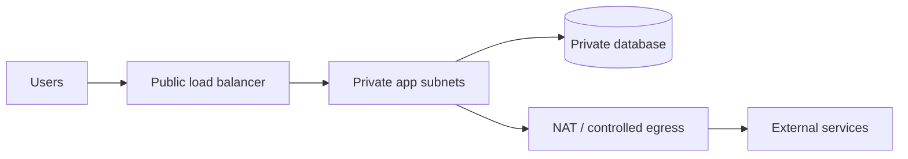

# AWS for DevOps

## Mental model

AWS is a collection of regional services. An account is the security and billing boundary; a Region contains independent service deployments; Availability Zones provide fault isolation within a Region. Design around failure of individual instances, zones, credentials, and deployments rather than assuming infrastructure is permanent.

## Core building blocks

- **Identity:** IAM users, roles, policies, and federation. Prefer short-lived role credentials and narrowly scoped permissions over long-lived access keys.
- **Networking:** VPCs, subnets, route tables, security groups, and network ACLs. Public/private placement and explicit egress paths are key design choices.
- **Compute and data:** EC2, ECS/EKS, Lambda, S3, RDS, and DynamoDB solve different workload and operational needs. Choose based on control, scaling, consistency, and operations—not fashion.
- **Operations:** CloudWatch metrics/logs/alarms, CloudTrail audit events, Systems Manager, and cost allocation tags.

## Delivery workflow

1. Establish organization/account guardrails, identity federation, logging, and budgets.
2. Define infrastructure as code; review plans and protect state/secrets.
3. Build immutable artifacts, scan them, and publish to controlled registries.
4. Deploy through staged environments with health checks, alarms, and rollback.
5. Test recovery, permissions, and cost assumptions continuously.

## Security and reliability

Use least privilege, encryption in transit and at rest, private networking where appropriate, and managed secret storage. Separate production access and deployment roles. Multi-AZ improves availability but does not replace backups or disaster-recovery tests. Define RTO/RPO, verify restore procedures, and monitor service quotas and spend.

## Practice

Build a private application tier behind a load balancer, store data in a managed database, and expose only required paths. Add role-based deployment, centralized logs, an availability alarm, and a tested backup restore. Explain the blast radius if one AZ or one credential is compromised.

## Further reading

[AWS Well-Architected Framework](https://docs.aws.amazon.com/wellarchitected/latest/framework/welcome.html) · [IAM best practices](https://docs.aws.amazon.com/IAM/latest/UserGuide/best-practices.html)

## Topic roadmap and examples

### Accounts, IAM, and governance

Use Organizations/accounts to isolate workloads and environments; SCPs constrain maximum permissions but do not grant access. A role trust policy determines who can assume a role; its permissions policy determines what the role can do. Example: a CI role trusted by the CI OIDC provider may deploy only to staging and read one artifact repository. Never confuse an identity policy with a resource policy.

### VPC and traffic paths

Trace packets with subnet routes, security-group stateful rules, network ACLs, DNS, and load-balancer health checks. Private subnets are not automatically isolated if they have unrestricted egress.

### Compute, storage, and data

Select EC2 for OS/control needs, ECS/EKS for container orchestration, Lambda for event-driven functions, S3 for object storage, RDS for managed relational databases, and DynamoDB for key-value/document access patterns. Consider availability, latency, consistency, backup/restore, limits, and operational burden. S3 versioning helps recover from overwrite/deletion but is not a complete isolated backup strategy.

### Delivery, observability, and recovery

Build once, sign/scan artifacts, deploy by immutable digest, and promote through stages. CloudTrail answers who changed what; CloudWatch provides metrics/logs/alarms; service health and application SLIs answer different questions. Define RTO/RPO and test recovery in a separate failure domain.

### Troubleshooting example

**Symptom:** application instances time out connecting to a database. Verify DNS resolution and endpoint/port first; inspect DB security-group ingress from the app security group, subnet routes, NACL return traffic, connection limits, TLS settings, and DB health. Avoid opening the database to `0.0.0.0/0` as a diagnostic shortcut.

### Revision

Account boundary ≠ VPC boundary; security groups are stateful; NACLs are stateless; IAM role trust ≠ role permissions; multi-AZ ≠ backup; CloudTrail ≠ application logs; tags support ownership/cost but do not grant authorization.
