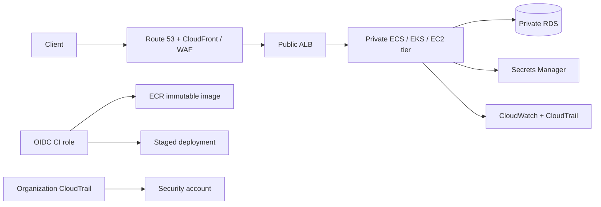

# AWS: production engineering guide

## Chapter map

| Chapter | Scope |
|---|---|
| [Architecture and accounts](architecture.md) | Organizations, account boundaries, Region/AZ, landing-zone controls |
| [IAM and security](iam-security.md) | Roles, federation, policies, secrets, audit |
| [VPC networking](networking.md) | Subnets, routing, endpoints, NAT, load balancing, troubleshooting |
| [Operations lab](operations-lab.md) | Delivery, observability, recovery, incident scenario |

These are original learning notes, not a reproduction of a paid handbook. Validate current AWS service behavior, quotas, pricing, and region support before applying designs.

## Reference production path

The components are alternatives and require service-specific design. Do not route every workload through a public subnet or grant account-wide deployment permissions. Use a sandbox account and inspect cost before creating resources.

## Study path

Establish account/identity guardrails; design network and workload permissions; deploy an immutable artifact; add service-level observability; then rehearse AZ failure, rollback, and data restore. [Architecture](architecture.md) → [Identity](iam-security.md) → [Networking](networking.md) → [Operations lab](operations-lab.md).

---

## Quick reference

| Need | Chapter |
|---|---|
| Account structure, AZ/Region, landing zone | [Architecture](architecture.md) |
| Role trust, workload federation, secrets, audit | [IAM and security](iam-security.md) |
| VPC flow, private service, hybrid connectivity | [Networking](networking.md) |
| Delivery, telemetry, DR and failure exercise | [Operations lab](operations-lab.md) |

**Revision:** account is a useful security/billing boundary; SCP constrains but does not grant; role trust differs from permissions; security groups are stateful and NACLs stateless; NAT is egress; multi-AZ is not a backup; CloudTrail is not application telemetry.

## Create and operate a VM

For EC2 use cases, prerequisites, a private launch command, Session Manager access, verification, troubleshooting, and termination checks, follow [`vm-instance.md`](vm-instance.md).

**Official references:** [AWS Well-Architected Framework](https://docs.aws.amazon.com/wellarchitected/latest/framework/welcome.html) · [IAM best practices](https://docs.aws.amazon.com/IAM/latest/UserGuide/best-practices.html)

## Visual study cards

Browse the [10 original visual study cards](visuals/README.md) as SVG or PNG, covering architecture, workflow, security, delivery, observability, troubleshooting, recovery, resilience, scenarios, and revision.
