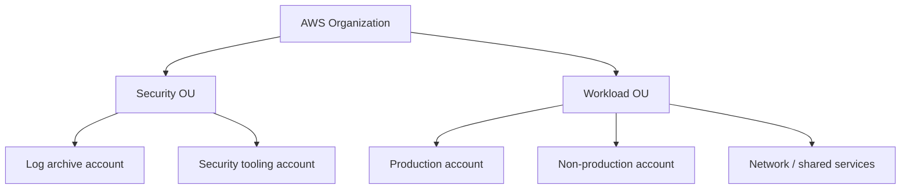

# AWS account architecture and landing-zone foundations

## 1. Accounts as isolation boundaries

AWS Organizations groups accounts. Separate production, non-production, security/log archive, and shared-services accounts where ownership/blast radius justify them. Consolidated billing does not mean shared permissions. SCPs set maximum permissions for member accounts; they do not grant a permission. Account root users require protected email/MFA and should not be used for routine work.

### Account bootstrap checklist

- Centralize identity federation and permission sets; protect root credentials and remove root access keys.
- Enable organization-level CloudTrail and protect the log archive from workload administrators.
- Define SCP guardrails, approved Regions, and break-glass path; test that recovery remains possible.
- Set account contacts, budgets, cost allocation tags, service quotas, and security notifications.
- Establish baseline IAM roles, Config/security findings, patching, and resource inventory.
- Define account vending/decommissioning and evidence retention processes.

## 2. Region and Availability Zone design

Availability Zones are independently powered/cooled failure domains within a Region. A multi-AZ architecture survives selected AZ failures but not Region-wide outage or application/data corruption. Cross-Region recovery adds replication lag, data residency, DNS/cutover, and cost considerations. Service behavior differs by service; verify where control plane and data plane operate.

For each dependency, record RTO/RPO, failover authority, data consistency, capacity in recovery Region, and restoration test. Simulate loss of one AZ and one Region in a controlled exercise.

## 3. Shared responsibility and governance

AWS secures the cloud infrastructure; customers configure identities, network policies, data, applications, and workloads. Managed services reduce some operations but still require access control, patch/configuration decisions, backup/recovery, and monitoring.

## Revision

Organization is not an account; account separation reduces blast radius; SCP limits but does not grant; AZ redundancy is not Region DR; CloudTrail records API activity but application logs need separate design; budget alerts do not cap spend.
