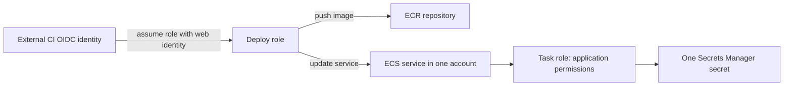

# AWS IAM and workload security

## 1. Assume-role model

An IAM role has a trust policy defining who may assume it and permissions policies defining allowed actions/resources. Cross-account access requires both a trusting role and caller-side permission (unless a service-specific model differs). Resource policies and SCPs can further affect access. Start with an explicit principal/action/resource and condition; avoid `Action: "*"` and `Resource: "*"`.

Use separate roles for CI deployment, runtime application access, and human operations. An ECS task execution role (image pull/logs) differs from the task role (application API calls).

## 2. Short-lived federation

Configure the CI OIDC provider and a trust policy restricted to expected audience and immutable repository/branch/environment claims. Use a dedicated role per environment, session duration appropriate to deployment, and auditable role sessions. Test that fork/untrusted branches fail to assume production roles. Rotate/remove static access keys after migration.

## 3. Secrets and data protection

Use Secrets Manager/Parameter Store according to secret lifecycle and access requirements. Grant the exact secret ARN to the workload role; rotate through application-safe rollout. KMS key policy, IAM permission, and service grants must all align. Encryption at rest does not protect plaintext in environment dumps, logs, or compromised authorized workloads.

## 4. Detection and audit

Use organization CloudTrail with protected central delivery; enable relevant data events for sensitive data services with cost/volume awareness. Review IAM Access Analyzer findings, credential age, unused roles, public resource policies, and security findings. Keep security logs outside workload-admin control.

## 5. Access-denied runbook

1. Capture principal ARN, action, resource ARN, Region, timestamp, and request ID.
2. Check active identity/role session, trust policy, and STS assumption.
3. Evaluate identity policy, permission boundary, session policy, resource policy, SCP, and explicit denies.
4. Check KMS key policy/grants and service-linked role prerequisites.
5. Use CloudTrail event and policy simulator as evidence; simulator does not reproduce every service/resource-policy condition.
6. Grant the minimum required action at the narrowest resource scope; test both allowed and denied paths.

Do not attach AdministratorAccess as a diagnostic shortcut.

## Revision

Trust policy controls assumption; permissions policy controls role actions; explicit deny wins; task role is not execution role; SCP is a ceiling, not a grant; KMS authorization has key-policy implications.
