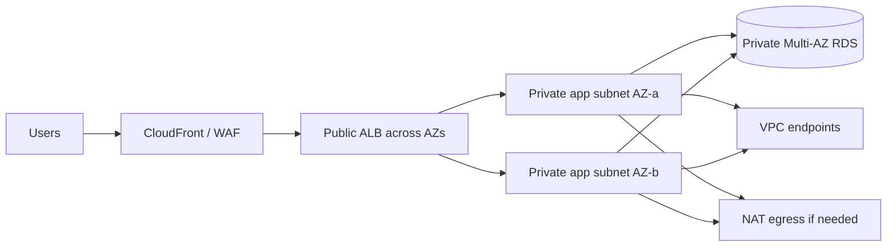

# AWS VPC networking: design and troubleshooting

## 1. Multi-AZ VPC pattern

The VPC is regional; subnets are AZ-specific. Public route tables point to an Internet Gateway; private egress commonly uses NAT Gateways (often one per AZ for availability). VPC endpoints can provide private paths to supported AWS services and reduce NAT dependency. Confirm endpoint policies, DNS, security groups, and routes.

## 2. Filtering layers

- Security groups are stateful and attached to ENIs/resources.
- Network ACLs are stateless subnet filters; return traffic requires explicit rules.
- Route tables select next hop; a route does not authorize traffic.
- AWS Network Firewall/WAF address different network/application layers.

Use security groups referencing peer security groups where possible; avoid broad SSH/RDP ingress. Private subnets are not secure solely because of their name—inspect routes, endpoint policy, and egress.

## 3. Hybrid connectivity

Site-to-Site VPN provides IPsec over internet; Direct Connect is private connectivity but not inherently encrypted. Transit Gateway centralizes routing for many VPCs but needs route-table segmentation and ownership. Design redundant paths, BGP advertisements, DNS, MTU, asymmetric routing, and failover testing.

## 4. Connection troubleshooting

1. Capture source/destination ENI, IP, port, protocol, direction, and timestamp.
2. Verify name resolution, subnet/AZ, and route table at both ends.
3. Check security-group ingress/egress references and NACL return ports.
4. Confirm IGW/NAT/TGW/VPN/endpoint attachment and relevant route propagation.
5. Verify target listener, health check, host firewall, TLS, and service policy.
6. Use VPC Flow Logs, load-balancer access logs, and Reachability Analyzer when available.
7. Make a narrow change and remove temporary rules.

### Common symptoms

| Symptom | First checks |
|---|---|
| Timeout to private service | Routes, security groups, NACL return path, DNS, target listener |
| Private instance cannot reach AWS API | Endpoint route/DNS/policy, NAT route, SG egress |
| ALB target unhealthy | Health-check path/port, target SG from ALB SG, app bind and response |
| Cross-VPC path fails | TGW/VPC attachment, both route tables, overlapping CIDRs, security rules |

## Revision

SG stateful, NACL stateless; route and permission differ; NAT is egress; VPC endpoints are service-specific; Direct Connect alone does not encrypt; AZ subnet placement is explicit.
