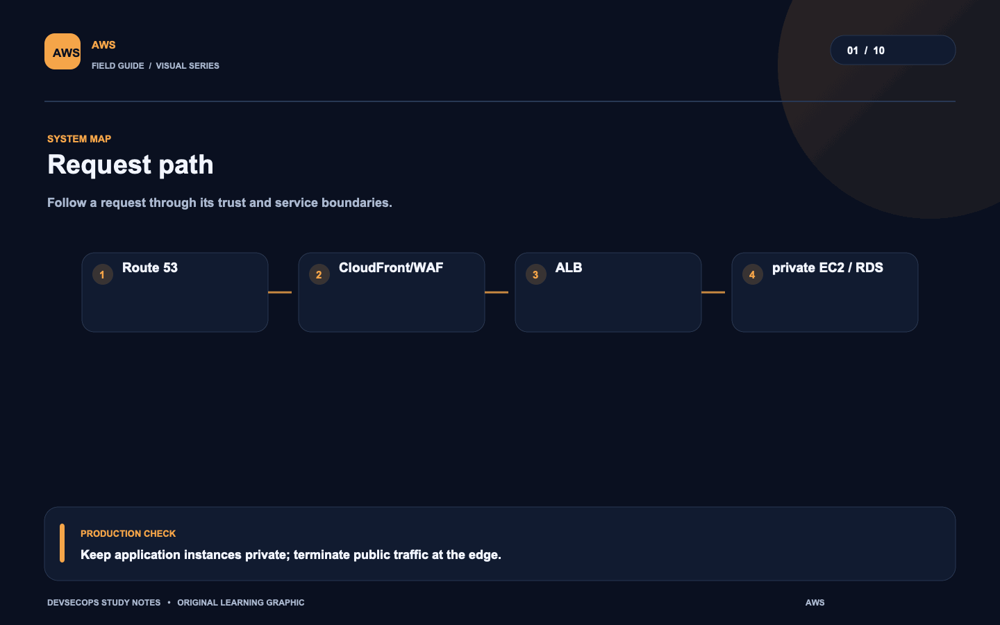
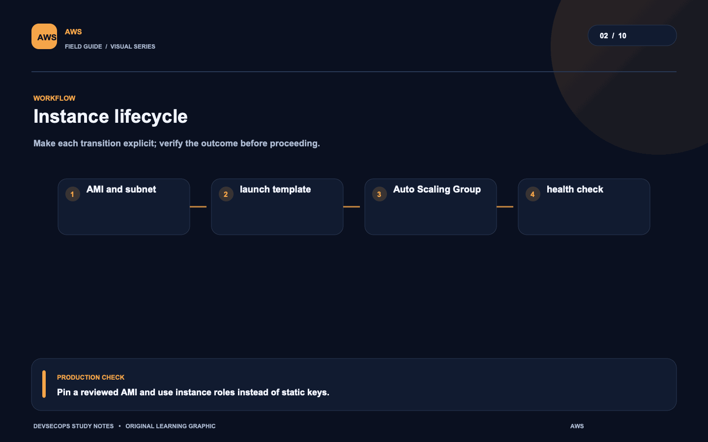
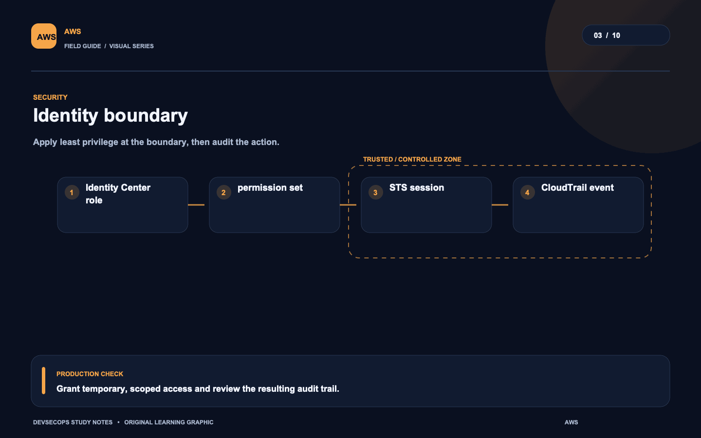
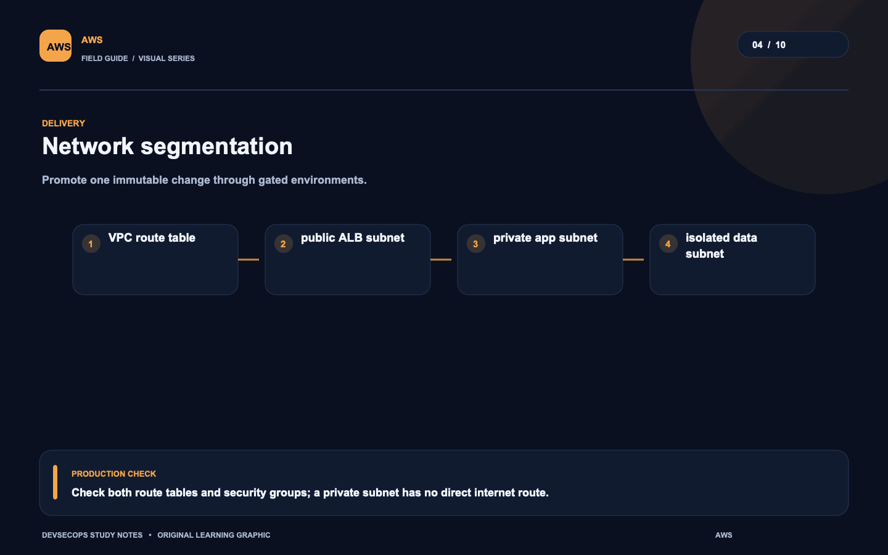
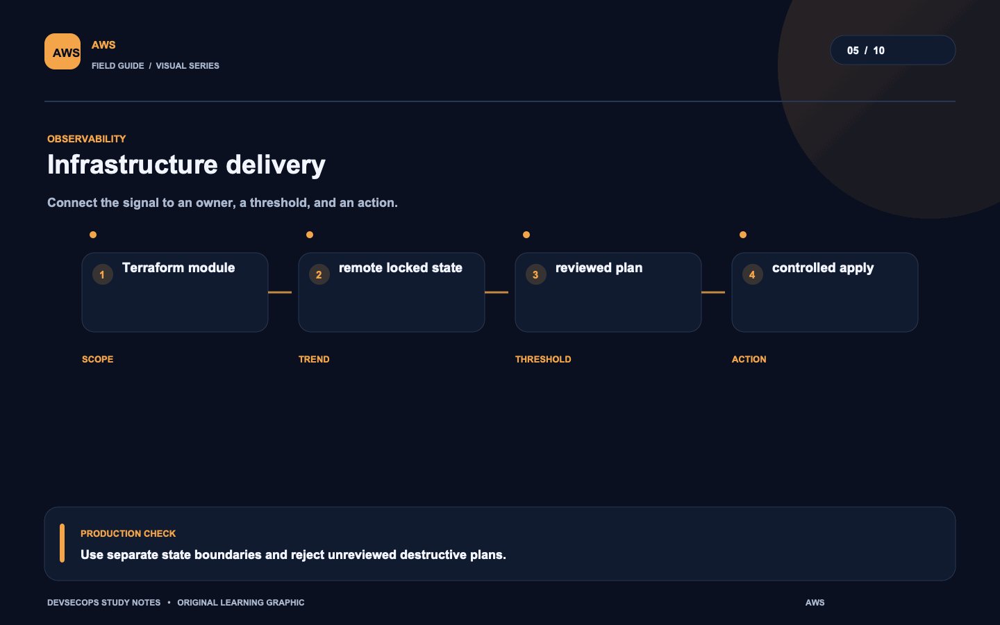
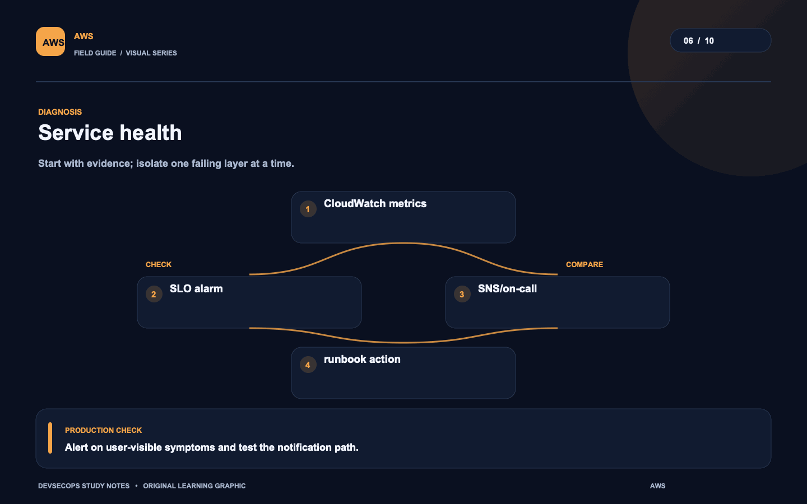
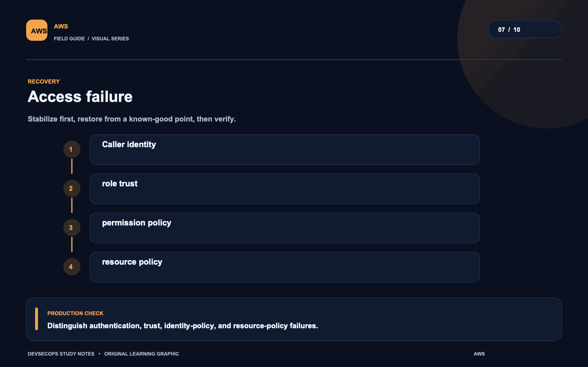
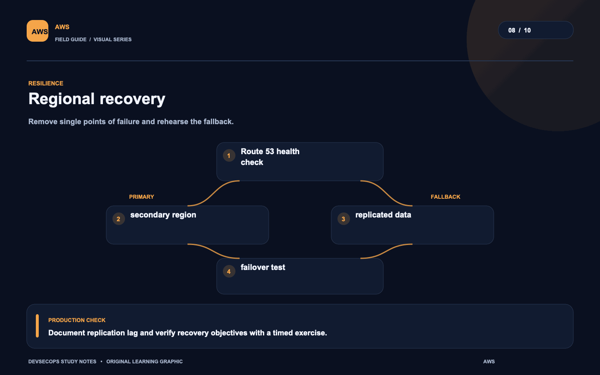
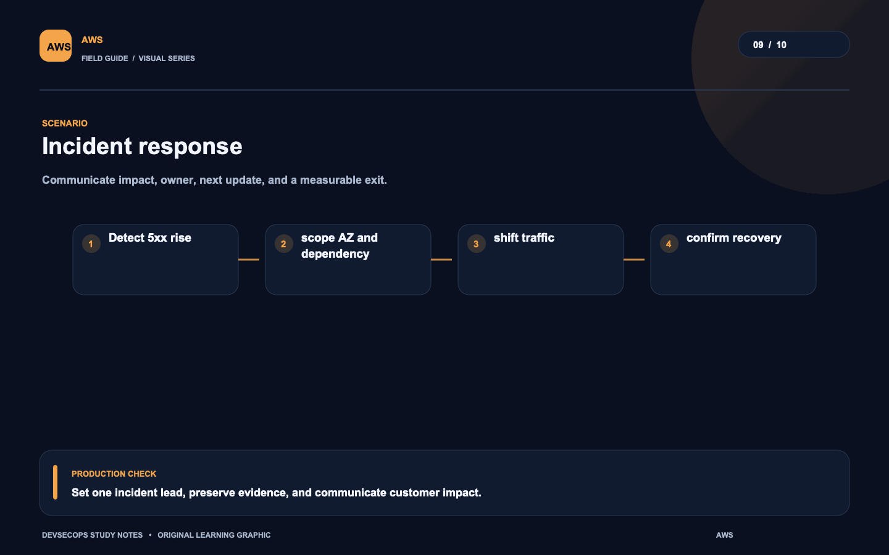
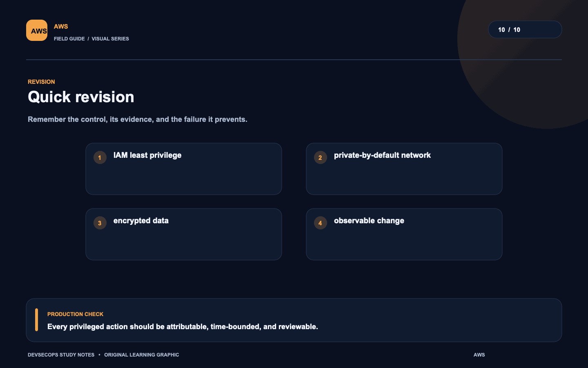

# Visual study cards

Ten original visuals for the [AWS guide](../README.md). Open the SVG for a crisp, scalable version; use PNG for slides and quick viewing.

## 01. Request path

[SVG source](01-request-path.svg) · [PNG image](01-request-path.png)

## 02. Instance lifecycle

[SVG source](02-instance-lifecycle.svg) · [PNG image](02-instance-lifecycle.png)

## 03. Identity boundary

[SVG source](03-identity-boundary.svg) · [PNG image](03-identity-boundary.png)

## 04. Network segmentation

[SVG source](04-network-segmentation.svg) · [PNG image](04-network-segmentation.png)

## 05. Infrastructure delivery

[SVG source](05-infrastructure-delivery.svg) · [PNG image](05-infrastructure-delivery.png)

## 06. Service health

[SVG source](06-service-health.svg) · [PNG image](06-service-health.png)

## 07. Access failure

[SVG source](07-access-failure.svg) · [PNG image](07-access-failure.png)

## 08. Regional recovery

[SVG source](08-regional-recovery.svg) · [PNG image](08-regional-recovery.png)

## 09. Incident response

[SVG source](09-incident-response.svg) · [PNG image](09-incident-response.png)

## 10. Quick revision

[SVG source](10-quick-revision.svg) · [PNG image](10-quick-revision.png)
