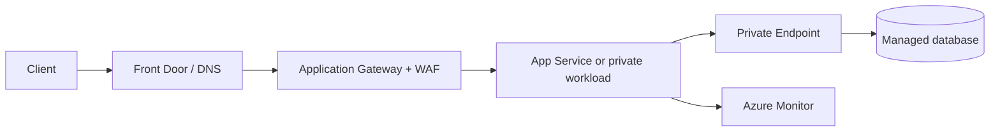

# Azure for DevOps

## Mental model

Azure resources live in subscriptions and are organized with management groups and resource groups. A resource group is a lifecycle/administrative grouping, not a network or security boundary by itself. Regions, availability zones, and paired-region strategies inform resilience choices.

## Core building blocks

- **Identity and governance:** Microsoft Entra ID, managed identities, role-based access control (RBAC), Azure Policy, and subscription/resource locks.
- **Networking:** virtual networks, subnets, network security groups, private endpoints, DNS, and load-balancing services.
- **Compute and data:** Virtual Machines, App Service, Functions, AKS, Storage, and managed database offerings.
- **Operations:** Azure Monitor, Log Analytics workspaces, alerts, Activity Logs, and Resource Health.

## Delivery workflow

Use Bicep or Terraform to provision environments consistently. Authenticate automation with workload identity federation or managed identities where supported; avoid client secrets that never expire. Build and scan immutable images/packages, promote the same artifact through stages, and deploy with health probes plus a rollback path. Keep production approvals and identity permissions separate from ordinary build permissions.

## Security and reliability

Apply least-privilege RBAC at the narrowest sensible scope, review inherited assignments, and use Policy to prevent unsafe configurations. Prefer private connectivity for sensitive services. Monitor both application SLIs and platform health. Backups need retention, isolation, and restore tests; zone redundancy and geo-replication have service-specific constraints and costs.

## Practice

Create a small web service with a managed identity, private data access, centralized diagnostics, and an alert on failed requests. Use policy to require tags and secure transport. Demonstrate a redeploy and a restore, then trace which identity can read secrets and modify the production network.

## Further reading

[Azure Well-Architected Framework](https://learn.microsoft.com/azure/well-architected/) · [Azure RBAC](https://learn.microsoft.com/azure/role-based-access-control/overview)

## Topic roadmap and examples

### Hierarchy, identity, and policy

Management groups inherit governance across subscriptions; subscriptions define billing/quota and access scopes; resource groups group resource lifecycle. Azure RBAC combines a security principal, role definition, and scope. Managed identities avoid application-managed credentials. Azure Policy evaluates/enforces configuration; a policy assignment does not replace RBAC.

### Network and application path

Use NSGs for subnet/NIC traffic filtering, private endpoints for private service access, and DNS zones to resolve private service names correctly. Validate the complete DNS, route, firewall, and identity path.

### Compute, data, and delivery

Compare VMs, App Service, Functions, AKS, Blob Storage, and managed databases by required control and operations. Provision with Bicep/Terraform, review changes, and deploy immutable artifacts through protected environments. Azure Monitor metrics, Log Analytics, Activity Logs, and resource diagnostic logs serve different troubleshooting needs.

### Troubleshooting example

**Symptom:** workload cannot reach a storage account through a private endpoint. Check name resolution from the workload (private DNS zone/link), endpoint connection approval/state, route/NSG rules, storage firewall, and workload identity/role scope. Network reachability and authorization are separate checks.

### Revision

Management groups organize policy/permissions; resource groups organize lifecycles; RBAC grants access; Policy constrains configuration; managed identity supplies workload identity; private endpoint is not equivalent to a public endpoint with an allowlist.
