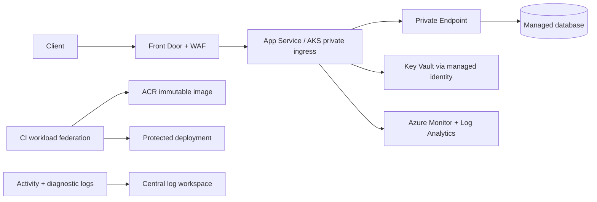

# Microsoft Azure: production engineering guide

## Chapter map

| Chapter | Scope |
|---|---|
| [Architecture and governance](architecture.md) | Tenant, management groups, subscriptions, regions, Policy |
| [Identity and security](identity-security.md) | Entra ID, managed identity, RBAC, Key Vault, audit |
| [Networking](networking.md) | VNet, NSG, private endpoint, DNS, hub-spoke, troubleshooting |
| [Operations lab](operations-lab.md) | IaC delivery, Monitor, SLO, recovery, production checks |

These are original notes, not a reproduction of a paid handbook. Verify current Azure service capabilities, region availability, quotas, pricing, and Microsoft Entra configuration before deployment.

## Reference production request path

Choose components based on requirements; the diagram is not a deployment blueprint. Use separate subscriptions/environments where blast radius, billing, and policy ownership require it. Set budget alerts, but do not treat them as hard spending limits.

## Study path

[Governance](architecture.md) → [Identity](identity-security.md) → [Networking](networking.md) → [IaC and operations lab](operations-lab.md). Add workload services only after identity, network path, telemetry, and recovery responsibilities are explicit.

---

## Quick reference

| Need | Chapter |
|---|---|
| Tenant/subscription structure and guardrails | [Architecture](architecture.md) |
| Entra identity, managed identity, Key Vault | [Identity and security](identity-security.md) |
| VNet, NSG, private endpoint, DNS, hybrid path | [Networking](networking.md) |
| Deployment, telemetry, recovery lab | [Operations lab](operations-lab.md) |

**Revision:** tenant is identity; management groups organize subscriptions; subscription is a billing/quota boundary; RBAC grants; Policy constrains; private endpoint requires correct DNS and does not automatically disable public access; backup needs restore evidence.

**Official references:** [Azure Well-Architected Framework](https://learn.microsoft.com/azure/well-architected/) · [Azure RBAC](https://learn.microsoft.com/azure/role-based-access-control/overview)
