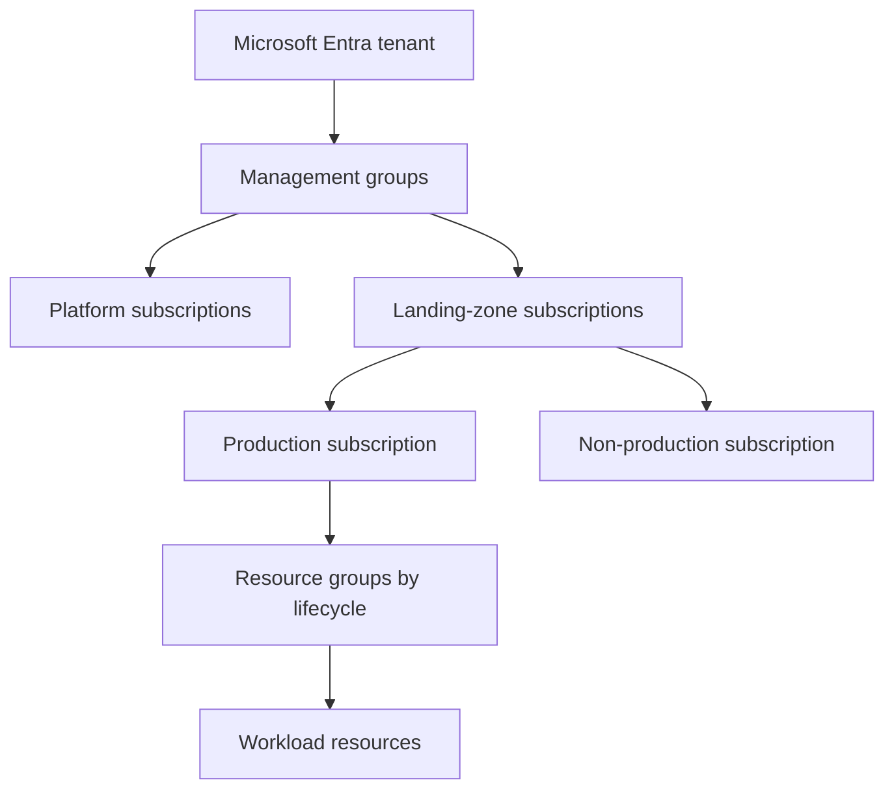

# Azure architecture, governance, and landing zones

## 1. Resource hierarchy

Management groups organize subscriptions and policy inheritance. Subscriptions are common billing, quota, and access boundaries. Resource groups group lifecycle and permissions; they are not a network boundary. Entra tenant is the identity directory and should not be confused with a subscription.

## 2. Landing-zone decisions

- Establish tenant identity, emergency access accounts, Conditional Access, privileged identity controls, and audit.
- Separate platform connectivity/identity/management from application landing zones.
- Define subscription vending, naming/tags, policy initiatives, allowed regions, public exposure standards, and owner metadata.
- Set diagnostic settings and central log routing before teams create workloads.
- Configure budgets, cost allocation, quota monitoring, security posture, and support ownership.
- Document subscription transfer, closure, and data-retention process.

Azure Policy evaluates or enforces configuration; Azure RBAC grants actions. A deny policy can block recovery or managed service deployment—test in a non-production scope before broad assignment.

## 3. Region and availability design

Availability zones, paired regions, and zone-redundant services differ by product and region. Check whether a service's control plane, data, backup, and restore are zone/region redundant. Define RPO/RTO and manually verify failover/restore; redundancy labels alone do not prove the application can recover.

## 4. Governance and cost controls

Apply tags for owner, environment, service, and cost center; tags improve allocation but do not authorize access. Use budgets/alerts and cost analysis; budgets generally notify rather than automatically prevent charges. Review idle disks, IPs, snapshots, logs, and data egress. Set quotas and contact routes for capacity.

## Troubleshooting policy blocks

Identify the resource, operation, subscription, identity, and exact policy denial. Trace inherited assignments/exemptions and RBAC scope; distinguish Policy deny from missing role assignment, provider registration, quota, and service limit. Use narrowly scoped exemptions with owner/expiry when approved.

## Revision

Tenant is identity; management group organizes subscriptions; subscription is useful billing/quota boundary; resource group manages lifecycle; RBAC grants actions; Policy enforces configuration; budgets alert, not cap.
