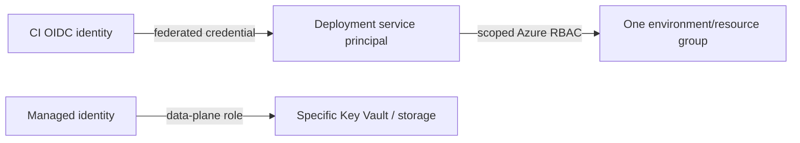

# Azure identity and security engineering

## 1. Entra identity and Azure RBAC

An Entra principal (user, group, service principal, or managed identity) receives a role definition at a scope (management group, subscription, resource group, or resource). Access can inherit. Review effective role assignments and avoid broad Owner/Contributor for workloads.

Use workload identity federation for CI instead of client secrets. Managed identity for an Azure workload avoids app-managed credentials; system-assigned identity follows resource lifecycle, user-assigned identity has independent lifecycle and can be shared (sharing requires deliberate scope). Keep CI deployment identity separate from application runtime identity.

## 2. Least privilege and privileged operations

- Use groups and role assignments at the narrowest usable scope.
- Separate control-plane roles from data-plane roles.
- Use Privileged Identity Management/JIT activation where licensed and appropriate.
- Protect emergency accounts, monitor sign-ins and role changes, and review external guests.
- Do not create client secrets/certificates with indefinite lifetime; inventory and rotate if exceptions exist.

## 3. Key Vault and data access

Use RBAC-based access or access policies consistently according to the vault configuration; avoid mixing assumptions. Grant the runtime identity only required secret/key/certificate permissions. Configure private endpoint/DNS if private access is required. Rotation must account for version pinning, cache refresh, rollout, and rollback. Key Vault firewall and network path are distinct from identity permission.

## 4. Audit and posture

Send Activity Logs and resource diagnostic logs to protected Log Analytics/storage/event destinations with retention and access controls. Microsoft Defender for Cloud findings and Azure Policy are different inputs: prioritize findings by exposure, identity path, exploitability, and data impact. Validate alerts with an incident owner/runbook.

## 5. Access denied runbook

1. Capture principal/object ID, action, resource ID, time, correlation ID, and error.
2. Check tenant/directory, subscription context, and federated credential subject/audience.
3. Evaluate role assignment scope/inheritance, deny assignments, PIM activation, and conditions.
4. For Key Vault/storage, inspect data-plane RBAC, firewall/private endpoint/DNS, and resource-specific authorization.
5. Check Policy, provider registration, quota, and service health.
6. Grant the minimum missing role and test both allowed and forbidden paths.

Do not grant subscription Owner as a diagnostic shortcut.

## Revision

Authentication != authorization; Azure RBAC controls actions at scope; managed identity is workload identity; control plane != data plane; Key Vault firewall != RBAC; federation claim restrictions must bind to trusted repo/branch/environment.
