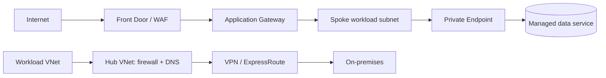

# Azure networking and private connectivity

## 1. Hub-spoke reference

Virtual Networks are regional; peering is non-transitive by default. Hub/spoke centralizes shared services but requires explicit routes, firewall policy, DNS forwarding, and ownership. VPN encrypts over internet; ExpressRoute is private connectivity but not inherently encrypted.

## 2. NSGs, routes, and private endpoints

NSGs filter traffic at subnet/NIC scope; route tables (UDRs) select next hop. An NSG allow does not create a route. Private Endpoint creates a private interface for supported services; clients need correct private DNS zone linkage/records and service firewall/authorization. A private endpoint does not automatically disable a public endpoint.

Use service endpoints only when their service/network semantics fit; they are not equivalent to private endpoints. Restrict egress and inspect default NSG rules/UDRs. Avoid inbound management ports from the internet; use Bastion or approved identity-aware access.

## 3. DNS and hybrid routing

Document authoritative zones, VNet links, custom DNS forwarders, conditional forwarding, and private-zone ownership. Test name resolution from the application subnet and on-premises. For ExpressRoute/VPN, verify route advertisements, propagation, asymmetric return paths, MTU, and redundant circuit/tunnel failover.

## 4. Connectivity runbook

1. Record source/destination, port, protocol, timestamp, and whether DNS/refusal/timeout/TLS failed.
2. Resolve target from the actual workload and inspect private DNS zone links.
3. Check UDR and effective routes, peering, gateway/route propagation, and return path.
4. Check NIC/subnet NSGs, firewall, service access restrictions, and egress.
5. Verify target listener, health probe, TLS, application logs, and service-side policy.
6. Use Network Watcher connection troubleshoot/flow logs where enabled.
7. Apply a narrow rule and remove temporary diagnostic access.

## Revision

NSG filters; route selects path; private endpoint does not disable public access automatically; VNet peering is non-transitive; DNS is essential to private link; ExpressRoute is not encryption.
