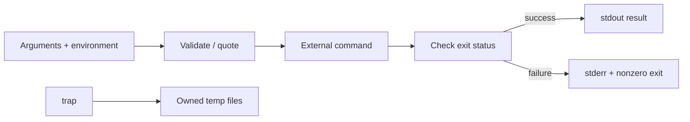

# Bash scripting for DevOps

## Mental model

Bash combines command execution, text streams, shell expansion, and process control. Its convenience can hide errors: a string is not automatically an array, a pipeline may mask an earlier failure, and unquoted expansions undergo word splitting and globbing.

## Reliable script structure

```bash
#!/usr/bin/env bash
set -Eeuo pipefail

usage() { printf 'Usage: %s INPUT\n' "${0##*/}" >&2; }
die() { printf 'error: %s\n' "$*" >&2; exit 1; }

[[ $# -eq 1 ]] || { usage; exit 2; }
input=$1
[[ -r "$input" ]] || die "cannot read: $input"
```

Quote variable expansions (`"$input"`), use arrays for argument lists, and prefer `[[ ... ]]` for Bash conditionals. Validate arguments and external dependencies early. Send diagnostics to stderr; reserve stdout for machine-consumable results. Use `mktemp` and a `trap` to clean up specifically created temporary files.

## Operational practices

`set -e` has exceptions in conditionals and pipelines; understand its semantics rather than treating it as complete error handling. `pipefail` catches many pipeline failures. Check exit statuses explicitly around commands whose failure is expected or needs context. Avoid parsing human-oriented `ls` output; use globs, `find -print0`, or structured command output. Make scripts idempotent when reruns are likely.

Do not use `eval` on external input. Avoid leaking secrets through command arguments, logs, tracing (`set -x`), or temporary files. Use timeouts and bounded retries for network calls; distinguish retryable from permanent errors.

## Practice

Write a deployment wrapper that validates an environment, checks required tools, prints a dry-run plan, and accepts a timeout. Test empty input, spaces in filenames, missing commands, nonzero subprocess exits, and interrupted execution.

## Further reading

[GNU Bash manual](https://www.gnu.org/software/bash/manual/)

## Topic roadmap and failure-safe example



**Shell behavior:** parameter expansion, command substitution, redirection, pipelines, globbing, functions, traps, and process substitution have different quoting and exit-status behavior. Use `"$@"` to forward arguments, arrays for command construction, and `read -r` to preserve backslashes. Use `printf` rather than portability-sensitive `echo`.

```bash
args=(--region "$region" --file "$input")
if ! cloud-tool "${args[@]}"; then
  printf 'deployment failed for region %s\n' "$region" >&2
  exit 1
fi
```

**Automation patterns:** validate inputs before side effects; use `mktemp` and a cleanup `trap`; use `flock` or an external lock for concurrent runs; add a timeout and bounded retry; make destructive actions support dry-run; quote paths and handle spaces/newlines safely. Avoid parsing `ls`; use `find -print0` with null-delimited reads.

**Troubleshooting:** script appears to skip failures—inspect conditionals, command substitutions, pipelines, and `pipefail`; wrong arguments—check word splitting and quote expansion; temp files remain—check signal/exit traps and variable scope; hangs—identify child process and use bounded timeout.

**Revision:** single quotes prevent expansion; double quotes preserve a single argument while allowing selected expansions; arrays preserve argument boundaries; `set -e` is not exception handling; `pipefail` exposes pipeline errors; never `eval` untrusted text; stdout is output, stderr is diagnostics.

## Health-check script lab

See [`examples/check-health.sh`](examples/check-health.sh). It validates an HTTPS URL and bounds curl runtime. It deliberately has no retry loop: add retries only for classified transient failures and ensure the caller's deadline remains bounded. Run with `bash examples/check-health.sh https://service.example/healthz`; test a failure against a controlled endpoint.
