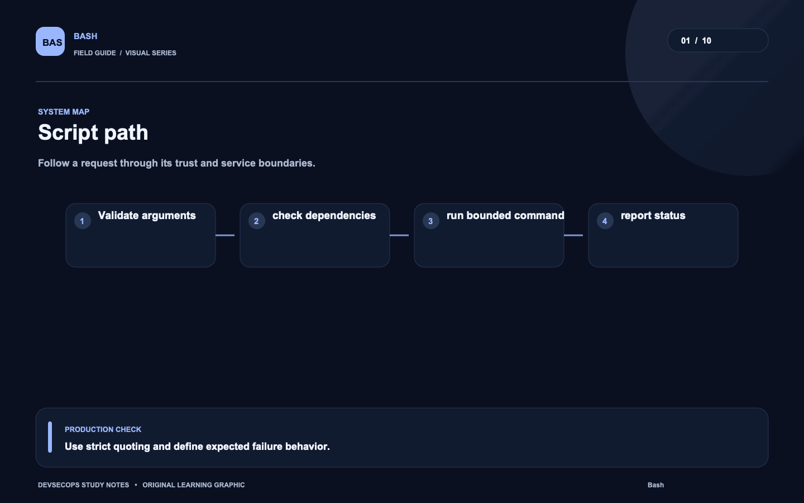
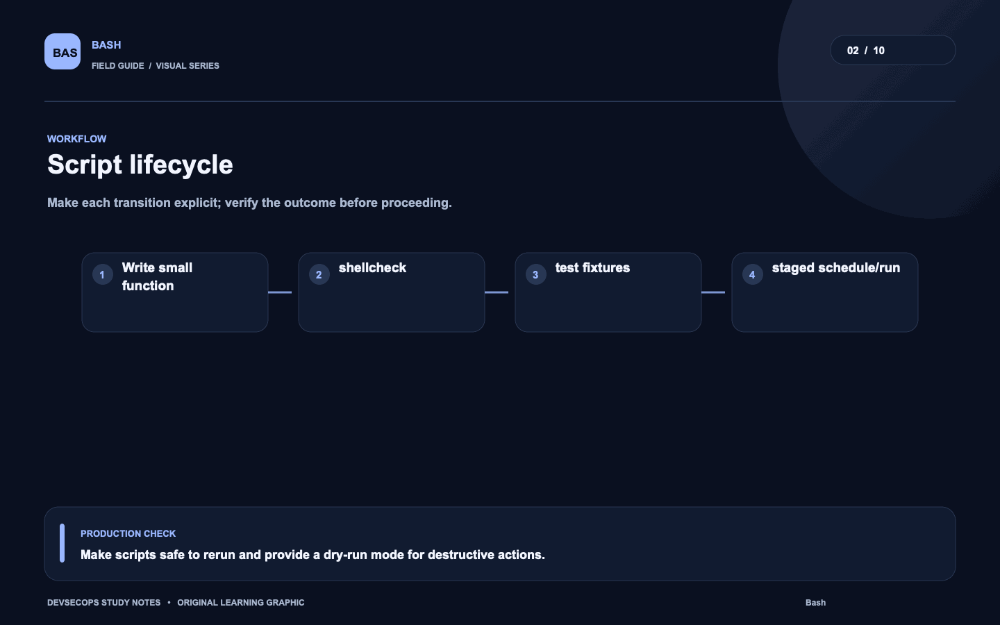
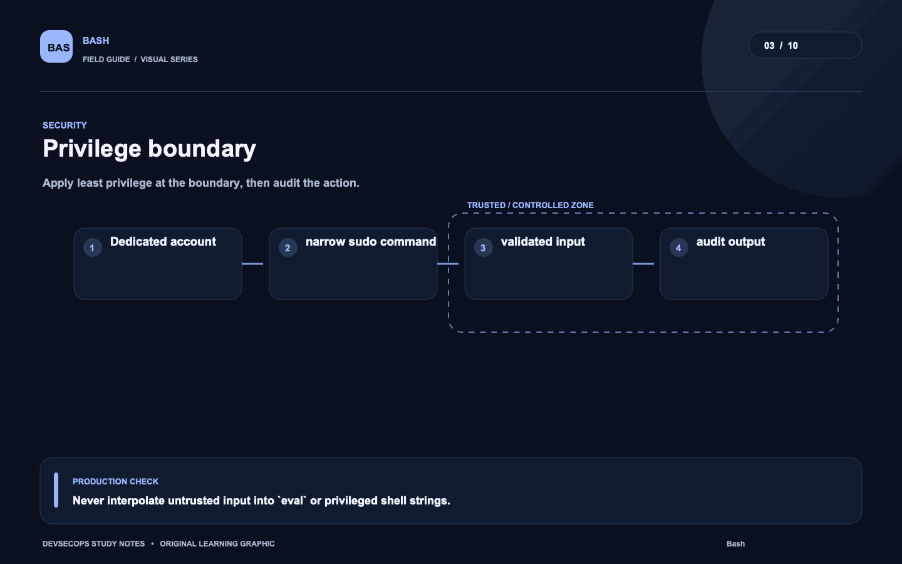
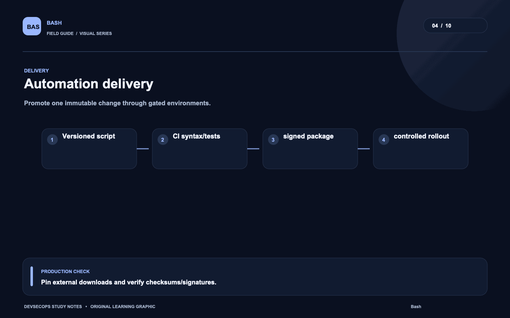
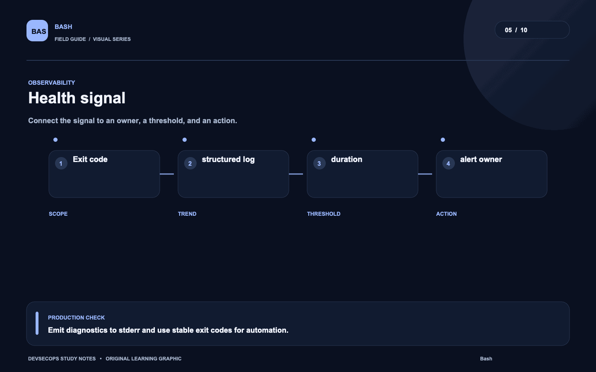
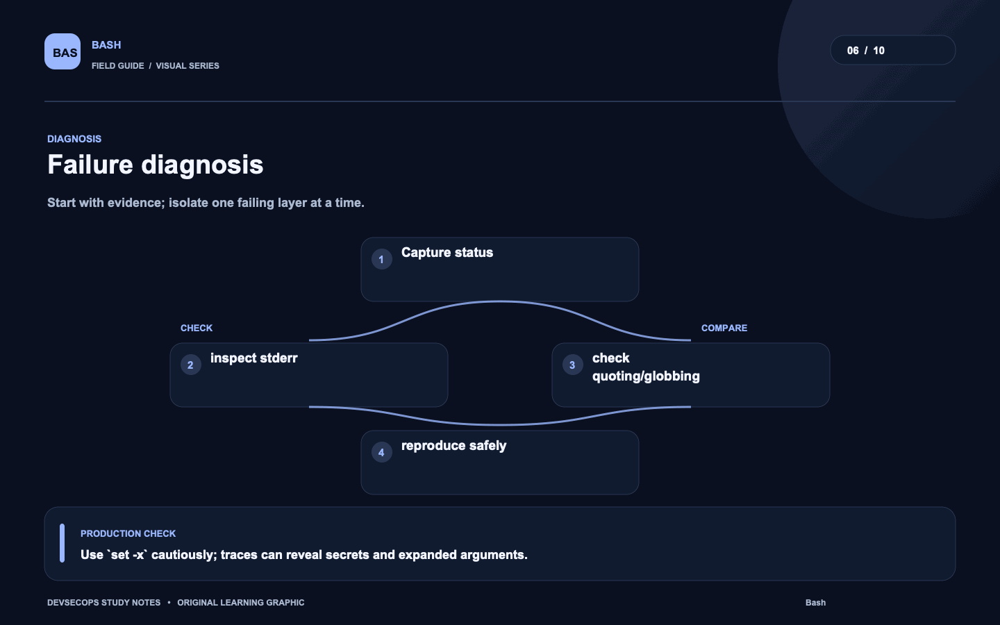
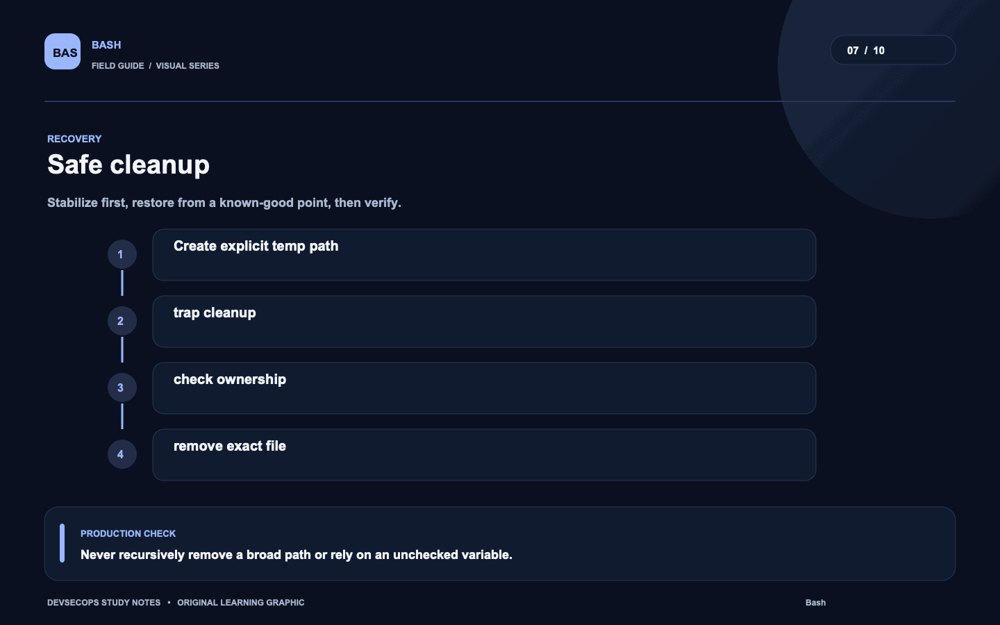
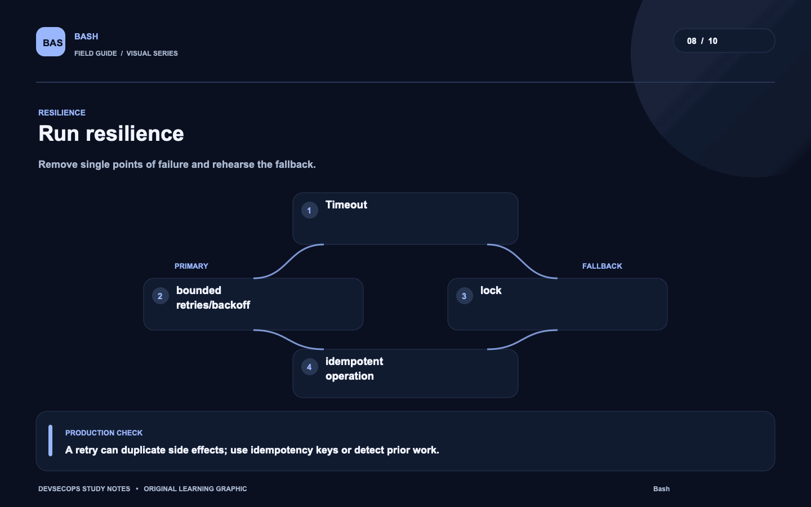
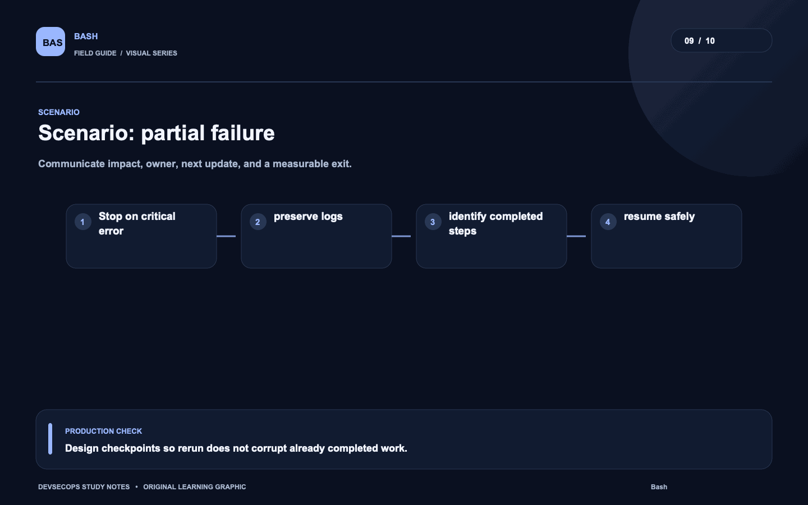
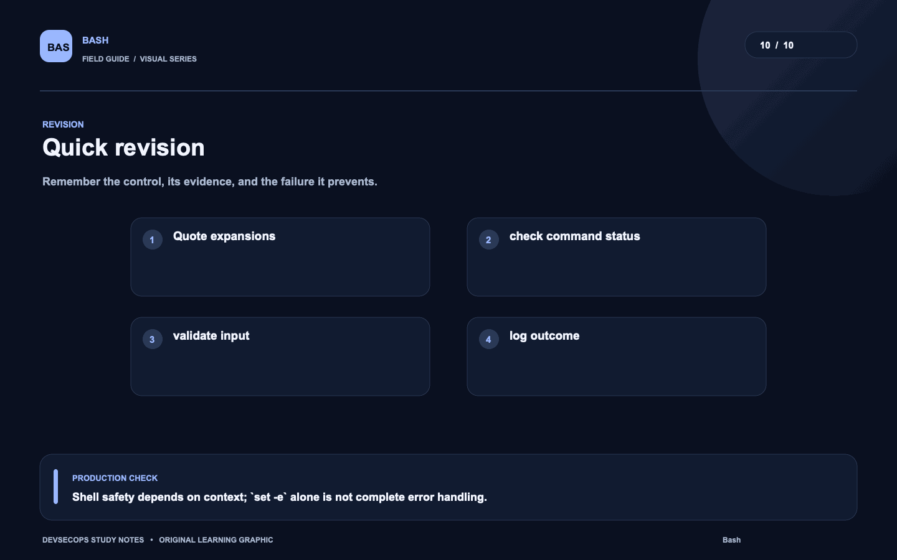

# Visual study cards

Ten original visuals for the [Bash guide](../README.md). Open the SVG for a crisp, scalable version; use PNG for slides and quick viewing.

## 01. Script path

[SVG source](01-script-path.svg) · [PNG image](01-script-path.png)

## 02. Script lifecycle

[SVG source](02-script-lifecycle.svg) · [PNG image](02-script-lifecycle.png)

## 03. Privilege boundary

[SVG source](03-privilege-boundary.svg) · [PNG image](03-privilege-boundary.png)

## 04. Automation delivery

[SVG source](04-automation-delivery.svg) · [PNG image](04-automation-delivery.png)

## 05. Health signal

[SVG source](05-health-signal.svg) · [PNG image](05-health-signal.png)

## 06. Failure diagnosis

[SVG source](06-failure-diagnosis.svg) · [PNG image](06-failure-diagnosis.png)

## 07. Safe cleanup

[SVG source](07-safe-cleanup.svg) · [PNG image](07-safe-cleanup.png)

## 08. Run resilience

[SVG source](08-run-resilience.svg) · [PNG image](08-run-resilience.png)

## 09. Scenario: partial failure

[SVG source](09-scenario-partial-failure.svg) · [PNG image](09-scenario-partial-failure.png)

## 10. Quick revision

[SVG source](10-quick-revision.svg) · [PNG image](10-quick-revision.png)
