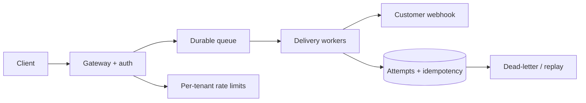

# Behavioural and system-design interviews

## Behavioural answers

Use a structured story: **Situation** (brief context), **Task** (your responsibility), **Action** (specific choices and collaboration), and **Result** (measurable outcome and learning). Be precise about your contribution; distinguish what you led from what the team did. Prepare examples for conflict, failure, ambiguity, prioritization, ownership, mentoring, and customer impact. A strong failure story explains the signal missed, corrective action, and changed practice without blaming others.

## System-design approach

1. Clarify functional requirements, users, scale, latency, availability, consistency, and constraints.
2. Estimate orders of magnitude (requests, storage, bandwidth) and state assumptions.
3. Draw a simple end-to-end architecture: clients, APIs, compute, data, queues, and dependencies.
4. Define data model and API contracts; explain consistency and idempotency.
5. Walk through bottlenecks and failure modes; add caching/partitioning only when justified.
6. Cover security, observability, deployment, capacity, and disaster recovery.
7. Identify trade-offs and summarize what you would validate next.

Explain a baseline before optimizing. For each component, name its failure mode, detection signal, and mitigation. Be explicit when a requirement is unclear instead of silently inventing one.

## Practice

Design a webhook delivery service. Discuss signature verification, durable queues, retries/backoff, duplicate delivery, per-tenant limits, dead-letter handling, and delivery observability. Then tell a STAR story about a production incident you helped resolve.

## Interview checklist

Keep answers structured, state assumptions, invite correction, and leave time for trade-offs and follow-up questions. Do not claim ownership of work you did not perform.

## Topic roadmap, worked design, and revision

**Behavioural topics:** ownership, collaboration, disagreement, ambiguity, prioritization, failure, customer focus, influence without authority, learning, and mentoring. Prepare several truthful examples and adapt each to the question. Quantify impact only when you can substantiate it.

**System-design topics:** requirements and constraints; capacity estimates; API/data model; component boundaries; synchronous vs asynchronous work; consistency; cache/queue/database choices; scaling; security; observability; deployment; failure recovery; and cost/trade-offs.

**Worked scenario—webhook service:** authenticate registration; sign each payload; persist delivery before acknowledging; process asynchronously; retry transient failures with capped backoff/jitter; make delivery IDs idempotent; cap retries; expose replay with authorization/audit; isolate tenant quotas; and alert on queue age/error ratio. Discuss at-least-once semantics rather than promising exactly once over unreliable networks.

**Troubleshooting an interview answer:** if the design sprawls, return to requirements and draw one request path; if capacity estimates are questioned, show assumptions and arithmetic; if a proposed component adds complexity, compare it with the simplest baseline; if a behavioural story lacks impact, clarify your role and the verifiable result without inventing metrics.

**Revision framework:** clarify → estimate → draw baseline → walk one request/write path → identify bottleneck/failure → secure it → add observability/recovery → state trade-offs. For STAR, keep Situation/Task brief; focus on your Actions and verifiable Result; close with learning.

## Repeatable interview preparation process

See [`process.md`](process.md) for competency inventory, STAR story development, timed system-design practice, feedback, and ethical follow-up preparation.
