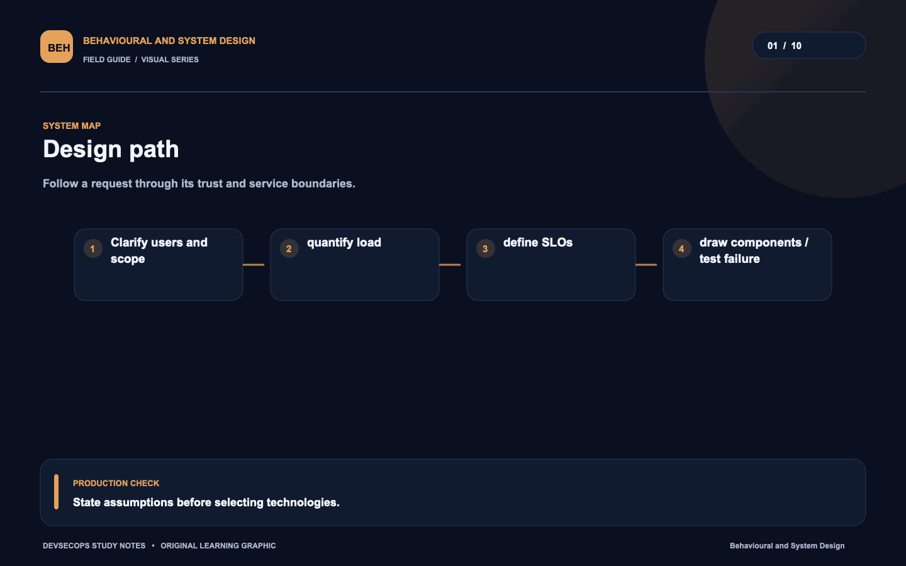
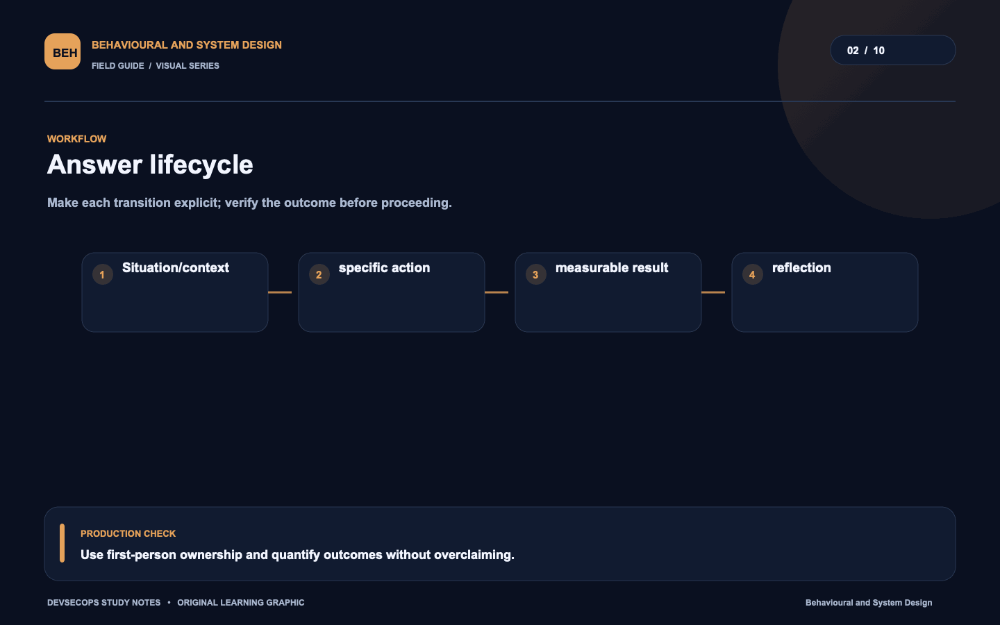
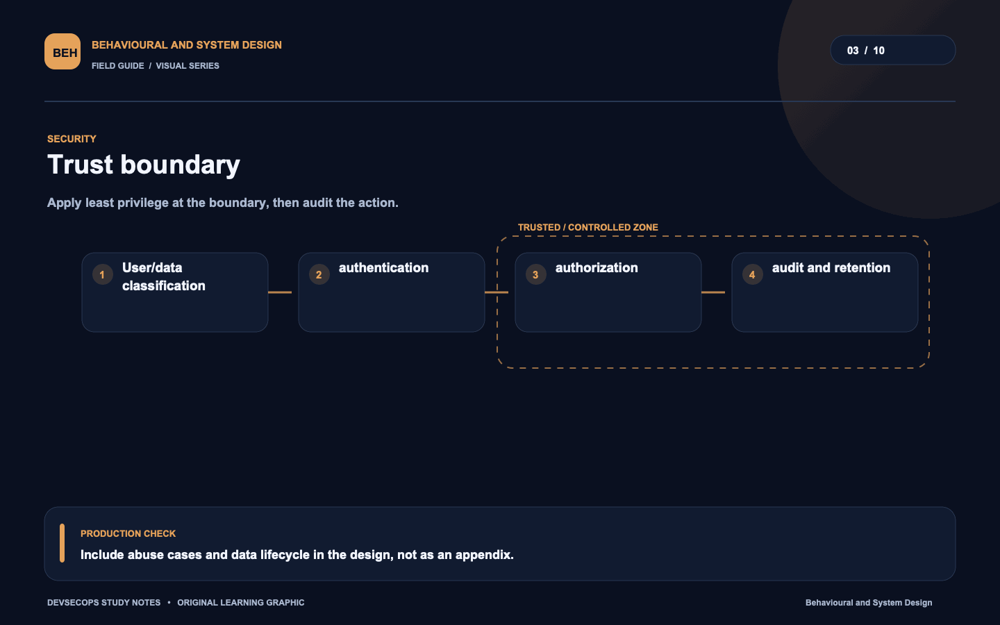
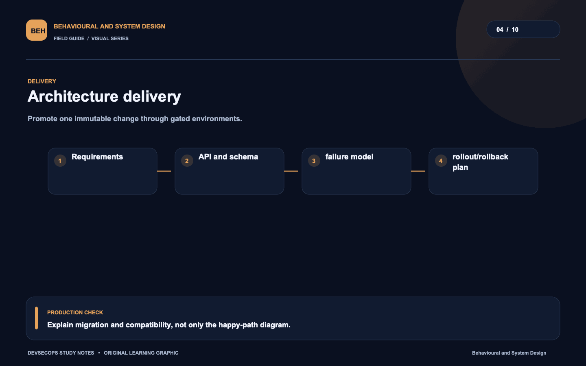
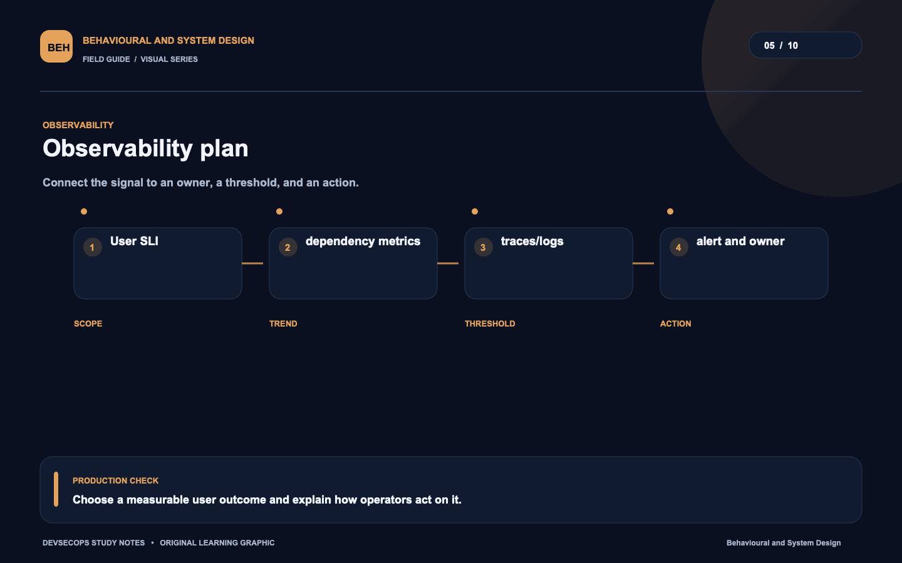
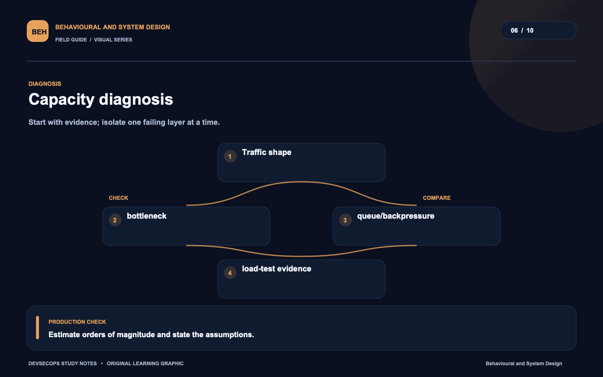
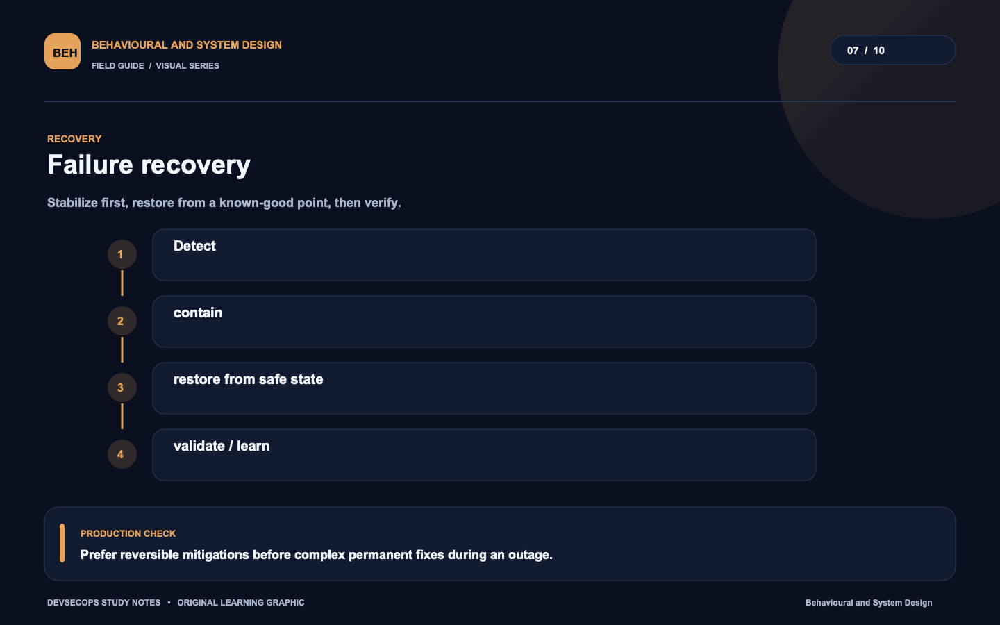
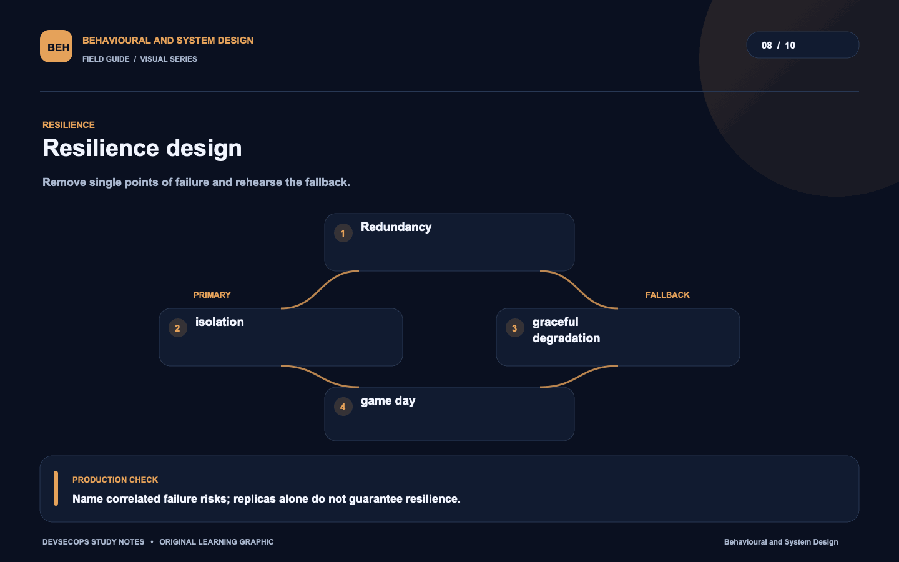
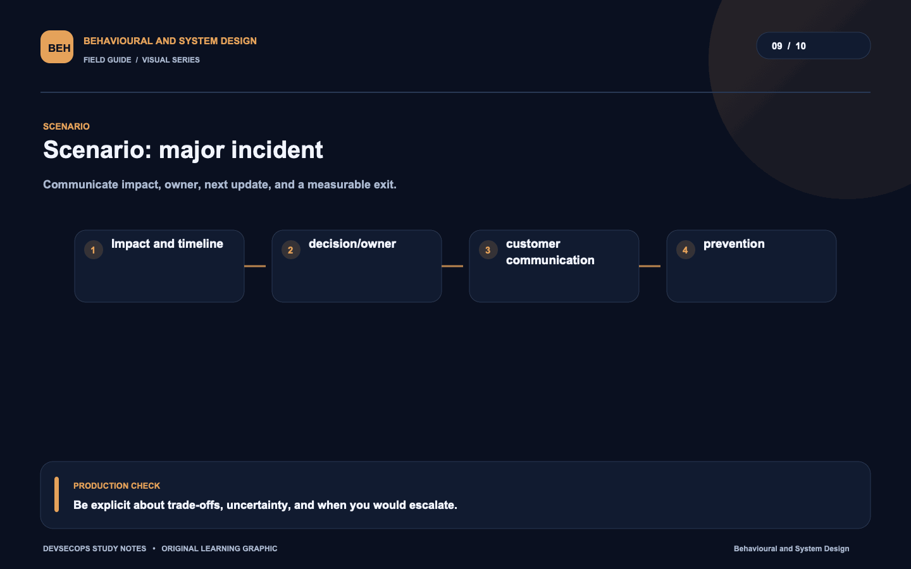
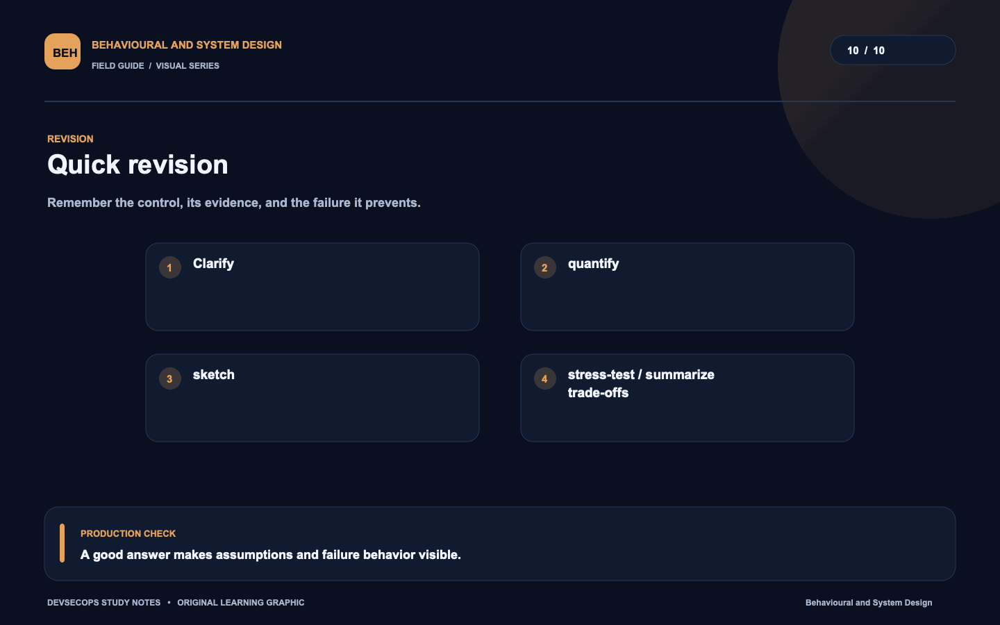

# Visual study cards

Ten original visuals for the [Behavioural and System Design guide](../README.md). Open the SVG for a crisp, scalable version; use PNG for slides and quick viewing.

## 01. Design path

[SVG source](01-design-path.svg) · [PNG image](01-design-path.png)

## 02. Answer lifecycle

[SVG source](02-answer-lifecycle.svg) · [PNG image](02-answer-lifecycle.png)

## 03. Trust boundary

[SVG source](03-trust-boundary.svg) · [PNG image](03-trust-boundary.png)

## 04. Architecture delivery

[SVG source](04-architecture-delivery.svg) · [PNG image](04-architecture-delivery.png)

## 05. Observability plan

[SVG source](05-observability-plan.svg) · [PNG image](05-observability-plan.png)

## 06. Capacity diagnosis

[SVG source](06-capacity-diagnosis.svg) · [PNG image](06-capacity-diagnosis.png)

## 07. Failure recovery

[SVG source](07-failure-recovery.svg) · [PNG image](07-failure-recovery.png)

## 08. Resilience design

[SVG source](08-resilience-design.svg) · [PNG image](08-resilience-design.png)

## 09. Scenario: major incident

[SVG source](09-scenario-major-incident.svg) · [PNG image](09-scenario-major-incident.png)

## 10. Quick revision

[SVG source](10-quick-revision.svg) · [PNG image](10-quick-revision.png)
