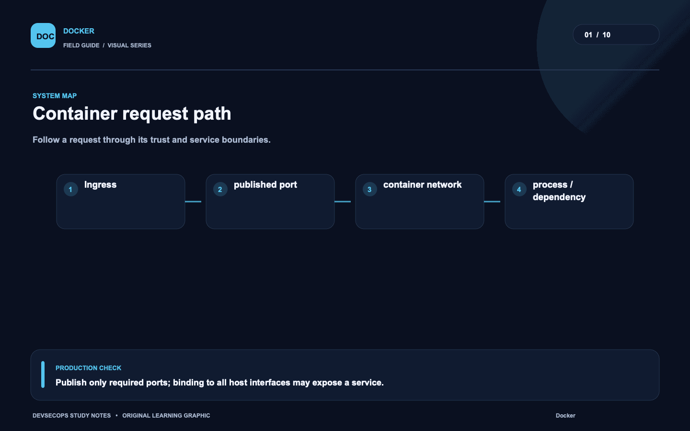
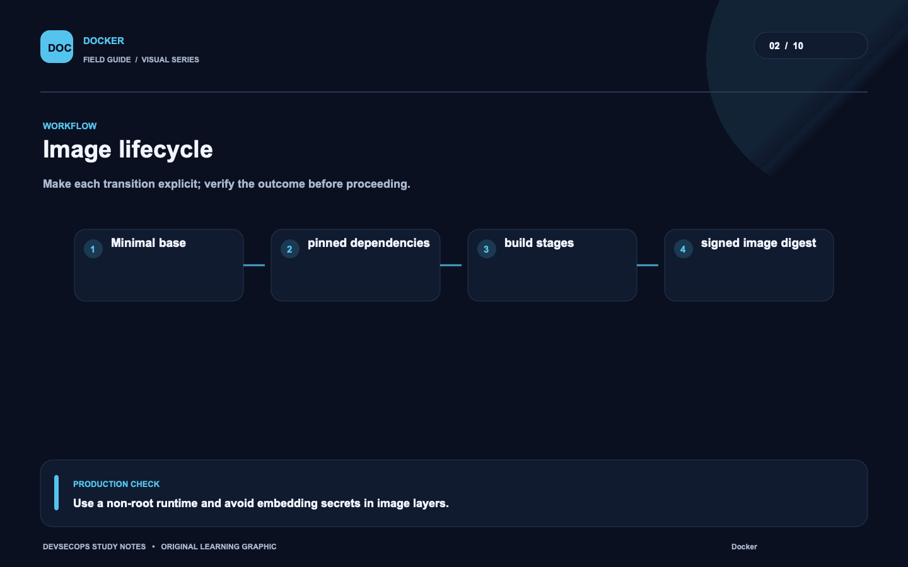
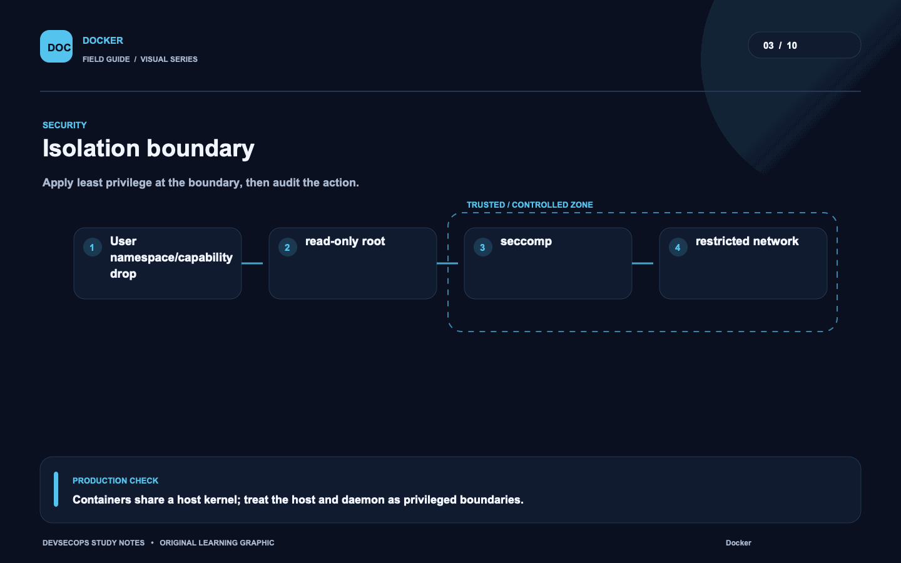
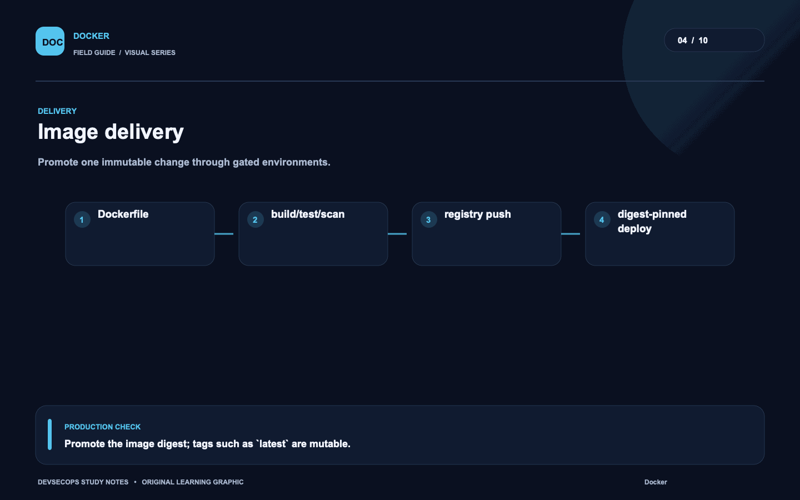
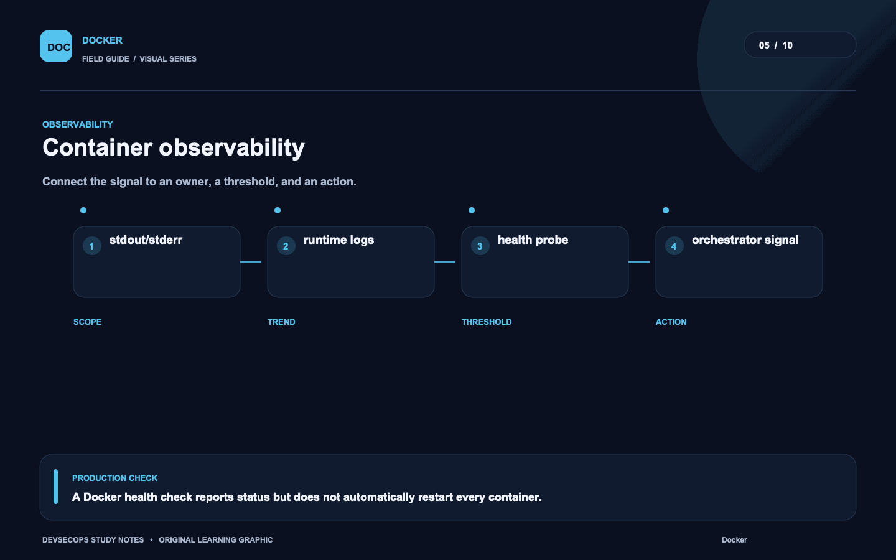
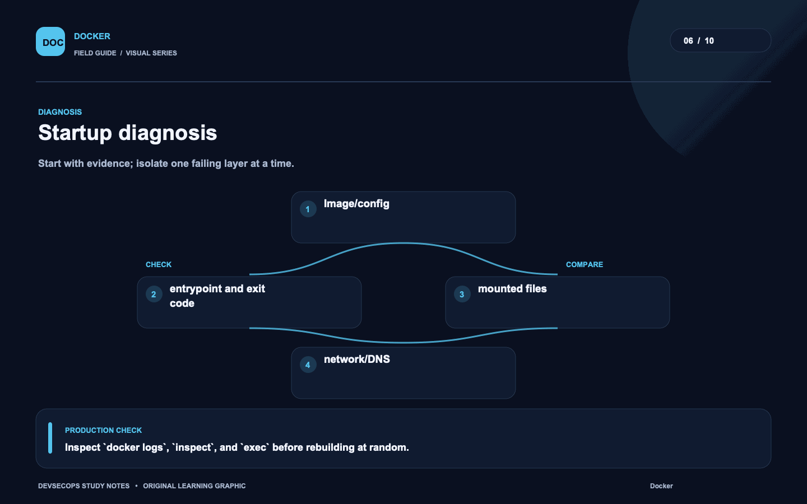
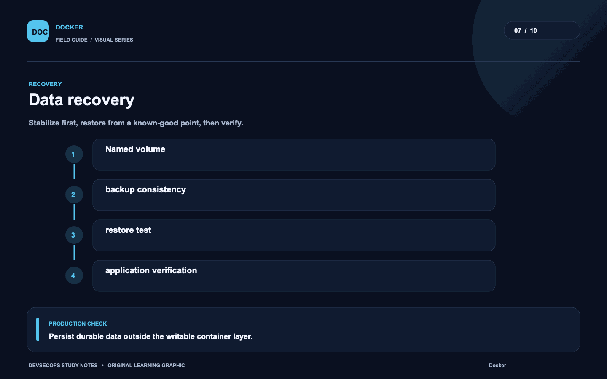
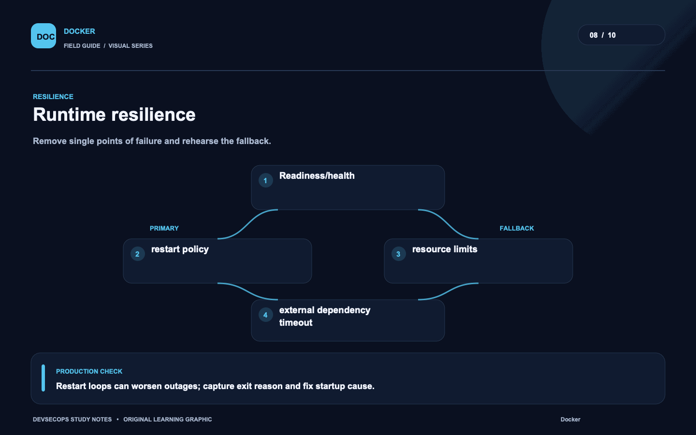
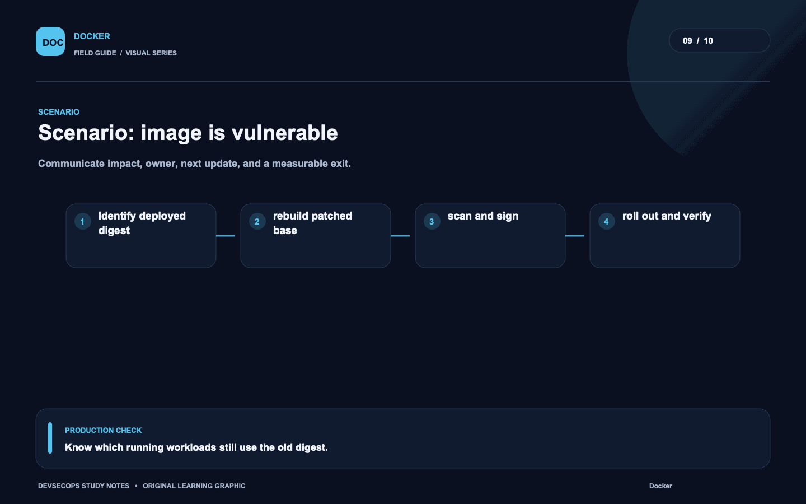
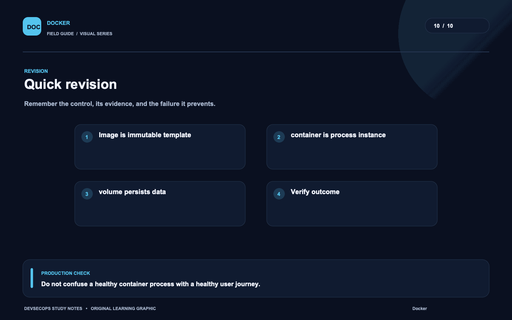

# Visual study cards

Ten original visuals for the [Docker guide](../README.md). Open the SVG for a crisp, scalable version; use PNG for slides and quick viewing.

## 01. Container request path

[SVG source](01-container-request-path.svg) · [PNG image](01-container-request-path.png)

## 02. Image lifecycle

[SVG source](02-image-lifecycle.svg) · [PNG image](02-image-lifecycle.png)

## 03. Isolation boundary

[SVG source](03-isolation-boundary.svg) · [PNG image](03-isolation-boundary.png)

## 04. Image delivery

[SVG source](04-image-delivery.svg) · [PNG image](04-image-delivery.png)

## 05. Container observability

[SVG source](05-container-observability.svg) · [PNG image](05-container-observability.png)

## 06. Startup diagnosis

[SVG source](06-startup-diagnosis.svg) · [PNG image](06-startup-diagnosis.png)

## 07. Data recovery

[SVG source](07-data-recovery.svg) · [PNG image](07-data-recovery.png)

## 08. Runtime resilience

[SVG source](08-runtime-resilience.svg) · [PNG image](08-runtime-resilience.png)

## 09. Scenario: image is vulnerable

[SVG source](09-scenario-image-is-vulnerable.svg) · [PNG image](09-scenario-image-is-vulnerable.png)

## 10. Quick revision

[SVG source](10-quick-revision.svg) · [PNG image](10-quick-revision.png)
