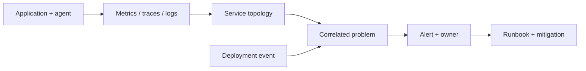

# Dynatrace observability

## Mental model

Dynatrace combines telemetry collection, topology/context, analytics, dashboards, and alerting. OneAgent-based discovery can associate processes and services, while integrations and APIs extend coverage. Automatic correlation is useful, but teams still need to validate instrumentation, service boundaries, and data quality.

## Practical workflow

1. Define the service and its user-facing indicators before onboarding hosts.
2. Deploy agents or integrations through controlled automation and verify coverage.
3. Map services and dependencies; confirm names and ownership match the operating model.
4. Build dashboards and alerts around latency, traffic, errors, saturation, and business impact.
5. Correlate deployments and changes with incidents; review false positives and blind spots.

Use management zones/tags to organize views and permissions. Apply data capture controls and retention settings so sensitive data is not collected unnecessarily. Instrument custom events and metrics with stable, low-cardinality dimensions. Set alert thresholds based on service objectives and baseline behavior, not every metric fluctuation.

## Governance and operations

Protect API tokens, scope them narrowly, and rotate them. Manage agent rollout, upgrades, resource overhead, and network egress. Document ownership for dashboards, alert profiles, and integrations. Validate that disabled/instrumentation gaps are visible; a quiet dashboard may indicate missing data rather than a healthy service.

## Practice

Onboard a sample service, confirm its dependency map, create a latency/error dashboard, and configure an alert tied to a runbook. Introduce a deployment event and trace how it appears during a simulated incident.

## Further reading

[Dynatrace documentation](https://docs.dynatrace.com/)

## Topic roadmap and incident workflow

**Observability topics:** OneAgent/infrastructure monitoring, service discovery/topology, distributed traces, logs, metrics, user experience, synthetic checks, dashboards, alerting/problem correlation, APIs, management zones/tags, and data privacy/retention. Validate automatic service boundaries and ownership; correlated topology does not automatically reflect architecture intent.

**Scenario:** latency rises after release. Compare affected service, endpoint, version, and dependency; inspect traces for added wait time, logs for new errors, and infrastructure saturation. Correlate deployment timing; rollback only after verifying the candidate change and expected recovery signal. Check sampling and data gaps before concluding there is no issue.

**Troubleshooting:** agent not reporting—host connectivity, token/scope, proxy/firewall, version/health; service missing—process detection/instrumentation, naming, filters; alert storm—threshold, baseline, deduplication/correlation and ownership; unexplained blind spot—ingestion limits, sampling, retention, and excluded entities.

**Revision:** metrics show aggregates; traces show request paths; logs provide events; topology adds context; correlation helps prioritization but needs validation; token scope and data capture settings are security controls.
