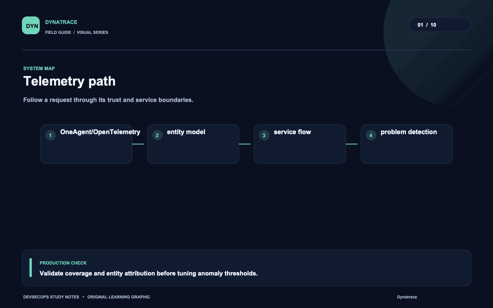
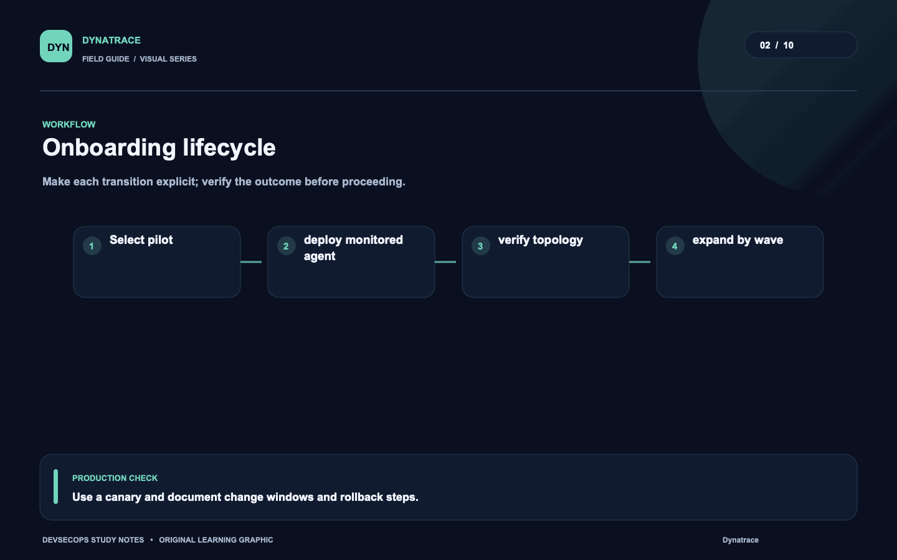
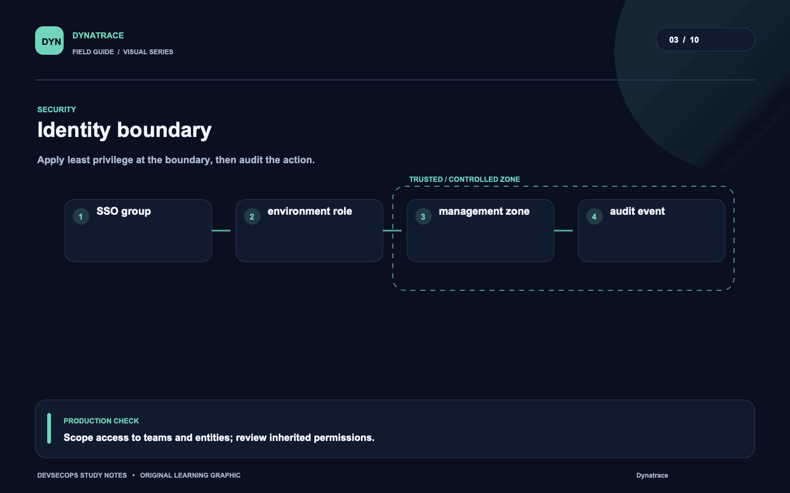
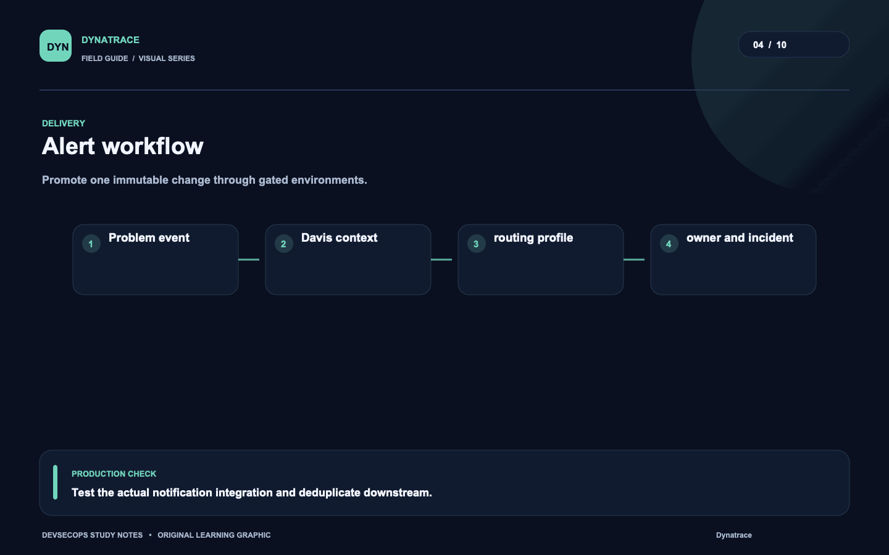
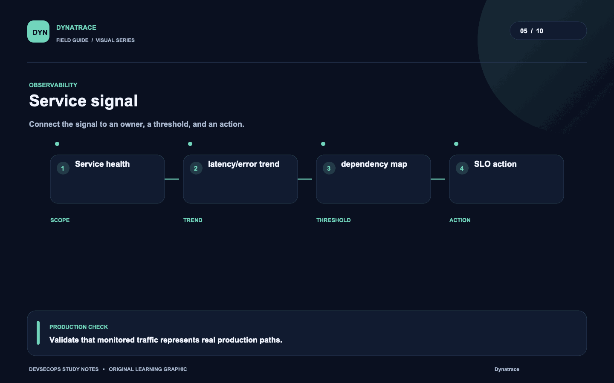
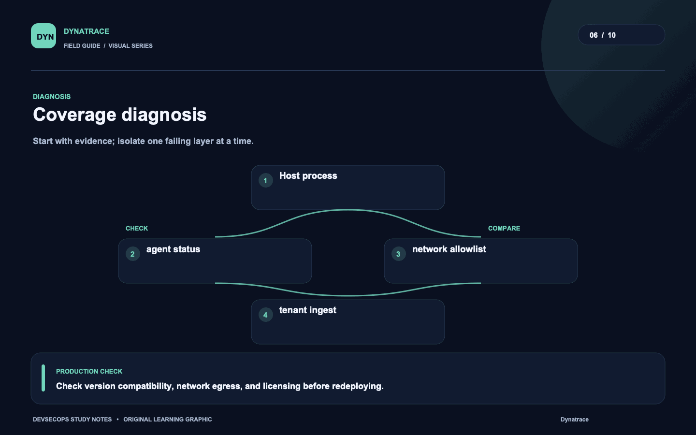
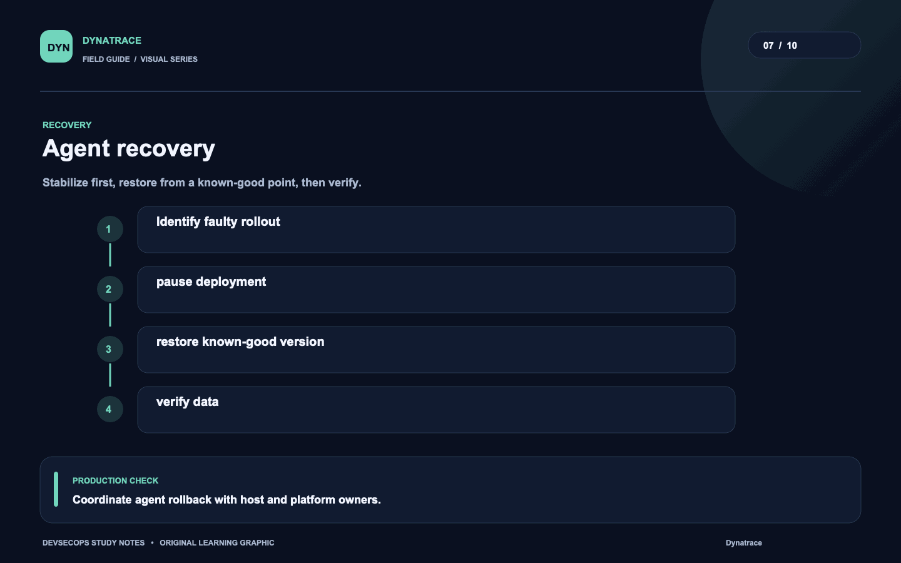
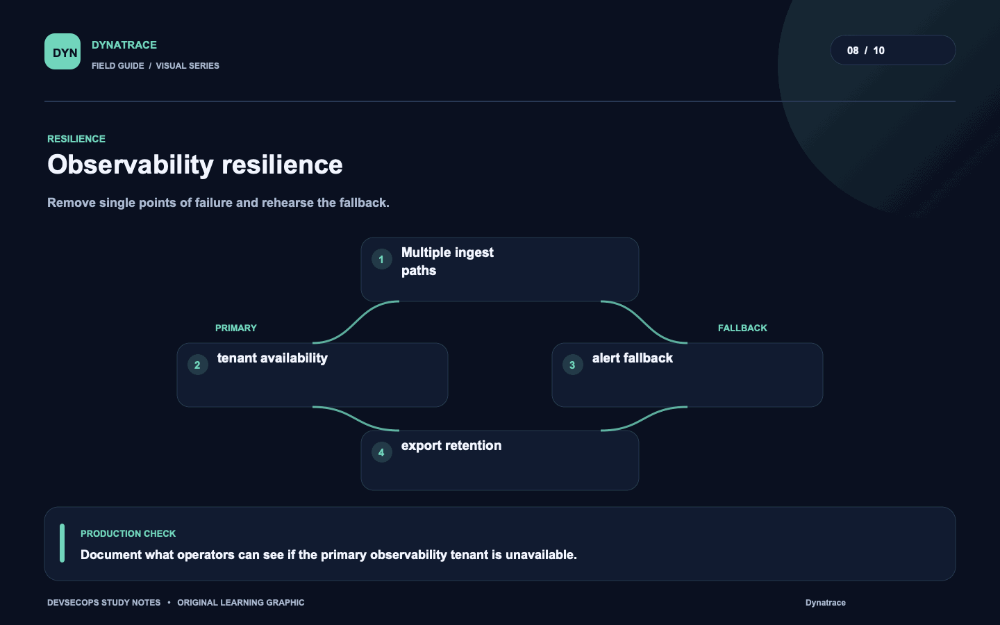
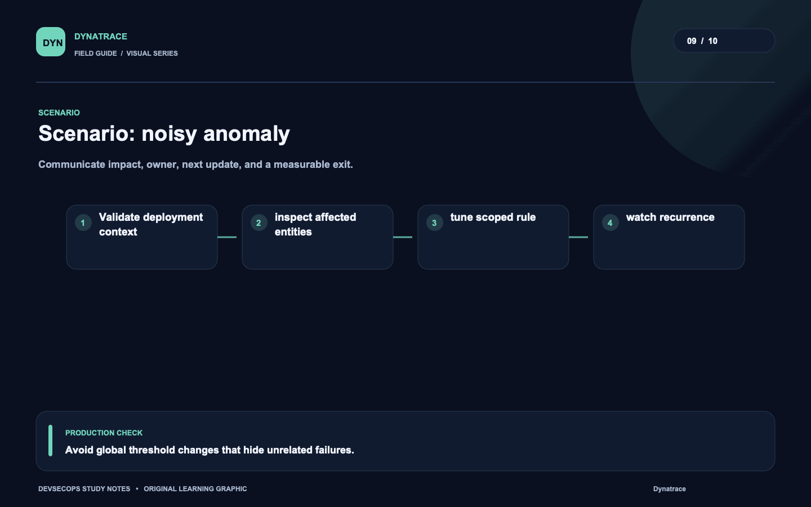
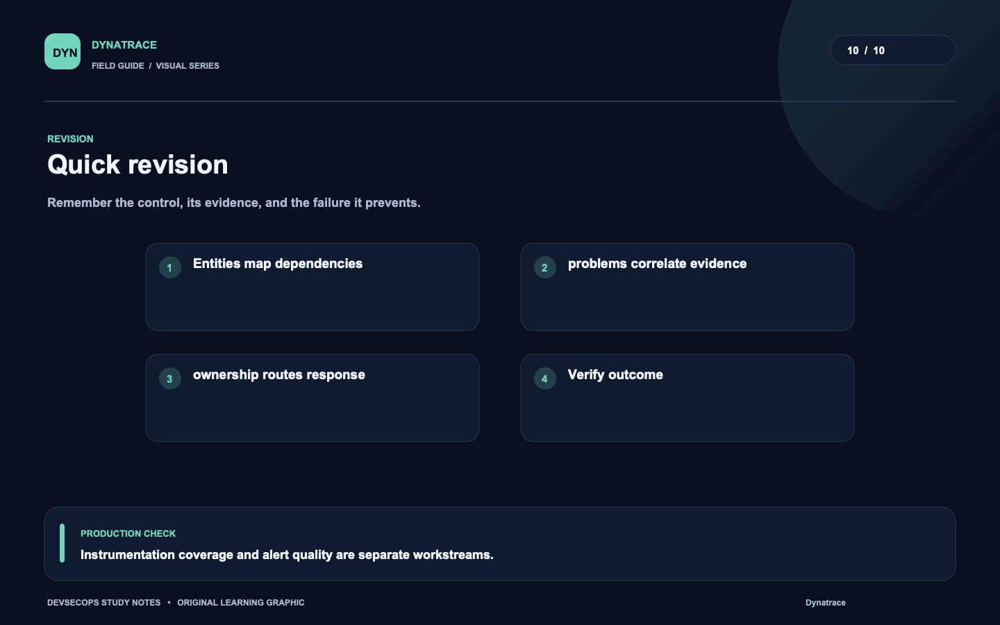

# Visual study cards

Ten original visuals for the [Dynatrace guide](../README.md). Open the SVG for a crisp, scalable version; use PNG for slides and quick viewing.

## 01. Telemetry path

[SVG source](01-telemetry-path.svg) · [PNG image](01-telemetry-path.png)

## 02. Onboarding lifecycle

[SVG source](02-onboarding-lifecycle.svg) · [PNG image](02-onboarding-lifecycle.png)

## 03. Identity boundary

[SVG source](03-identity-boundary.svg) · [PNG image](03-identity-boundary.png)

## 04. Alert workflow

[SVG source](04-alert-workflow.svg) · [PNG image](04-alert-workflow.png)

## 05. Service signal

[SVG source](05-service-signal.svg) · [PNG image](05-service-signal.png)

## 06. Coverage diagnosis

[SVG source](06-coverage-diagnosis.svg) · [PNG image](06-coverage-diagnosis.png)

## 07. Agent recovery

[SVG source](07-agent-recovery.svg) · [PNG image](07-agent-recovery.png)

## 08. Observability resilience

[SVG source](08-observability-resilience.svg) · [PNG image](08-observability-resilience.png)

## 09. Scenario: noisy anomaly

[SVG source](09-scenario-noisy-anomaly.svg) · [PNG image](09-scenario-noisy-anomaly.png)

## 10. Quick revision

[SVG source](10-quick-revision.svg) · [PNG image](10-quick-revision.png)
