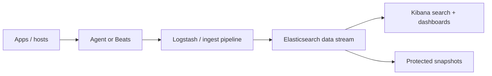

# ELK Stack: Elasticsearch, Logstash, and Kibana

## Mental model

Elasticsearch stores and searches indexed documents across shards and replicas. Logstash can collect, parse, and route events through input/filter/output pipelines. Kibana supports search, visualizations, dashboards, and alerting. Beats and Elastic Agent are common collection options. Current Elastic deployments may use integrated features beyond the original three-component stack.

## Data lifecycle

Define event schemas and timestamps before ingest. Parse at the edge or in a pipeline, normalize important fields, and remove secrets/irrelevant payloads. Use index templates and lifecycle policies for mappings, rollover, retention, and tiering. Mapping choices affect query behavior and storage; uncontrolled dynamic fields can create mapping explosion. Search by time and selective filters, then aggregate.

## Resilience and performance

Shards are parallelism and allocation units, not a universal performance knob. Choose shard sizes and replica count based on workload and recovery goals. Monitor cluster health, JVM/memory pressure, disk watermarks, indexing/search latency, and rejected tasks. Back up snapshots to a separate, protected repository and regularly test restore. A replica is not a backup.

## Security

Require authenticated TLS access, restrict roles and index privileges, protect API keys, and isolate public network exposure. Apply document/field access controls only when properly supported and tested. Manage retention and deletion for regulated data.

## Practice

Ingest JSON service logs, define a stable mapping, create a lifecycle policy, and build an error-rate dashboard. Simulate node loss and restore a snapshot in a separate environment.

## Further reading

[Elastic documentation](https://www.elastic.co/guide/index.html)

## Topic roadmap and data-flow diagram

**Ingest and query:** Elastic Agent/Beats or Logstash collect events; ingest pipelines parse/enrich; mappings define field types; indices/data streams organize data; shards distribute work; Kibana explores and visualizes. Use ECS-compatible fields when practical. Prefer data streams/lifecycle policies for time-series logs.

**Example:** parse JSON at ingestion, map `@timestamp` as date and status as numeric/keyword as appropriate, redact secrets, and configure rollover/retention before high-volume onboarding. Aggregations should filter time and fields first.

**Troubleshooting:** cluster yellow—unassigned replicas, capacity and allocation; red—unassigned primary and data risk; indexing rejected—resource pressure, bulk sizing, mappings; query slow—shard count, expensive wildcard/aggregation, time range; disk watermark—retention, snapshots, tiering and expansion. Restore a snapshot into an isolated test cluster.

**Revision:** primary shard stores a partition; replica supports resilience/read capacity; replica is not backup; mapping controls query semantics; lifecycle manages data; snapshot repository must be protected and restore-tested; Kibana is not a substitute for access controls.

## Example ingest contract

Before onboarding a source, define an event contract: UTC `@timestamp`, stable service/environment/host fields, numeric duration/status fields, bounded keyword dimensions, maximum event size, redaction rules, and retention class. Reject or route malformed records to a controlled dead-letter stream instead of silently indexing partial fields.

An Elasticsearch index template should explicitly map fields used for filters/aggregations; do not allow arbitrary request IDs or user-provided keys to become unbounded mapped fields. Roll out template changes using a new data stream/index and reindex only with a tested migration plan. Alert on ingest rejection, delayed events, shard allocation, disk watermarks, and snapshot failures.

## Incident scenario: disk watermark

Stop uncontrolled ingest growth first. Inspect node disk, shard allocation, index growth, retention/lifecycle execution, and oversized fields. Do not delete indices blindly. Confirm snapshot status and retention requirements, then add capacity or safely expire approved data. Rebalance and verify cluster health/search/indexing recovery; record bytes and recovery duration.

## End-to-end log pipeline process

See [`process.md`](process.md) for source onboarding, parsing/mapping, lifecycle setup, Kibana dashboards/alerts, snapshots, troubleshooting, and source offboarding.

## Visual study cards

Browse the [10 original visual study cards](visuals/README.md) as SVG or PNG, covering architecture, workflow, security, delivery, observability, troubleshooting, recovery, resilience, scenarios, and revision.
