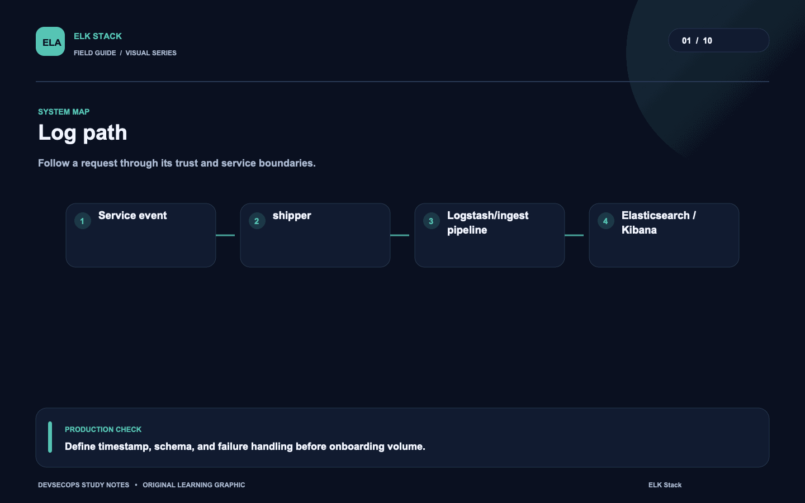
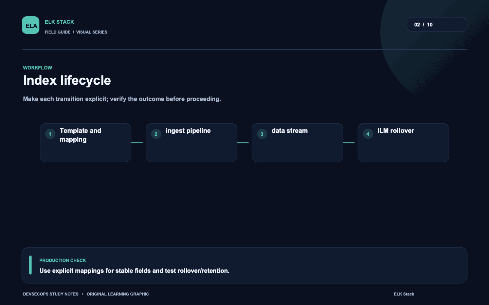
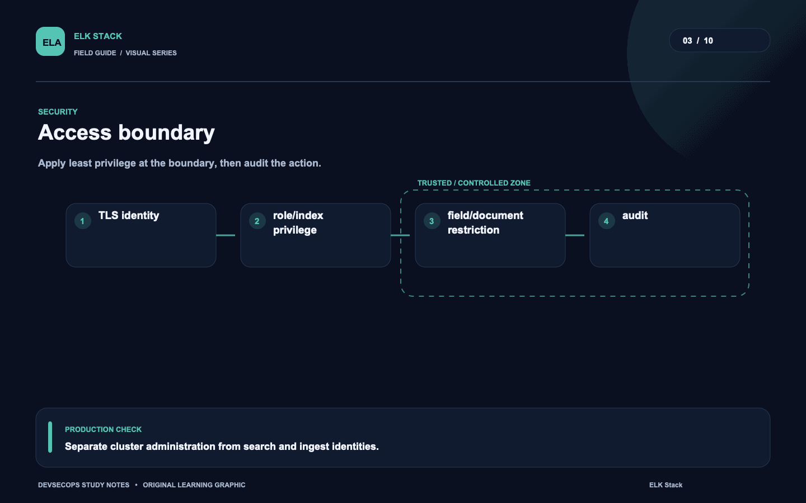
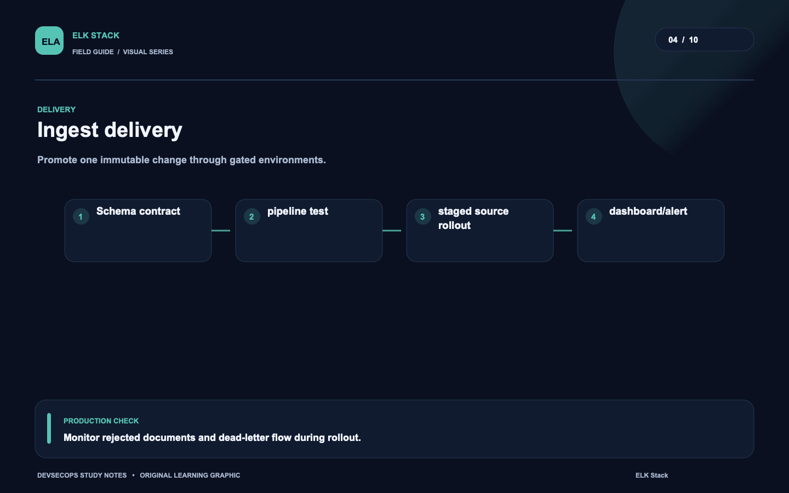
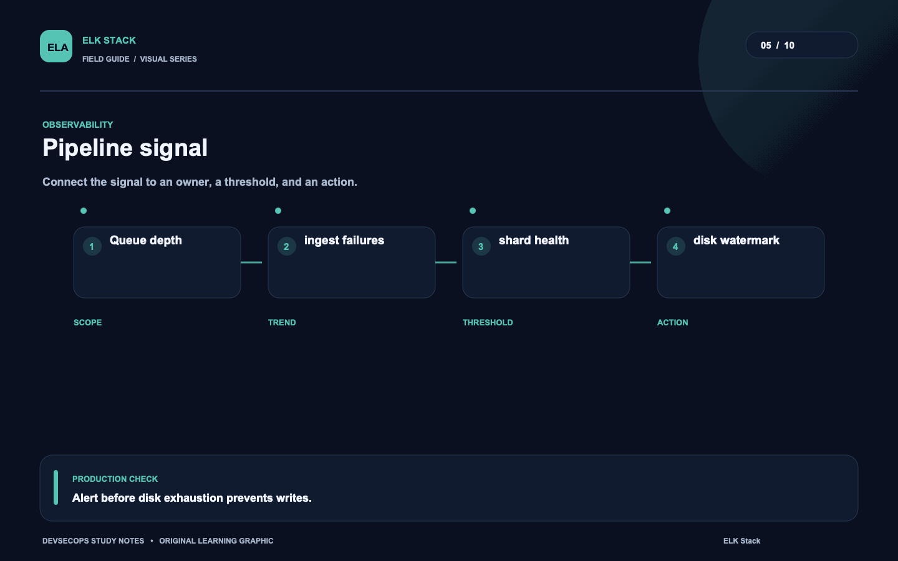
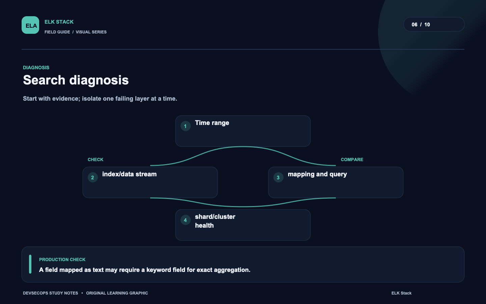
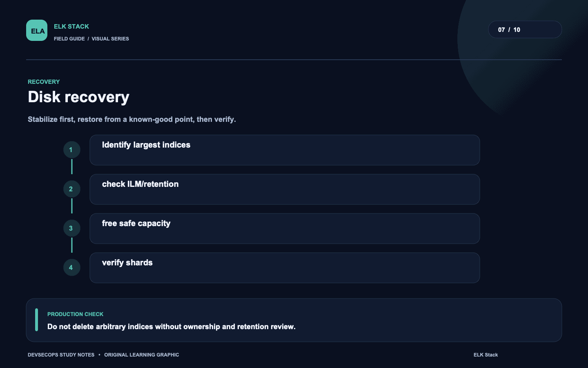
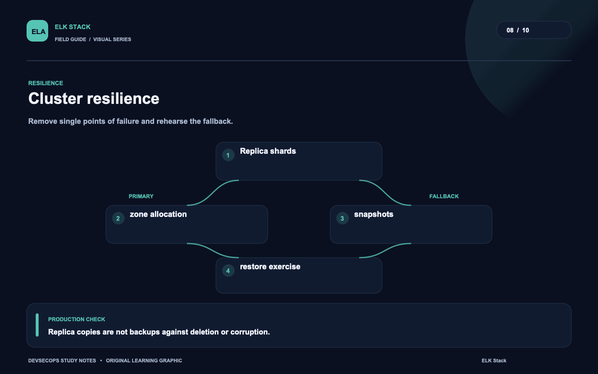
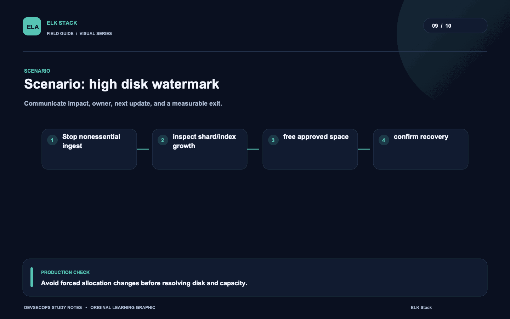
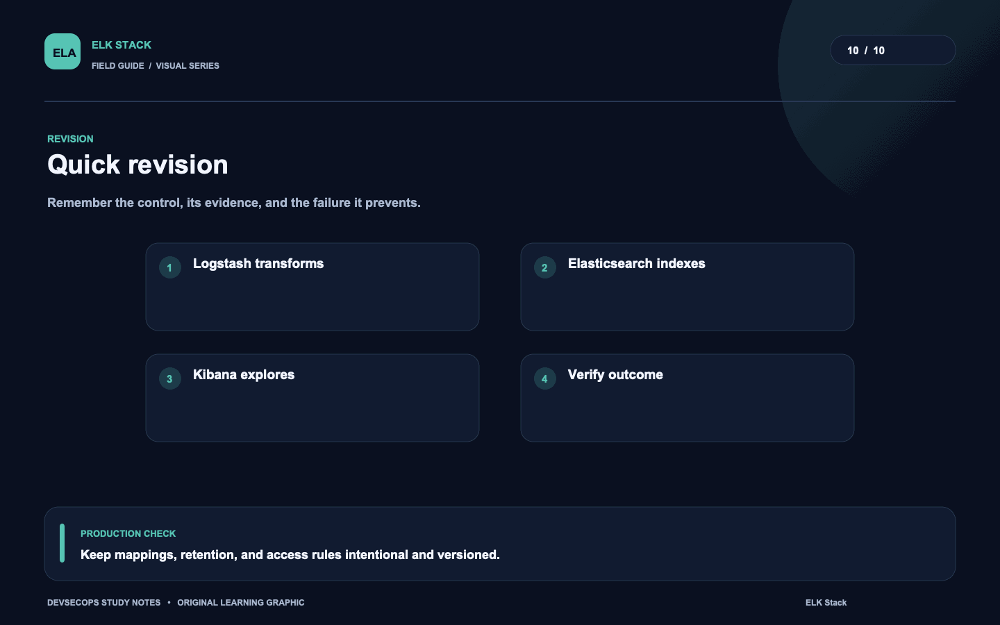

# Visual study cards

Ten original visuals for the [ELK Stack guide](../README.md). Open the SVG for a crisp, scalable version; use PNG for slides and quick viewing.

## 01. Log path

[SVG source](01-log-path.svg) · [PNG image](01-log-path.png)

## 02. Index lifecycle

[SVG source](02-index-lifecycle.svg) · [PNG image](02-index-lifecycle.png)

## 03. Access boundary

[SVG source](03-access-boundary.svg) · [PNG image](03-access-boundary.png)

## 04. Ingest delivery

[SVG source](04-ingest-delivery.svg) · [PNG image](04-ingest-delivery.png)

## 05. Pipeline signal

[SVG source](05-pipeline-signal.svg) · [PNG image](05-pipeline-signal.png)

## 06. Search diagnosis

[SVG source](06-search-diagnosis.svg) · [PNG image](06-search-diagnosis.png)

## 07. Disk recovery

[SVG source](07-disk-recovery.svg) · [PNG image](07-disk-recovery.png)

## 08. Cluster resilience

[SVG source](08-cluster-resilience.svg) · [PNG image](08-cluster-resilience.png)

## 09. Scenario: high disk watermark

[SVG source](09-scenario-high-disk-watermark.svg) · [PNG image](09-scenario-high-disk-watermark.png)

## 10. Quick revision

[SVG source](10-quick-revision.svg) · [PNG image](10-quick-revision.png)
