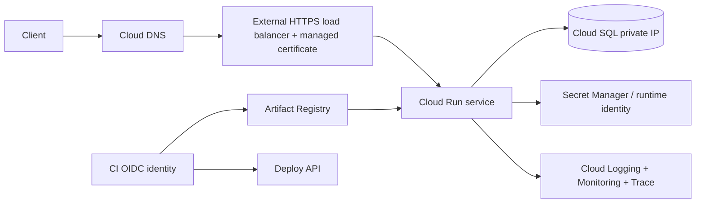

# Google Cloud Platform: production engineering guide

> Learning material, not a copy of any paid handbook. The linked sales page does not publish its detailed table of contents. This guide therefore covers a practical GCP engineering curriculum and links each domain to a dedicated chapter.

## Chapter map

| Chapter | Scope |
|---|---|
| [Architecture and project foundations](architecture.md) | Resource hierarchy, landing zone, region strategy, shared responsibility |
| [IAM and security](iam-security.md) | IAM, service identities, federation, secrets, guardrails |
| [VPC networking](networking.md) | VPC, subnets, firewall, NAT, private services, hybrid paths |
| [Compute and serverless](compute.md) | Compute Engine, MIGs, Cloud Run, GKE choice |
| [Data services and Cloud SQL](data-services.md) | Storage, database selection, private connectivity, recovery |
| [Delivery with Terraform](terraform-delivery.md) | State, modules, CI identity, release promotion |
| [Observability and operations](operations.md) | Logging, Monitoring, SLOs, incident and recovery runbooks |
| [Production scenario lab](production-lab.md) | Secure private web app; deployment and failure exercises |

## Production request path

The diagram is a reference pattern, not a universal topology. Cloud Run, GKE, and Compute Engine are alternatives with different operational costs and network models. A service account and private IP do not by themselves guarantee least privilege or secure connectivity: validate IAM, ingress/egress, DNS, TLS, and workload identity end to end.

## Learning path

1. Complete [architecture foundations](architecture.md); establish a non-production project with budgets and APIs.
2. Implement [identity and networking](iam-security.md) before deploying workloads.
3. Compare [compute choices](compute.md); deploy the smallest runtime that meets actual requirements.
4. Add data only after defining access paths, RPO/RTO, and restore tests.
5. Provision through [Terraform](terraform-delivery.md) and operate through [monitoring/runbooks](operations.md).
6. Complete the [production lab](production-lab.md) including negative security tests and teardown.

**Cost/safety:** use a dedicated sandbox project, set a budget alert, inspect pricing/quotas, avoid public databases, and remove billable test resources after validation. Budget notifications are not spending caps.

## References

[Google Cloud Architecture Framework](https://cloud.google.com/architecture/framework) · [Google Cloud documentation](https://cloud.google.com/docs) · [Pricing calculator](https://cloud.google.com/products/calculator)

---

## Quick reference

| Need | Start here |
|---|---|
| IAM denial or keyless CI | [IAM and security](iam-security.md) |
| Private/public connectivity | [VPC networking](networking.md) |
| Workload runtime choice | [Compute and serverless](compute.md) |
| Database/storage or recovery | [Data services](data-services.md) |
| Infrastructure plan and apply | [Terraform delivery](terraform-delivery.md) |
| SLO, incident, restore | [Operations](operations.md) |
| End-to-end exercise | [Production lab](production-lab.md) |

**Revision:** projects are useful policy/quota/billing units; VPC is global but subnets are regional; IAM grants access while organization policy constrains; service-account federation avoids long-lived CI keys; private networking does not replace authorization; HA does not replace restore tests.
