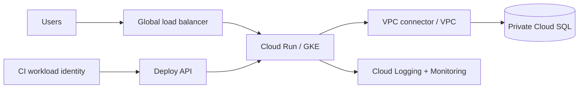

# Google Cloud Platform for DevOps

## Mental model

Google Cloud resources are organized under an organization, folders, projects, and resources. Projects are common boundaries for APIs, IAM, quotas, and billing attribution. Regions and zones determine placement and resilience; a multi-region design still needs explicit data and failover behavior.

## Core building blocks

- **Identity and governance:** Cloud IAM roles, service accounts, organization policies, folders, projects, and Cloud Audit Logs.
- **Networking:** VPC networks, subnetworks, firewall rules, Cloud NAT, load balancing, and Private Service Connect.
- **Compute and data:** Compute Engine, GKE, Cloud Run, Cloud Functions, Cloud Storage, Cloud SQL, and BigQuery.
- **Operations:** Cloud Monitoring, Cloud Logging, Error Reporting, Trace, and managed uptime checks.

## Delivery workflow

Create projects through a controlled bootstrap process, enable only required APIs, and apply IAM and organization policies before workload deployment. Use Terraform or another reviewed IaC workflow. Build immutable artifacts, scan them, and deploy through staged environments. Workload Identity Federation can let external CI obtain short-lived Google credentials without storing service-account keys.

## Security and reliability

Grant predefined or custom roles at the narrowest useful scope; avoid broad primitive roles for workloads. Restrict service-account impersonation and key creation. Use private access patterns, encryption, centralized audit logs, and explicit retention. Design for zonal failures, set budgets/quotas, and rehearse data restoration and regional recovery.

## Practice

Deploy a containerized service to Cloud Run or GKE, give it a dedicated runtime identity, and connect it to a private data store. Add request/error dashboards, an alert, and an audit-log review. Show how a CI identity deploys without a downloadable long-lived key.

## Further reading

[Google Cloud Architecture Framework](https://cloud.google.com/architecture/framework) · [IAM overview](https://cloud.google.com/iam/docs/overview)

## Topic roadmap and examples

### Organization, projects, and identity

Organization/folders/projects form the resource hierarchy. IAM policies inherit through it; bindings associate principals with roles. A service account represents a workload, while Workload Identity Federation lets an external identity exchange proof for short-lived credentials. Avoid downloadable service-account keys unless there is a documented exception and lifecycle control.

### Network and service path

VPC networks are global while subnetworks are regional. Firewall rules and routes, Cloud NAT, DNS, and service controls each address different parts of connectivity and boundary design.

### Compute, data, delivery

Choose Compute Engine, GKE, Cloud Run, or Functions based on runtime/control needs. Choose Cloud Storage, Cloud SQL, BigQuery, or other data services based on access and consistency patterns. Provision through reviewed IaC; use Artifact Registry and immutable versions; observe with Cloud Monitoring, Logging, Trace, and audit logs.

### Troubleshooting example

**Symptom:** CI can build but cannot deploy. Verify federation provider/audience and subject conditions, service-account impersonation permission, deployment role scope, enabled API, and target project. Then inspect deployment logs. Do not solve it by granting project-wide Owner.

### Revision

Project is a common policy, quota, and billing unit; IAM bindings grant; organization policy constrains; a service account is an identity, not a key; global VPC does not make every subnet global; audit logs track administrative/data access events according to configuration.
