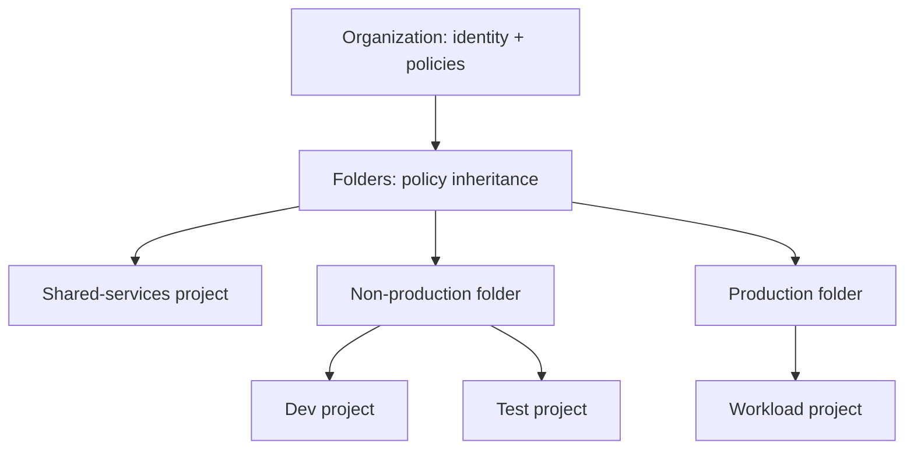

# GCP architecture and landing-zone foundations

## 1. Resource hierarchy and blast radius



An organization is rooted in Cloud Identity/Workspace. Folders and projects inherit IAM and organization policies. A project is an API, quota, billing, and common operational boundary—not necessarily sufficient isolation for every threat model. Keep production and non-production projects separate. Use Shared VPC only when central network ownership is an intentional operating model.

### Project bootstrap checklist

- Create projects through an auditable process; link the correct billing account and apply naming/labels.
- Enable only required APIs; record API owners and disable unused services.
- Apply organization policies for public exposure, service-account key creation, allowed locations, and resource constraints as appropriate.
- Set IAM groups and break-glass access; require MFA and audit privileged access.
- Establish centralized audit log routing, retention, alerting, and access controls before onboarding workloads.
- Set budgets, quota monitoring, cost labels, and ownership contacts.
- Define deletion protection and project recovery/closure procedures.

Do not grant `roles/owner` to automation as a bootstrap shortcut. Test organization-policy changes in a non-production folder; some policies can block recovery or managed service integrations.

## 2. Region, zone, and availability design

A region contains zones. Zonal resources can fail with a zone; regional resources may distribute across zones; multi-region products have product-specific replication and consistency. Select placement based on latency, residency, service availability, dependencies, and recovery objective—not simply nearest region.

For each stateful component document: primary/failover location, replication mode, failover authority, RPO, RTO, backup retention, and restore test date. Redundancy is not backup; replication may faithfully copy deletion or corruption.

## 3. Shared responsibility and architecture review

Google secures the underlying cloud infrastructure; customers remain responsible for identity, data classification, workload configuration, access paths, and application security. Managed services reduce operations but do not remove responsibility for IAM, network boundaries, retention, availability targets, and cost.

Before launch, record:

| Concern | Required decision |
|---|---|
| Identity | Human and workload principals; narrowly scoped roles; keyless automation |
| Network | Entry points, egress, private service paths, DNS ownership, hybrid routes |
| Data | Classification, encryption, retention, backup, deletion and residency |
| Availability | SLO, dependency failure behavior, capacity/quota, failover and restore |
| Operations | Dashboard, actionable alert, runbook, on-call owner, change history |
| Cost | Cost center, unit economics, budgets, scaling limits, idle cleanup |

## 4. Useful CLI discovery

```bash
gcloud auth list
gcloud config list
gcloud projects describe "$PROJECT_ID"
gcloud services list --enabled --project "$PROJECT_ID"
gcloud asset search-all-resources --scope="projects/$PROJECT_ID"
```

Set the project explicitly for commands that support it. Avoid relying on a developer's active default project in automation. Do not paste tokens or credential output into tickets/logs.

## 5. Troubleshooting

**Unexpected `PERMISSION_DENIED`:** identify the principal from the error/audit event; check inherited IAM, conditional bindings, deny policies, organization policies, service-agent permissions, and resource-level policy. Verify the active gcloud identity and project. Do not grant Owner to see whether it fixes the problem.

**Resource creation blocked:** inspect API enablement, quota, location policy, billing, service-specific limits, and exact policy violation. Keep the denial evidence and request the narrow permission/policy exception through governance.

## Revision

Organization and folder policies inherit; project is a useful boundary but not every boundary; region does not mean multi-region; managed service does not mean managed access policy; budget alert does not cap spend; replication does not replace a protected backup.
