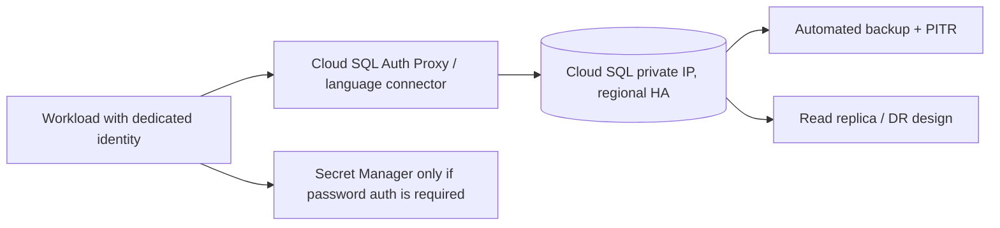

# GCP storage, databases, and recovery

## 1. Choose by access pattern

| Service | Data model and fit | Design checks |
|---|---|---|
| Cloud Storage | Objects, backups, data lake | IAM, lifecycle, versioning/retention, access path |
| Cloud SQL | Managed relational engines | Connection limits, HA, private IP, backup/PITR, replicas |
| AlloyDB | PostgreSQL-compatible higher-performance relational workloads | Compatibility, regional design, cost and operational fit |
| Spanner | Horizontally scalable relational semantics | Schema/key design, transaction patterns, latency and cost |
| Firestore | Document access patterns | Query/index design, rules/IAM, consistency and quotas |
| Bigtable | High-scale wide-column access | Row-key distribution, hot spotting, replication |
| BigQuery | Analytical warehouse | Partitioning, bytes scanned, dataset controls, job governance |

Service names are not interchangeable database choices. Model read/write patterns, transaction boundaries, expected size/throughput, latency, consistency, retention, and recovery before selection.

## 2. Cloud SQL private-access architecture

The Auth Proxy/connector provides secure connection establishment and IAM integration; it does not itself grant database SQL privileges or make a public instance private. Use database users/roles and network controls together. Prefer IAM database authentication where supported and operationally appropriate.

## 3. Recovery design

Write down RPO/RTO per dataset. Configure automated backups and point-in-time recovery as supported. Replicas serve specific availability/read-scaling/DR patterns but do not replace independent backups. Protect backups from production administrator deletion where required. Schedule restore tests into an isolated project/network and verify application-level integrity, not only that a database starts.

## 4. Cloud Storage controls

Use uniform bucket-level access unless there is a justified legacy need; enable public access prevention; grant narrowly scoped IAM; consider retention policies/holds only with legal/operational review; and select lifecycle rules based on access evidence. Versioning increases recovery options and storage cost. A retention lock may be irreversible—test with non-production data and governance approval.

## 5. DB deployment and migration

Use expand/contract schema changes: add compatible schema, deploy readers/writers compatible with both, migrate data, then remove old schema in a later release. Bound connection pools; serverless instance scale can overwhelm database connection limits. Test migration duration, lock behavior, rollback path, and backup before production.

## Troubleshooting

**Application cannot connect to Cloud SQL:** verify DNS/IP, private service access, VPC route/connector, database connector enforcement, instance state, IAM connection permission, database user auth, TLS, connection limit, and server-side logs. Distinguish network timeout from permission/auth failure.

## Revision

HA is not backup; replica is not restore test; Cloud SQL connector authorization is distinct from SQL grants; object versioning costs storage; analytics and OLTP have different workload patterns; measure recovery time with an actual restore.
