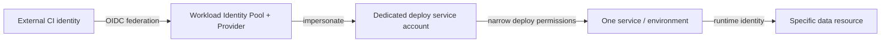

# GCP IAM and workload security

## 1. Principal, role, resource: reason about the binding

An IAM binding relates a **principal** to a **role** on a **resource**, optionally with a condition. Permissions accumulate through resource ancestry; inspect inherited grants. Prefer Google-managed predefined roles when they fit, custom roles only when justified and maintained. Avoid primitive Owner/Editor/Viewer for workload identities.



Separate CI build and deploy identities from the runtime identity. A runtime service account should access only resources the application needs; the deployment identity should not inherit runtime data access without reason.

## 2. Keyless CI with Workload Identity Federation

Use a workload identity provider with a condition restricting issuer, audience, repository/project, branch or protected environment. Grant `roles/iam.workloadIdentityUser` on one dedicated service account to the tightly constrained federated principal set. Grant that service account only required target permissions.

Illustrative trust conditions must be adapted to the CI issuer's exact claims:

```text
assertion.repository == 'ORG/REPO' &&
assertion.ref == 'refs/heads/main'
```

Do not copy this expression without verifying claim names and immutability. Test both an allowed identity and a fork/untrusted branch; the latter must fail to impersonate. Audit service-account impersonation and rotate/delete legacy keys after migration.

## 3. Human access, service agents, and break-glass

- Use groups for human access and grant at the narrowest level that supports operations.
- Restrict who can grant roles (`setIamPolicy`) and who can create service-account keys.
- Service agents are Google-managed identities required by services; do not remove their roles blindly.
- Break-glass access should be rare, MFA protected, monitored, tested, and documented.
- Review IAM changes and periodically remove stale principals, bindings, and unused service accounts.

## 4. Secrets and encryption

Keep application secrets in Secret Manager, grant runtime identity access to specific secrets, and rotate with a tested rollout. Avoid printing secret payloads. CMEK is appropriate when key lifecycle/control requirements justify its operational burden; verify the service-agent permissions and key availability path. Encryption at rest does not prevent authorized principal misuse.

## 5. Audit and detection

Route Admin Activity and relevant Data Access audit logs centrally. Data Access logging may need explicit enablement and has volume/cost implications. Protect the log project from workload administrators. Use Security Command Center/Cloud Asset Inventory and policy tooling according to organizational controls; alerts need owner and response procedure.

## 6. Troubleshooting IAM denials

1. Capture the exact API, resource, principal, timestamp, and error reason.
2. Confirm the caller identity (human, service account, service agent, or federated subject).
3. Check role permissions, resource scope, inherited/conditional bindings, deny policy, and organization policy.
4. Check service-account impersonation separately from the target API permission.
5. Inspect audit logs and service-specific prerequisites/API enablement.
6. Grant the minimum missing permission at the narrowest scope; verify with positive and negative tests.

Never resolve a denial by broadening all identities or making a resource public.

## Revision

Authentication identifies the caller; IAM authorizes actions; federation exchanges external identity for short-lived access; impersonation has its own permission; a service account is not a key; Secret Manager controls access but consumers can still leak retrieved values.
