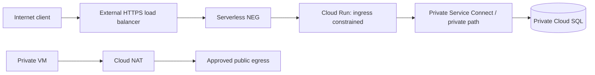

# GCP VPC networking: production design and diagnosis

## 1. VPC fundamentals

VPC networks are global; subnets are regional. Firewall rules are stateful and apply to VPC resources according to direction, priority, targets, and source/destination selectors. Routes determine next hop. Cloud NAT provides outbound internet translation for eligible private resources; it does not accept unsolicited inbound connections. Private Google Access and Private Service Connect solve different private service access patterns.

This is a conceptual composition: not every service path uses PSC. Follow the exact service's supported private connectivity method and DNS requirements.

## 2. Address and routing plan

Before creating subnets, inventory on-premises, peered VPCs, service ranges, Pod/Service CIDRs, and future regions. Prevent overlapping CIDRs. Define who owns route advertisement and DNS zones. Prefer custom-mode VPCs for controlled production addressing. Avoid broad `0.0.0.0/0` ingress and undocumented static routes.

## 3. Ingress and egress controls

- Terminate public HTTP(S) at a managed load balancer with TLS policy, health checks, and appropriate WAF controls.
- Use firewall policies/rules with explicit targets and source ranges; review implied rules and rule priority.
- Restrict egress by architecture and risk; NAT is address translation, not an egress security policy.
- Use Cloud DNS/private zones consistently across shared VPC and hybrid resolution.
- Monitor flow logs where appropriate; sample/retention affect cost and investigative coverage.

## 4. Hybrid connectivity

Cloud VPN is encrypted connectivity over internet; Cloud Interconnect provides dedicated connectivity with its own redundancy design. Cloud Router exchanges routes using BGP but does not encrypt traffic. Document route advertisement, failover timers, MTU, asymmetric routing, and DNS forwarding. Test loss of each tunnel/attachment, not only the healthy path.

## 5. Connectivity runbook: client times out

1. Identify source/destination IP, port, protocol, timestamp, and whether the failure is timeout, refusal, DNS, or TLS.
2. Resolve DNS from the actual workload network namespace.
3. Verify subnet, route, next hop, peering/PSC/hybrid route, and return path.
4. Check hierarchical/VPC firewall policy, network tags/service-account targets, priority, and egress rules.
5. Verify the target is listening on the expected interface/port and its health check passes.
6. Inspect VPC Flow Logs/firewall logs and load-balancer/backend logs if enabled.
7. Test a narrow correction and remove temporary rules immediately.

Do not open all ingress as a test. ICMP reachability does not prove TCP/application connectivity.

## 6. Revision

Global VPC ≠ global subnet; route ≠ firewall permission; Cloud NAT ≠ inbound path; Private Google Access ≠ general private endpoint; VPC peering is not transitive; Cloud Router exchanges routes but does not provide VPN encryption.
