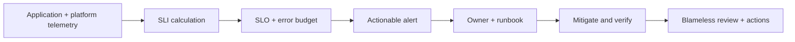

# GCP operations: telemetry, SLOs, and incident response

## 1. Signals and ownership

Use metrics for trends and saturation, logs for discrete event detail, traces for request dependency paths, and audit logs for control-plane actions. Define an owner, retention class, access control, and cardinality/volume budget for each signal. Centralize critical audit/security logs so workload administrators cannot erase their own evidence.

## 2. SLO-first monitoring

Choose user-visible SLIs: availability, request latency percentile, correctness, or freshness. Define a service-level objective and evaluation window; derive alert thresholds from error-budget policy. Page only on actionable, urgent impact; route lower urgency to tickets/dashboards. Add deployment and dependency context.

## 3. Incident runbook template

1. **Declare:** service, severity, time started, user impact, incident commander, communications owner.
2. **Stabilize:** freeze risky changes; choose reversible mitigation; preserve logs and change history.
3. **Diagnose:** compare healthy/broken revisions, region/zone, dependency SLIs, saturation, quotas, and audit/change events.
4. **Recover:** roll back or fail over using documented controls; avoid simultaneous speculative changes.
5. **Verify:** confirm user-facing SLI recovery and data integrity; monitor for recurrence.
6. **Learn:** document contributing factors, detection gaps, and owned actions with due dates and validation.

## 4. Backup and disaster recovery

For each service, record supported backup type, consistency, encryption, location, retention, access principal, deletion protections, restore steps, and dependencies. Conduct scheduled restore exercises into an isolated environment. Measure achieved RPO/RTO; do not infer them from configuration.

## 5. Operational troubleshooting

**Latency increase:** segment by method/route/region/revision; inspect p50/p95/p99, queueing, downstream traces, saturation, and recent changes. **Missing logs:** check agent/collector, exclusion filters, permissions, quota, sink destination and time bounds. **Noisy alerts:** verify SLI, window, missing-data behavior, grouping, ownership and actionable runbook.

## Revision

Logs ≠ metrics ≠ traces ≠ audit trail; alert on user impact; availability is not correctness; backup configured is not restore verified; incident action should be reversible, owned, and measurable.
