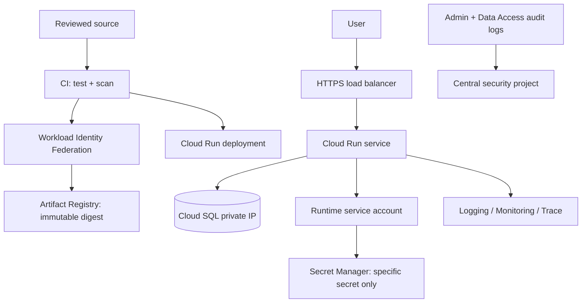

# GCP production-pattern lab: private web service

> Run only in a dedicated sandbox project with permission to create resources. This guide is intentionally a design-and-exercise lab; it does not silently create billable cloud resources. Check current service pricing and clean up resources when finished.

## Objective and acceptance criteria

Deploy a small stateless service with HTTPS ingress, private data access, keyless CI identity, actionable telemetry, and a tested rollback/recovery plan.

Acceptance criteria:

- No long-lived cloud service-account key exists for CI.
- Database is not publicly addressable.
- Runtime identity has only required data permissions.
- One immutable artifact is promoted through stages.
- SLO dashboard/alert and audit events are discoverable.
- A failed deploy can be rolled back without losing data.

## Architecture

Decide first whether a public Cloud Run endpoint behind a managed HTTPS load balancer meets the requirement; enforce ingress so users cannot bypass intended edge controls. For private database connectivity, select and test a supported Cloud SQL connectivity pattern for the chosen runtime and region.

## Phase A: design review before provisioning

1. Create a sandbox project under the correct organization/folder, link billing, set budget alert and quotas.
2. List APIs, resource names, region, expected monthly usage, and teardown commands.
3. Draw identity paths for human operator, CI deployer, and runtime service.
4. Specify ingress and egress; identify DNS, certificate, and private networking prerequisites.
5. Write RPO/RTO and decide which data can be disposable in the lab.
6. Review current service documentation for region support and network limitations.

## Phase B: deploy in controlled increments

1. Provision project/network/identity with reviewed Terraform and protected remote state.
2. Build a minimal container; run tests and vulnerability/dependency scans.
3. Push to Artifact Registry and record the digest/SBOM.
4. Configure federation with a claim condition for the trusted repository and protected branch.
5. Deploy a non-production revision with a dedicated runtime identity and explicit scaling/ingress limits.
6. Add database connectivity and schema migrations only after application health is observable.
7. Enable dashboards, alert routing, and relevant audit log sinks.

Avoid copying credentials into `terraform.tfvars`, shell history, or build logs. Keep plans/state access restricted.

## Phase C: verification tests

| Test | Expected outcome |
|---|---|
| Anonymous request to protected endpoint | Rejected |
| Trusted CI branch federation | Can deploy only intended service/environment |
| Fork/untrusted branch federation | Cannot impersonate deploy identity |
| Runtime attempts unrelated secret access | Denied and auditable |
| Database public endpoint scan | No public route/address |
| Invalid readiness/failed revision | Traffic does not shift or rollback succeeds |
| Dependency outage | Bounded timeout/failure behavior; actionable alert |
| Restore exercise | RPO/RTO and data integrity verified |

## Incident scenario: bad deployment

Pause promotion. Compare candidate and known-good revisions, error ratio/latency, logs, traces, and deployment event. Shift traffic to the last known-good immutable digest if it is safe. Verify user SLI and database compatibility; do not assume rolling back application code reverses a schema change. Preserve evidence and create a blameless review with an owner and due date.

## Cost teardown checklist

Inventory billable compute, load balancers, databases, IPs, disks, logs, artifact storage, and backups. Export needed evidence, remove only lab-owned resources, confirm deletion, and inspect billing after cleanup. Do not delete shared organization/network resources.
