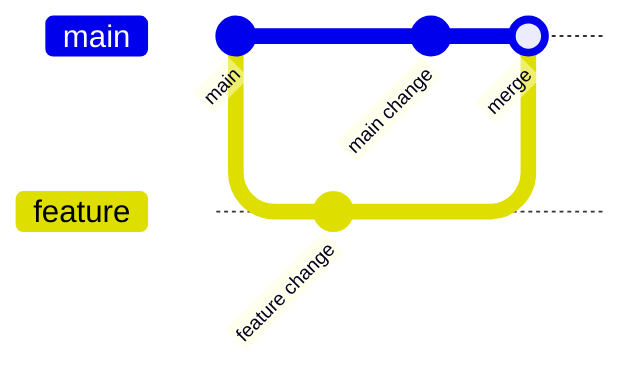

# Git for DevOps

## Mental model

Git stores a directed graph of commits. A branch is a movable name pointing to a commit; `HEAD` identifies the current checkout. The index (staging area) records the proposed next snapshot. A merge joins histories; a rebase recreates commits on a new base and therefore changes their IDs.

## Daily workflow

Inspect before changing: `git status`, `git diff`, and `git log --oneline --graph`. Stage deliberately (`git add -p` for partial changes), write focused commits, and fetch before integrating remote work. Resolve conflicts by understanding both intended changes, then run tests before completing the merge/rebase. Use `git revert` for a shared-history undo; reserve `reset` and force-push for carefully coordinated local-history changes.

## Useful tools

- `git show <commit>` inspects a change; `git blame` traces line history, not correctness.
- `git stash` temporarily shelves work; branches are usually clearer for longer tasks.
- `.gitignore` prevents untracked files from appearing, but does not remove already tracked secrets.
- Tags identify releases; signed commits/tags can add provenance when the organization verifies them.

## Safety and collaboration

Never commit credentials. If a secret was pushed, revoke/rotate it immediately; deleting a commit does not invalidate copied credentials. Protect default branches, require reviews and status checks, and use small commits to aid review and rollback. Before rewriting history, verify nobody depends on the branch.

## Practice

Create two feature branches from a shared base, make overlapping edits, resolve a conflict, and compare merge and rebase histories. Revert a bad commit without rewriting the shared branch.

## Further reading

[Pro Git book](https://git-scm.com/book/en/v2) · [Git reference](https://git-scm.com/docs)

## Topic roadmap, examples, and recovery

**Objects and refs:** blobs store file content, trees store directory structure, commits point to trees/parents, and annotated tags store metadata/signatures. Branches are refs, not copies of the whole repository. `git fetch` updates remote-tracking refs without integrating; `pull` fetches and integrates.

**Example—undo a shared mistake:** use `git revert <commit>` to create an inverse commit. For local unshared edits, `git restore` can discard work and `git reset` can move a branch; inspect status/diff first. `reflog` can often locate a recently moved local ref, but is not a backup.

**Conflict workflow:** inspect conflict markers and `git status`; compare each side and the merge base; edit to the intended combined behavior; run tests; stage resolved paths; complete merge/rebase. During rebase, `--ours`/`--theirs` perspective may surprise—inspect the actual commit sides before choosing.



**Troubleshooting:** `non-fast-forward` means remote history advanced—fetch, inspect divergence, then integrate. A secret committed but not pushed should be removed from history and rotated if real; if pushed, revoke/rotate immediately before considering history rewrite. `.gitignore` does not untrack a file already committed (`git rm --cached` does).

**Revision:** fetch downloads refs; merge preserves branch topology; rebase replays commits and changes IDs; revert is history-safe undo; reset moves a ref; stash is temporary; reflog is local recovery, not remote backup.

## Team workflow lab

```bash
git switch main
git fetch origin --prune
git pull --ff-only
git switch -c feature/health-check
# make a focused change
git diff --check
git diff
git add -p
git diff --cached
git commit -m "Add bounded health check"
git push -u origin feature/health-check
```

Before opening a pull request, run targeted tests, confirm no generated files/secrets are staged, and include risk/rollback notes. If the remote branch advanced, fetch and inspect the graph before integrating. Rebase rewrites your local commits and should not be used on a shared branch unless the team coordinates it.

## Secret exposure response

If a credential enters a commit: revoke/rotate immediately, assess access logs and scope, remove it from active code/history where appropriate, notify the security owner, and prevent recurrence with secret scanning. History rewrite does not invalidate a credential or erase clones/caches. Do not wait for a history cleanup before rotation.

## End-to-end team workflow

See [`process.md`](process.md) for the issue-to-release process, required review/test gates, conflict recovery, rollback, and leaked-secret response.

## Visual study cards

Browse the [10 original visual study cards](visuals/README.md) as SVG or PNG, covering architecture, workflow, security, delivery, observability, troubleshooting, recovery, resilience, scenarios, and revision.
