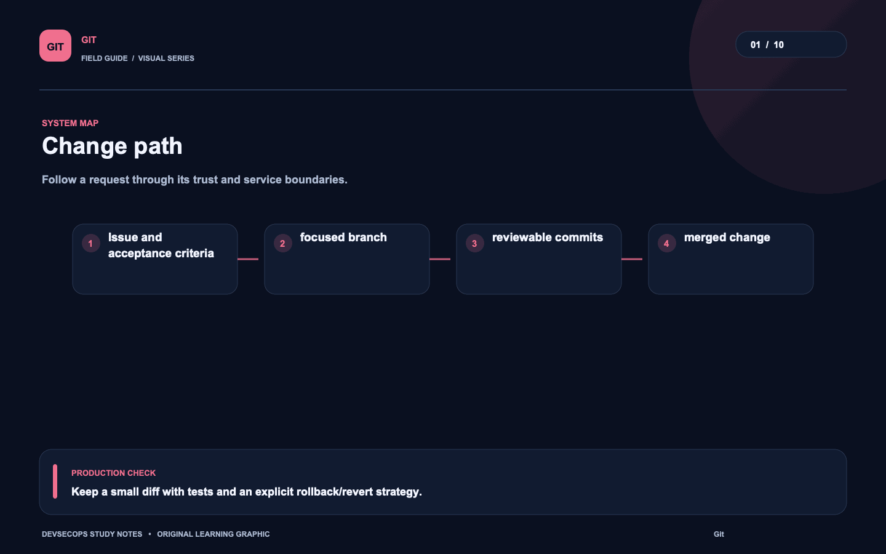
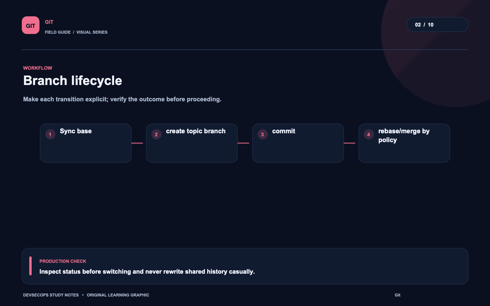
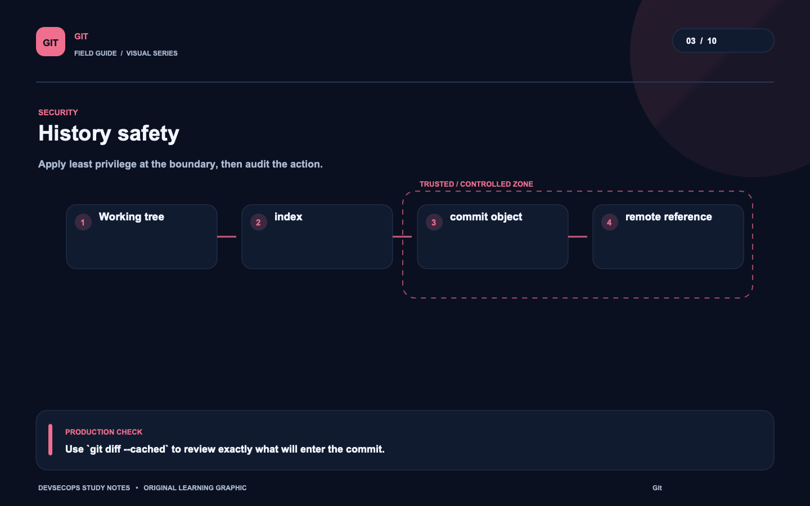
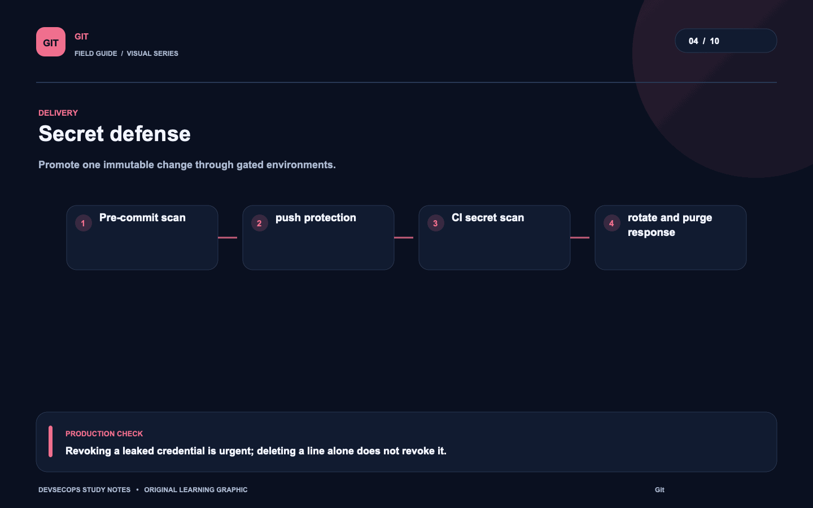
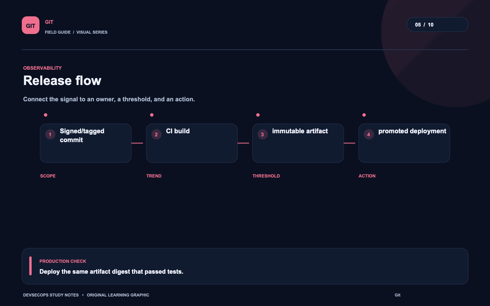
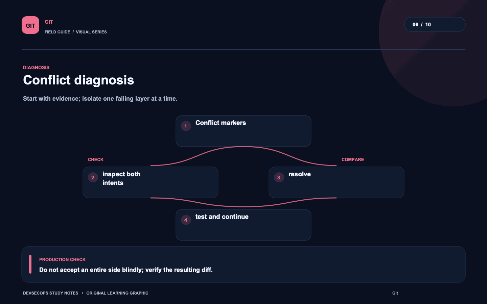
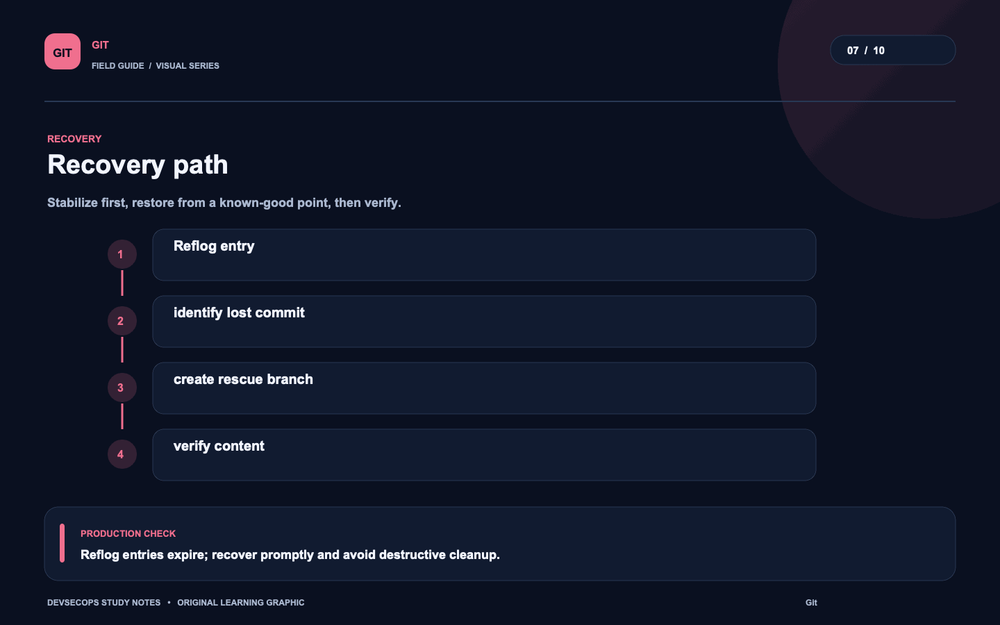
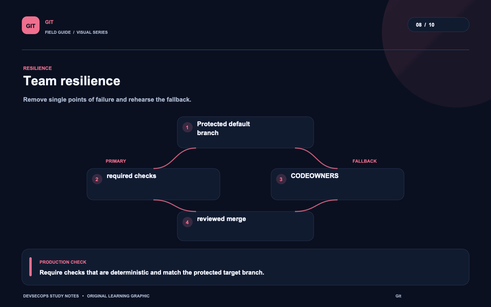
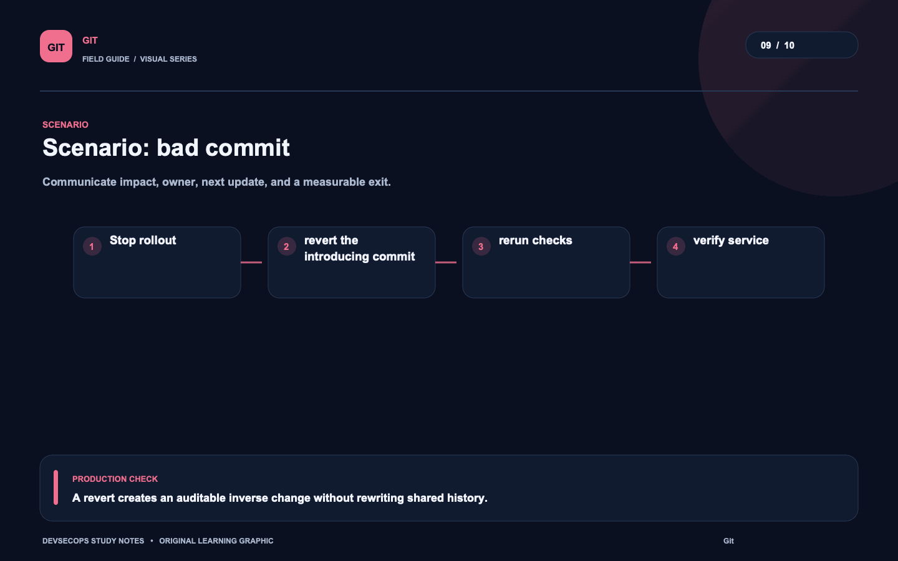
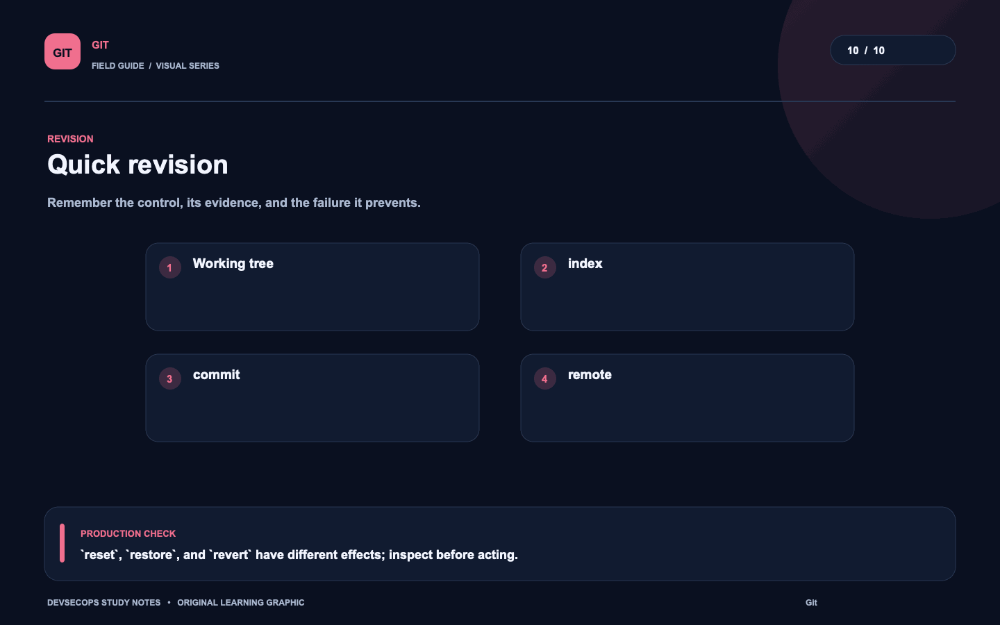

# Visual study cards

Ten original visuals for the [Git guide](../README.md). Open the SVG for a crisp, scalable version; use PNG for slides and quick viewing.

## 01. Change path

[SVG source](01-change-path.svg) · [PNG image](01-change-path.png)

## 02. Branch lifecycle

[SVG source](02-branch-lifecycle.svg) · [PNG image](02-branch-lifecycle.png)

## 03. History safety

[SVG source](03-history-safety.svg) · [PNG image](03-history-safety.png)

## 04. Secret defense

[SVG source](04-secret-defense.svg) · [PNG image](04-secret-defense.png)

## 05. Release flow

[SVG source](05-release-flow.svg) · [PNG image](05-release-flow.png)

## 06. Conflict diagnosis

[SVG source](06-conflict-diagnosis.svg) · [PNG image](06-conflict-diagnosis.png)

## 07. Recovery path

[SVG source](07-recovery-path.svg) · [PNG image](07-recovery-path.png)

## 08. Team resilience

[SVG source](08-team-resilience.svg) · [PNG image](08-team-resilience.png)

## 09. Scenario: bad commit

[SVG source](09-scenario-bad-commit.svg) · [PNG image](09-scenario-bad-commit.png)

## 10. Quick revision

[SVG source](10-quick-revision.svg) · [PNG image](10-quick-revision.png)
