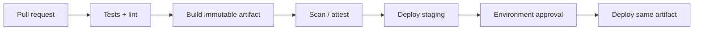

# GitHub Actions for CI/CD

## Mental model

An event starts a workflow; jobs run on hosted or self-hosted runners; steps execute actions or shell commands. Jobs can run in parallel or depend on earlier jobs. Workflows are defined as YAML under `.github/workflows/`, so they are code and require review.

## Workflow design

Use explicit event filters, path/branch conditions where appropriate, job permissions, timeouts, and concurrency groups. Separate validation from deployment. Cache dependencies to improve speed, but never treat a cache as a trusted artifact. Pass data through artifacts with retention appropriate to the use case. Use environments for production approvals and protected environment secrets.

```yaml
permissions:
  contents: read

jobs:
  test:
    runs-on: ubuntu-latest
    timeout-minutes: 10
    steps:
      - uses: actions/checkout@v4
      - run: ./scripts/test.sh
```

Tune `permissions` to the minimum required at workflow/job level. Pin actions to immutable SHAs when policy calls for it. Avoid interpolating untrusted event fields directly into shell commands; pass values through environment variables and validate them. Fork pull requests should not receive secrets. Self-hosted runners need isolation, cleanup, patching, and restricted network access.

## Delivery pattern

Test and scan once, publish an immutable artifact, then promote that artifact through environments. Use OIDC federation for short-lived cloud credentials rather than stored cloud keys. Make deployments idempotent and provide a rollback route.

## Practice

Build a test-and-release pipeline with least-privilege permissions, dependency caching, artifact upload, a protected production environment, and a fork-PR safety check.

## Further reading

[GitHub Actions documentation](https://docs.github.com/actions) · [Security hardening](https://docs.github.com/actions/security-guides/security-hardening-for-github-actions)

## Topic roadmap and secure pipeline example

**Events and execution:** `on` selects triggers; filters and `if` conditions control scope; `needs` forms a job DAG; runners execute steps; artifacts carry outputs across jobs. Pin action versions, set `timeout-minutes`, and use `concurrency` to prevent overlapping deployments.

**Webhooks:** GitHub sends event payloads to configured endpoints. Verify the signature over the exact raw request body using a protected secret, reject invalid signatures, and respond promptly before processing asynchronously. Deduplicate deliveries by delivery ID, tolerate retries, and return success only after durable acceptance. Do not trust event payloads as authorization; fetch current resource state through a scoped API identity when needed. Protect webhook secrets and avoid logging full payloads.



Use `GITHUB_TOKEN` permissions minimally. OIDC tokens can exchange workflow identity for short-lived cloud credentials; trust policies should constrain repository, branch/environment, and audience. Treat cache/artifact contents from untrusted PRs as untrusted. Avoid constructing shell code from `${{ }}` expressions; pass untrusted values via environment and validate/quote them. Composite actions and reusable workflows need version and permission review too.

**Troubleshooting:** job stuck—check runner labels/capacity and concurrency; auth denied—inspect token scope, event type (forks), OIDC subject/audience, and environment protection; artifact not found—check job dependency, artifact name/retention, and run ID; intermittent test—separate product/test/runner causes before adding retries.

**Revision:** workflow YAML is executable policy; `needs` controls dependency order; environment approval protects deployment, not build; secrets masking does not prevent exfiltration; pinning protects against mutable action tags.

## Copyable validation workflow

See [`examples/ci.yml`](examples/ci.yml). It runs tests with a read-only token and pins checkout to a reviewed immutable commit. Review and update pinned action SHAs through your dependency process; verify the SHA corresponds to the intended upstream release. The example intentionally has no deployment credentials or cloud permission.

## Webhook receiver controls

For a webhook receiver, verify the provider's signature against the **exact raw request bytes** before parsing JSON, using a constant-time comparison. Enforce body-size limits, validate event type and schema, and durably enqueue before returning success. Persist delivery IDs to deduplicate retries; signatures authenticate origin/integrity but do not prevent replay. Keep the secret in a secret manager, rotate it, avoid logging payloads, and verify current repository/installation permissions before taking actions.

## End-to-end workflow setup

See [`process.md`](process.md) for workflow creation, least-privilege permission selection, validation, artifact promotion, protected deployment, and fork-PR testing.
