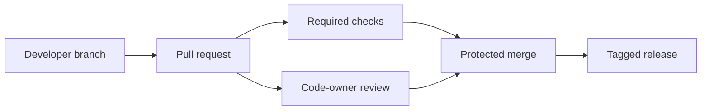

# GitHub for DevOps

## Mental model

GitHub hosts Git repositories and adds collaboration controls: pull requests, reviews, branch/ruleset protections, issues, releases, packages, and automation. Repository visibility and permission inheritance affect who can read code, secrets, and workflow output.

## Pull-request workflow

Keep changes small and explain intent, risk, and validation in the pull request. Use required reviews and checks on protected branches. Make CI status meaningful: it should test the proposed commit, not a stale branch. Prefer CODEOWNERS for routing expertise; it does not replace review policy. Use issues and projects to track work without placing credentials or sensitive operational details in public tickets.

## Identity and supply chain

Grant teams the minimum repository/org permissions needed. Use SSO and short-lived authentication where available; rotate and scope tokens. Protect Actions secrets, environments, and deployment approvals. Pin third-party Actions to a reviewed full commit SHA when stronger supply-chain assurance is required. Review dependency updates and verify release artifacts/provenance.

## Operations

Define a release process: version/tag, changelog, artifact, and rollback instructions. Use releases for durable distribution and packages for versioned artifacts. Audit organization settings, outside collaborators, deploy keys, webhooks, and app installations periodically.

## Practice

Configure a protected default branch with required tests and review, add CODEOWNERS, and create a release workflow. Demonstrate that a forked pull request cannot access deployment secrets and that a release can be traced to a reviewed commit.

## Further reading

[GitHub Docs](https://docs.github.com/) · [Repository rulesets](https://docs.github.com/repositories/configuring-branches-and-merges-in-your-repository)

## Topic roadmap and operating examples

**Collaboration:** issue → branch → pull request → required review/checks → merge → release. Use templates and labels to capture context, not as a replacement for clear ownership. CODEOWNERS requests expertise; branch rules/rulesets enforce merge conditions.

**Repository administration:** use teams and least-privilege roles, audit outside collaborators and app installations, and separate private deployment environments. Releases should point to a reviewed commit and identify artifact digests. Packages have independent access/retention considerations.

**Example:** a pull request modifies a workflow. Review its `permissions`, action references, event triggers, and whether untrusted code can access secrets—not only application source changes. A read-only `pull_request` workflow is safer than granting write tokens to arbitrary PR code.

**Troubleshooting:** required check missing—verify exact check name, event execution, and whether the commit is current. A workflow did not run—inspect branch/path filters and fork restrictions. A collaborator cannot clone—check org SSO authorization, team/repo permission, and identity state; do not issue an oversized token as a workaround.

**Revision:** authentication answers who; authorization answers what; branch protection/rulesets gate changes; Actions secrets are not safe from code that is allowed to read them; a release tag is useful only if tied to a verified source and artifact.
