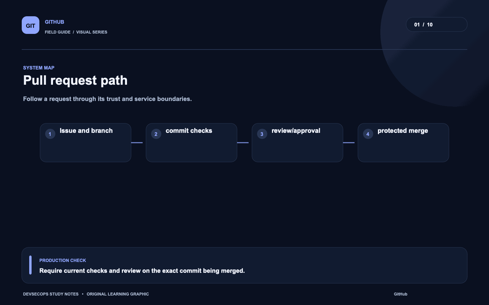
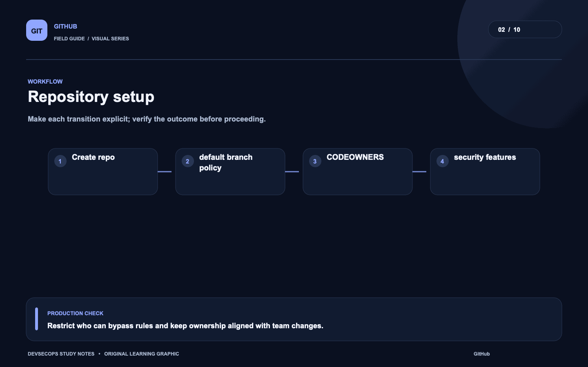
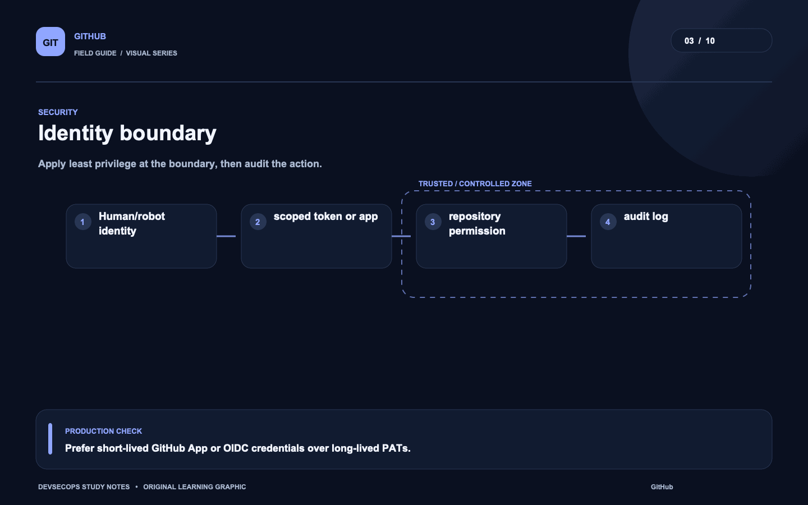
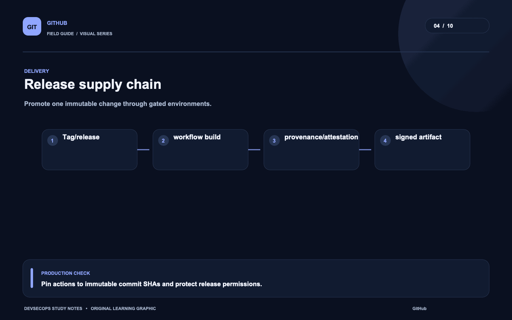
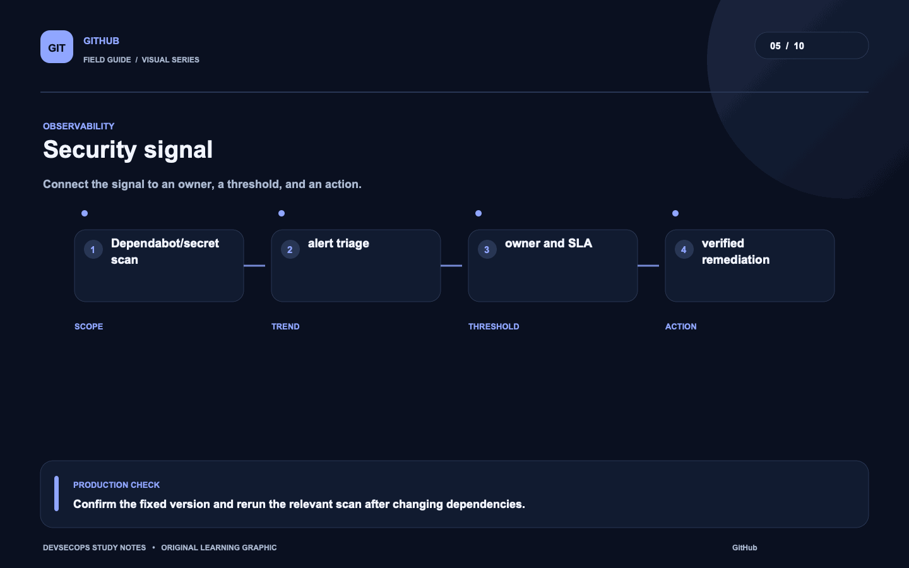
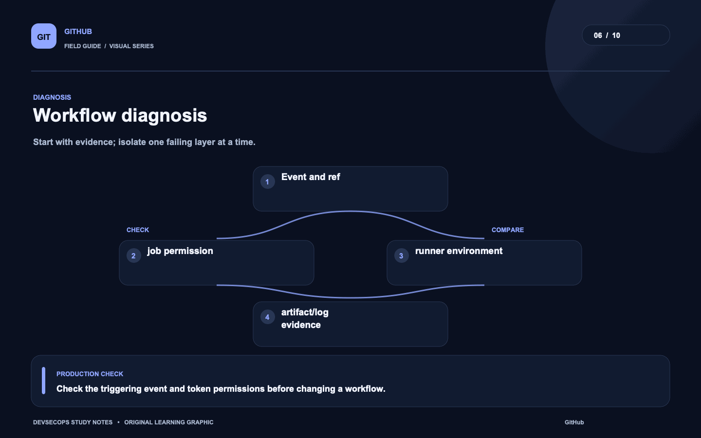
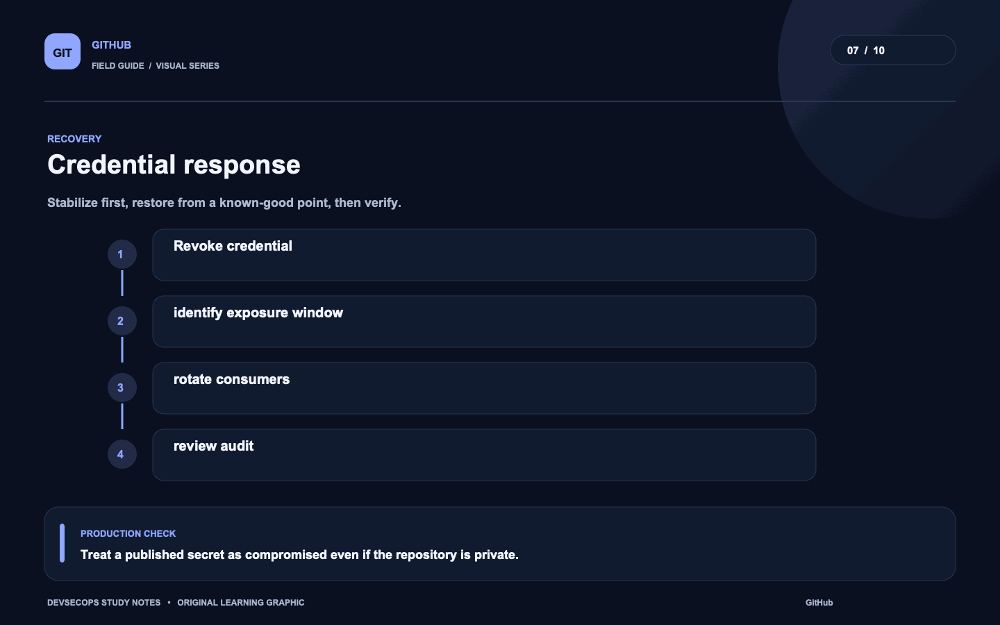
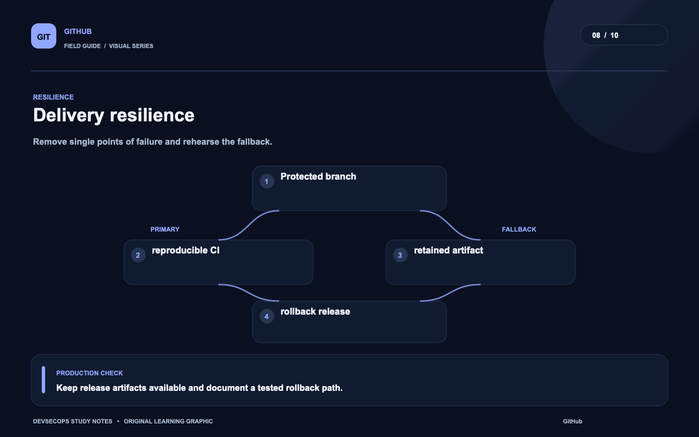
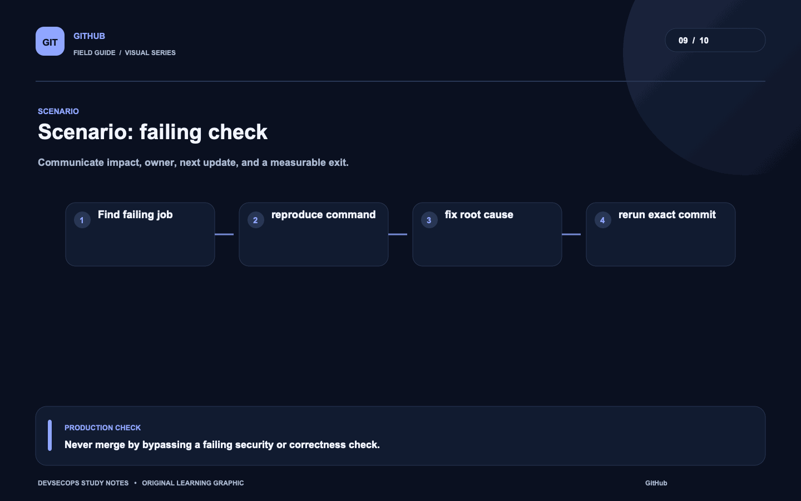
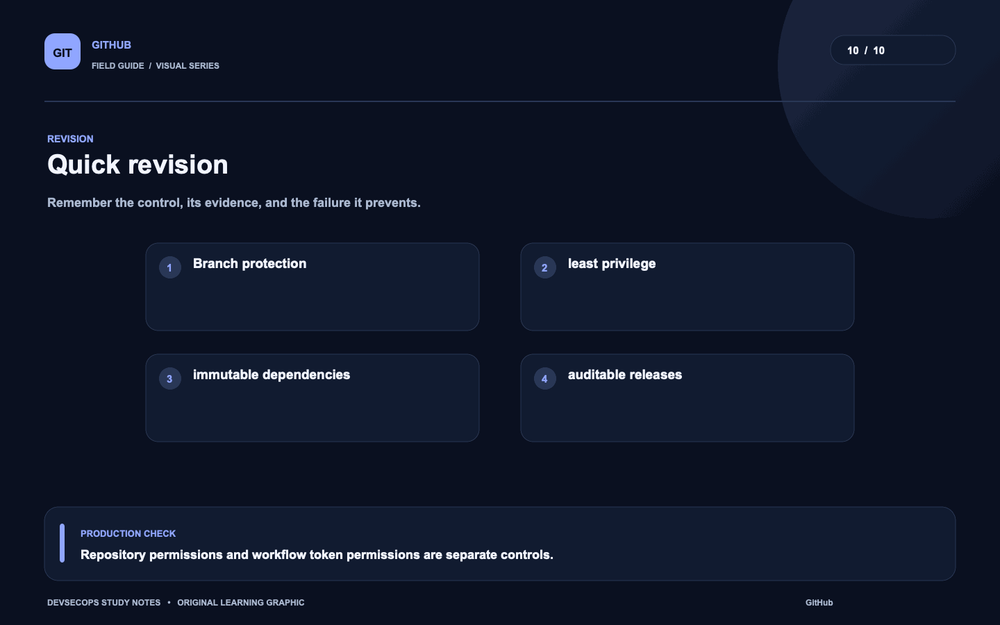

# Visual study cards

Ten original visuals for the [GitHub guide](../README.md). Open the SVG for a crisp, scalable version; use PNG for slides and quick viewing.

## 01. Pull request path

[SVG source](01-pull-request-path.svg) · [PNG image](01-pull-request-path.png)

## 02. Repository setup

[SVG source](02-repository-setup.svg) · [PNG image](02-repository-setup.png)

## 03. Identity boundary

[SVG source](03-identity-boundary.svg) · [PNG image](03-identity-boundary.png)

## 04. Release supply chain

[SVG source](04-release-supply-chain.svg) · [PNG image](04-release-supply-chain.png)

## 05. Security signal

[SVG source](05-security-signal.svg) · [PNG image](05-security-signal.png)

## 06. Workflow diagnosis

[SVG source](06-workflow-diagnosis.svg) · [PNG image](06-workflow-diagnosis.png)

## 07. Credential response

[SVG source](07-credential-response.svg) · [PNG image](07-credential-response.png)

## 08. Delivery resilience

[SVG source](08-delivery-resilience.svg) · [PNG image](08-delivery-resilience.png)

## 09. Scenario: failing check

[SVG source](09-scenario-failing-check.svg) · [PNG image](09-scenario-failing-check.png)

## 10. Quick revision

[SVG source](10-quick-revision.svg) · [PNG image](10-quick-revision.png)
