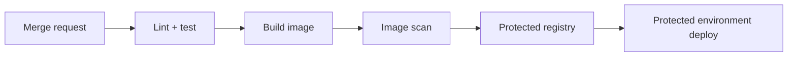

# GitLab for DevOps

## Mental model

GitLab combines source management, merge requests, CI/CD, registries, security features, and project planning. A `.gitlab-ci.yml` file describes pipelines as stages and jobs; runners execute jobs using shell, Docker, Kubernetes, or other executors. Runner configuration defines an important trust boundary.

## Pipeline workflow

Start with deterministic stages such as validate, test, package, scan, and deploy. Use `rules` to express when jobs run; avoid brittle combinations of legacy-only/except logic. Cache reusable dependencies, but publish build outputs as artifacts. Make dependencies between jobs explicit with `needs` where it improves graph execution. Scope artifacts and retain them only as long as needed.

## Security and release controls

Protect branches, tags, environments, and CI variables. Masking is not a substitute for restricting who can run jobs or view logs. Never expose secrets to untrusted merge-request code. Use isolated, ephemeral runners for untrusted workloads; privileged Docker-in-Docker and persistent runners need extra scrutiny. Prefer short-lived OIDC-based cloud identity when supported. Scan dependencies, containers, and IaC, and make findings actionable through policy.

## Operations

Monitor runner capacity and queue time, and keep runners patched. Keep deployment credentials separate from build credentials. Promote immutable artifacts rather than rebuilding independently for production. Define manual approvals and rollback behavior for production.

## Practice

Build a pipeline that tests a merge request, produces one image digest, scans it, and deploys that exact digest to a staging environment. Verify an untrusted fork cannot access protected variables.

## Further reading

[GitLab CI/CD documentation](https://docs.gitlab.com/ci/) · [Pipeline security](https://docs.gitlab.com/ci/pipeline_security/)

## Topic roadmap and pipeline example

**Pipeline concepts:** stages provide a familiar sequence; jobs in a stage may run concurrently; `needs` creates a DAG; `rules` determines job inclusion; artifacts pass build outputs; caches accelerate dependency reuse. Use includes/components for shared policy, with pinned/reviewed versions.

Use protected variables only in trusted refs/environments. A masked variable can still be printed, transformed, or exfiltrated by malicious job code. Ensure fork/MR pipelines have no production credentials. Isolate shared runners and prohibit privileged container execution for untrusted projects. Use OIDC identity where available.

**Example:** a pipeline builds once and records the image digest; the deploy job consumes that exact digest rather than rebuilding. A production job should be protected by environment permissions and approval policy.

**Troubleshooting:** job pending—runner tags, capacity, project scope, and protected-runner eligibility; job omitted—evaluate each matching `rules` condition and pipeline source; artifact missing—check `needs`/dependencies, expiry, and job success; clone/push denied—check token permissions and protected branch/tag rules.

**Revision:** cache is disposable acceleration, artifact is an output; rules decide whether jobs exist; runner is part of the trust boundary; protected variables must never reach untrusted pipeline code.
