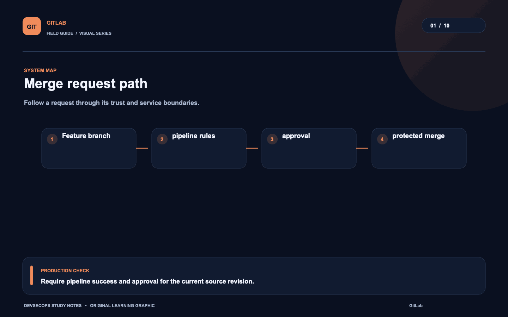
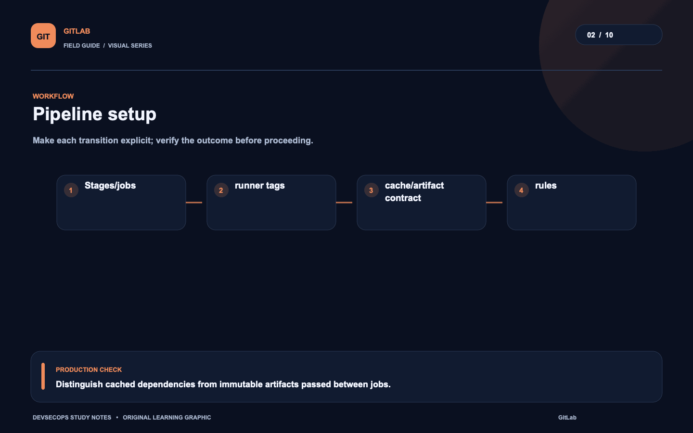
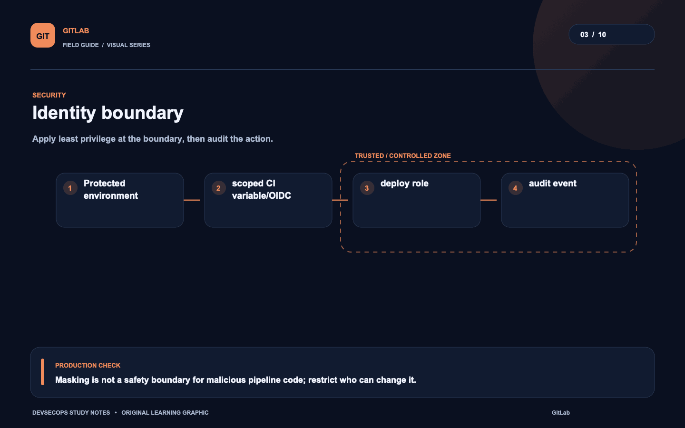
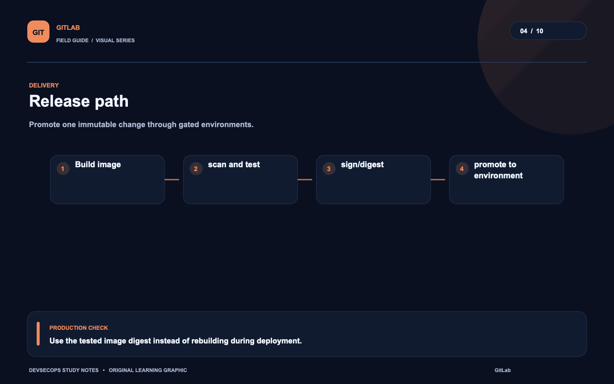
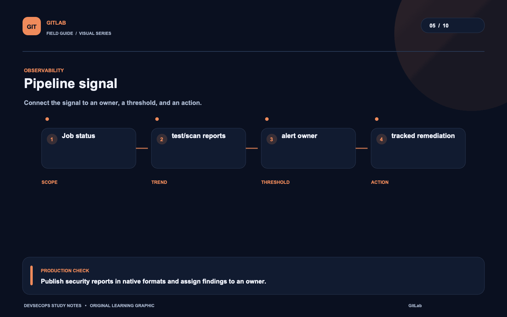
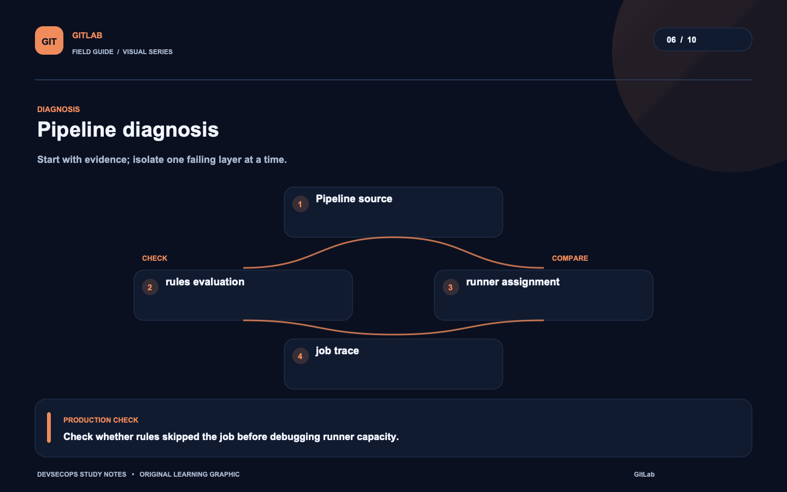
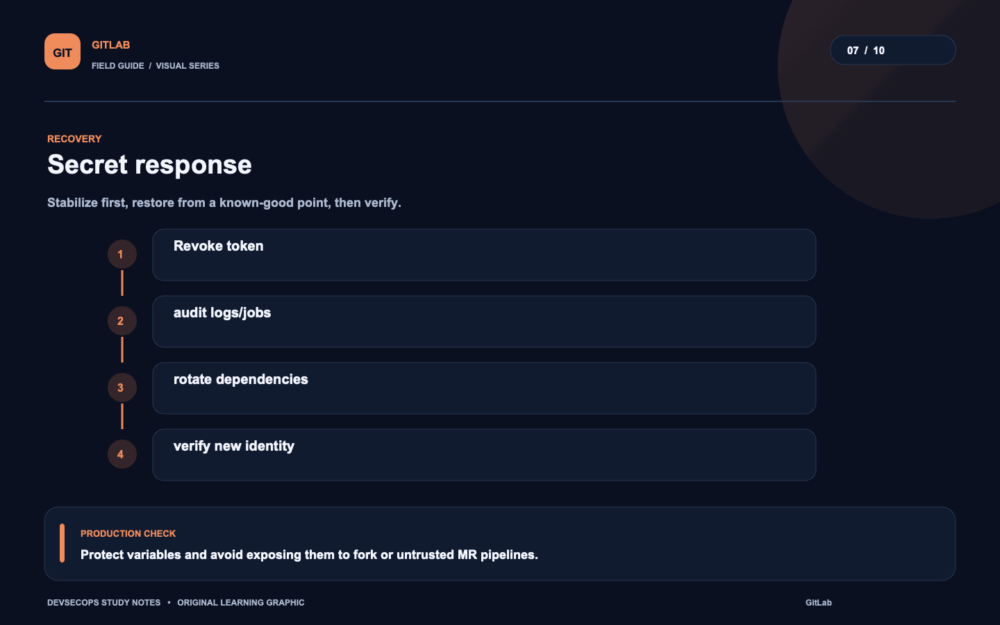
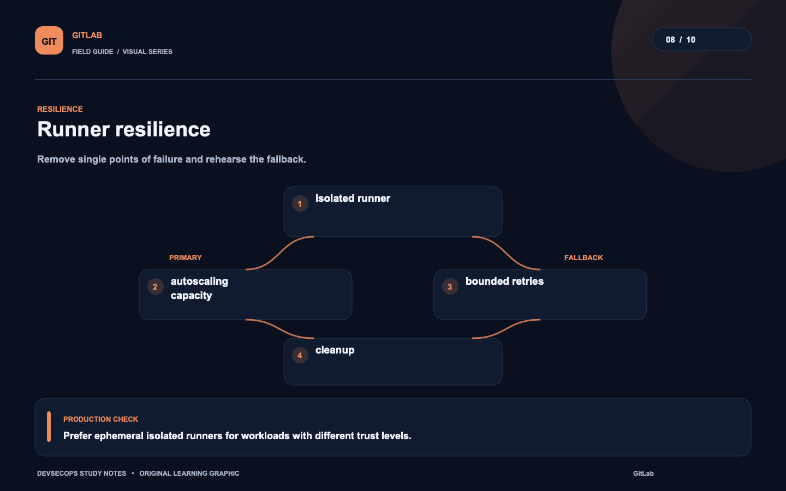
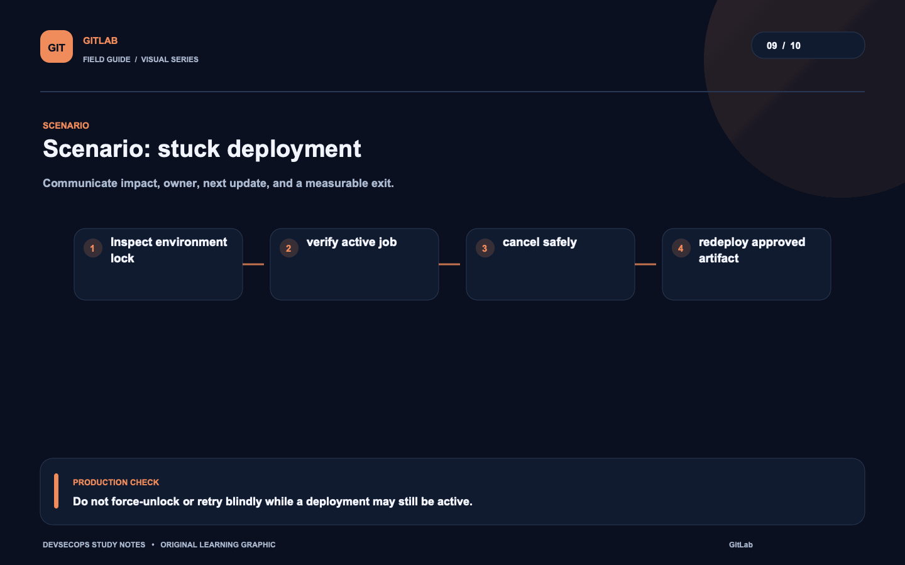
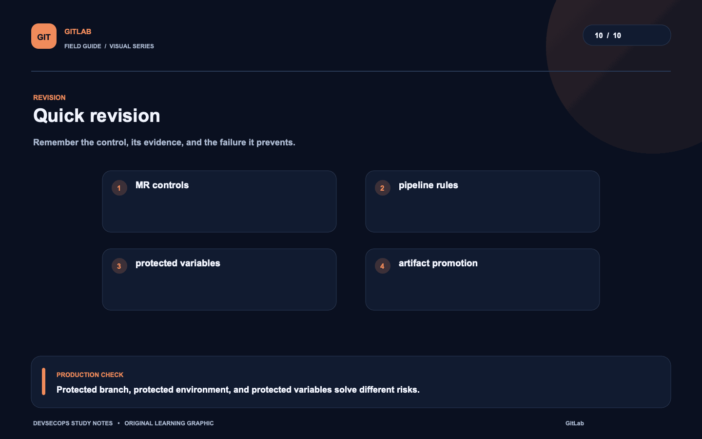

# Visual study cards

Ten original visuals for the [GitLab guide](../README.md). Open the SVG for a crisp, scalable version; use PNG for slides and quick viewing.

## 01. Merge request path

[SVG source](01-merge-request-path.svg) · [PNG image](01-merge-request-path.png)

## 02. Pipeline setup

[SVG source](02-pipeline-setup.svg) · [PNG image](02-pipeline-setup.png)

## 03. Identity boundary

[SVG source](03-identity-boundary.svg) · [PNG image](03-identity-boundary.png)

## 04. Release path

[SVG source](04-release-path.svg) · [PNG image](04-release-path.png)

## 05. Pipeline signal

[SVG source](05-pipeline-signal.svg) · [PNG image](05-pipeline-signal.png)

## 06. Pipeline diagnosis

[SVG source](06-pipeline-diagnosis.svg) · [PNG image](06-pipeline-diagnosis.png)

## 07. Secret response

[SVG source](07-secret-response.svg) · [PNG image](07-secret-response.png)

## 08. Runner resilience

[SVG source](08-runner-resilience.svg) · [PNG image](08-runner-resilience.png)

## 09. Scenario: stuck deployment

[SVG source](09-scenario-stuck-deployment.svg) · [PNG image](09-scenario-stuck-deployment.png)

## 10. Quick revision

[SVG source](10-quick-revision.svg) · [PNG image](10-quick-revision.png)
