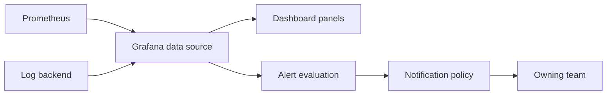

# Grafana

## Mental model

Grafana visualizes and explores data from configured data sources such as Prometheus, Loki, Elasticsearch, and cloud monitoring systems. Dashboards contain panels, queries, variables, and annotations. Grafana is a presentation and alerting layer; source data quality and retention remain responsibilities of the underlying systems.

## Build useful dashboards

Start from a user or operator question, not a chart type. Put service health and SLO signals first; add drill-downs for traffic, errors, latency, and saturation. Use consistent units, clear titles, meaningful time ranges, and labels. Variables should narrow a dashboard safely and predictably. Avoid a single dashboard with hundreds of panels or high-cardinality selectors that overload the data source.

Provision data sources, dashboards, folders, and alert rules as code for repeatability. Use stable UIDs and review changes. Set panel query limits and refresh intervals based on data freshness and backend capacity. Annotations can correlate deployments and incidents, but should be trustworthy.

## Alerting and access

Write alerts against actionable conditions, specify pending windows and recovery behavior, and route them to an owner with context/runbooks. Avoid duplicate pages for the same incident. Use folders/teams and least-privilege roles; protect data-source credentials and restrict public dashboard sharing. A dashboard is not an alerting strategy by itself.

## Practice

Create an SLO dashboard with request rate, error ratio, and latency, then add a linked drill-down and one actionable alert. Provision it in a test instance and verify the alert with both firing and recovery data.

## Further reading

[Grafana documentation](https://grafana.com/docs/grafana/latest/)

## Topic roadmap and dashboard example

**Data path:** a data source plugin queries a backend; dashboard variables parameterize queries; panels visualize results; transformations reshape returned data; alert rules evaluate conditions; contact points/routes deliver notifications. Provision data sources/folders/dashboards and alert rules as code to keep environments consistent.

**Example dashboard layout:** top row for SLO/error budget and active alerts; next row request rate, error ratio, latency percentiles; lower rows by dependency/region/version. Link panels to useful drill-downs, deployment annotations, and runbooks. Use dashboard variables with safe defaults, clear units, and meaningful time windows.

**Troubleshooting:** no data—verify time range, datasource permissions, query and labels; slow dashboard—inspect query cost, refresh frequency, cardinality and backend; alert differs from panel—compare rule evaluation interval, reducer, pending period, no-data/error handling; duplicate pages—review grouping, labels, routes, and inhibition.

**Revision:** dashboard informs; alert pages; datasource query semantics matter; provisioned config is reviewable; alert no-data behavior must be deliberate; dashboards should answer operational questions and link to action.

## Panel query cookbook

For a request-rate panel, query a counter with `sum by (service)(rate(http_requests_total[5m]))`. For error ratio, divide the filtered error rate by the total request rate, guarding low/no traffic and ensuring matching labels. For latency, use histogram buckets with `histogram_quantile(0.95, sum by (le, service)(rate(http_request_duration_seconds_bucket[5m])))`; confirm the application exports a Prometheus histogram. Label units explicitly and do not average quantiles from separate instances.

Provision folders, datasources, dashboards, and alert rules from version control. Validate dashboard JSON in CI and deploy to a test Grafana before production. Avoid committing data-source passwords; use environment/secret-provider integration. Set dashboard permissions and folder ownership deliberately.

## Incident workflow example

When an alert fires, dashboard should show SLI trend, affected service/region/revision, and deployment annotations. Link to the alert rule and runbook. During an incident, narrow dashboard variables and time range, compare healthy vs failing slices, and use trace/log links for drill-down. An empty panel may indicate no traffic, missing series, query error, or backend delay—not necessarily zero errors.
