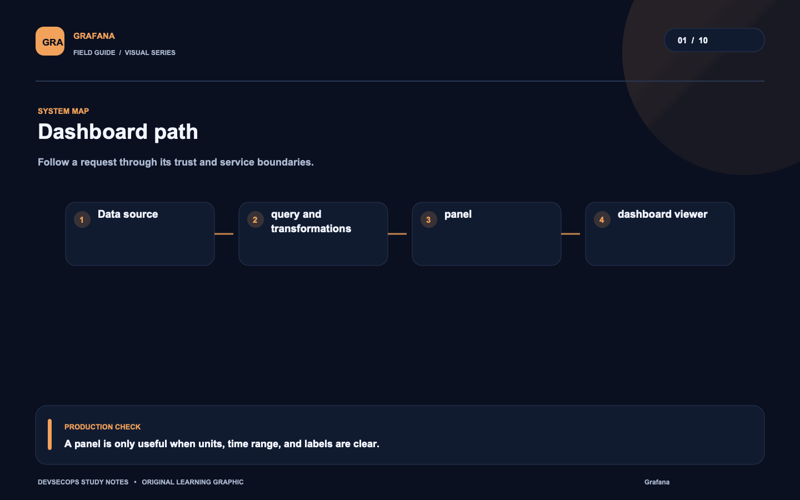
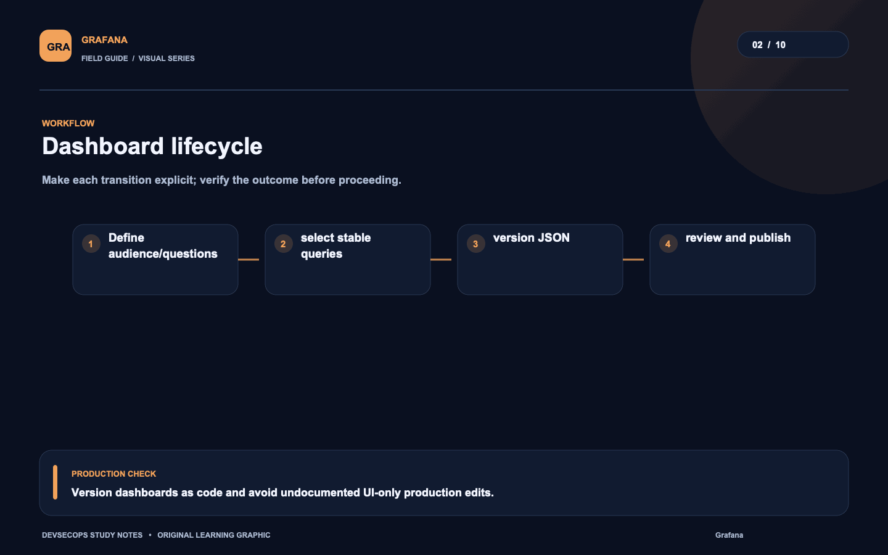
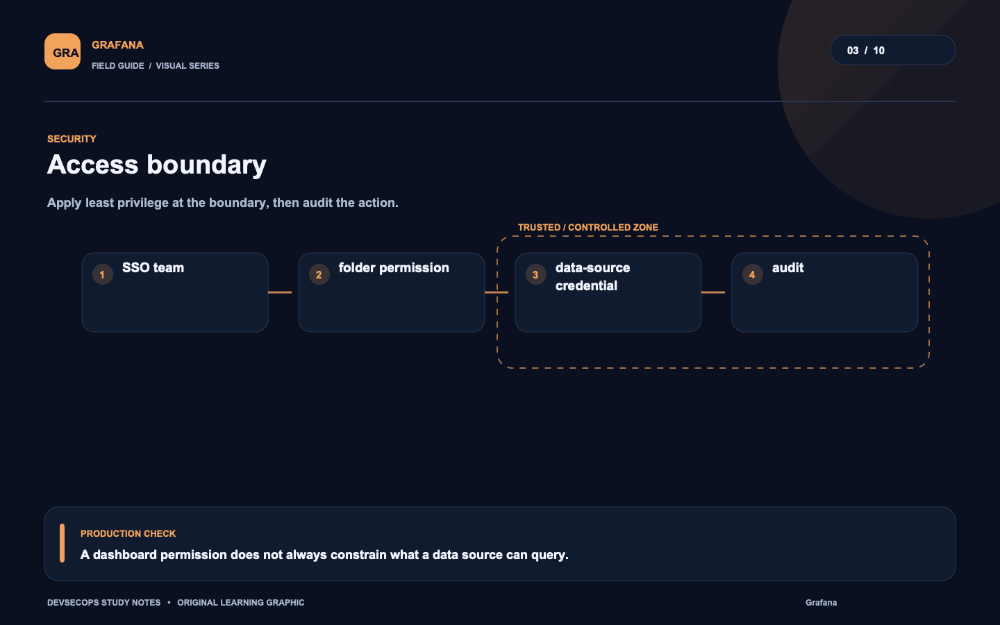
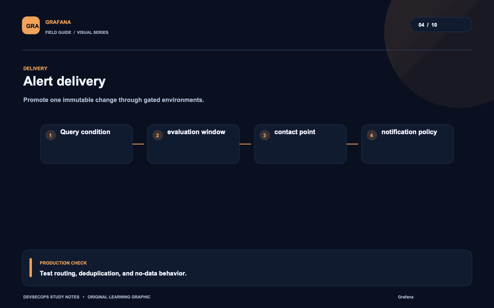
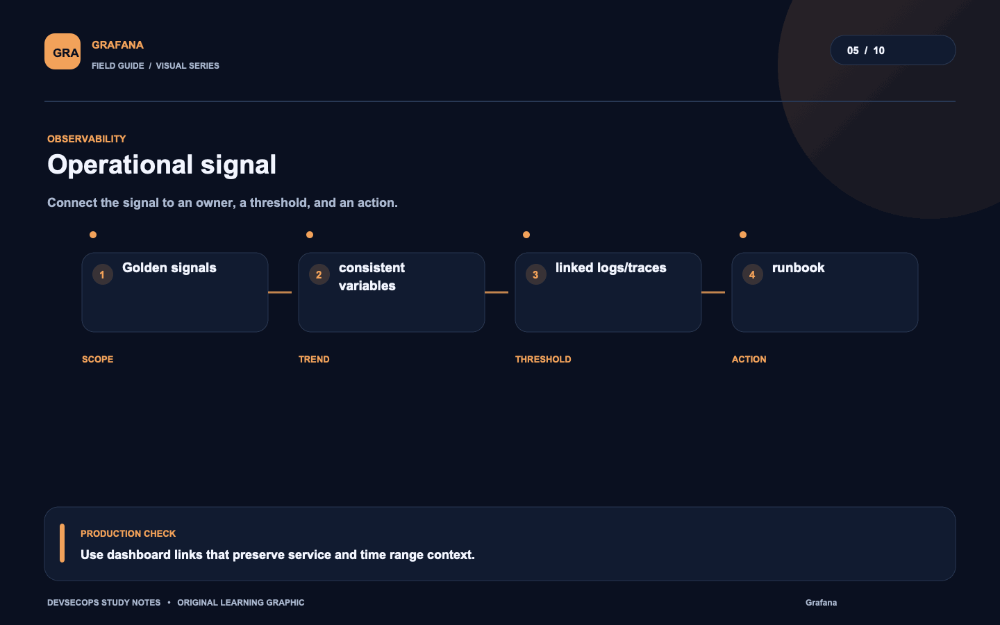
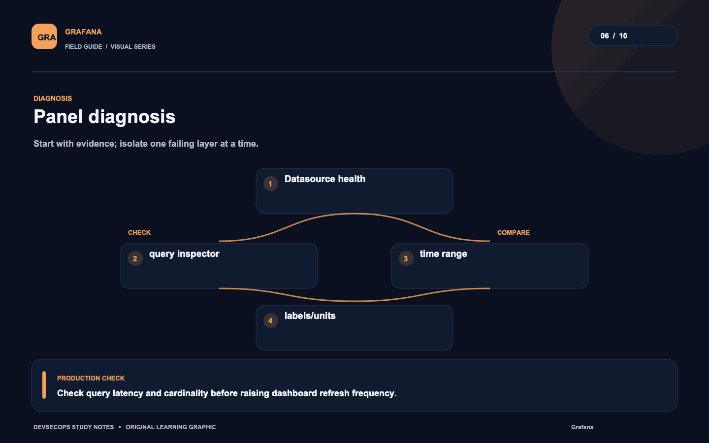
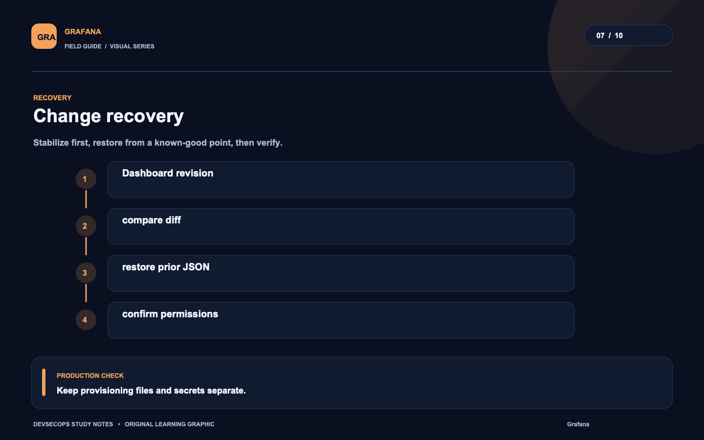
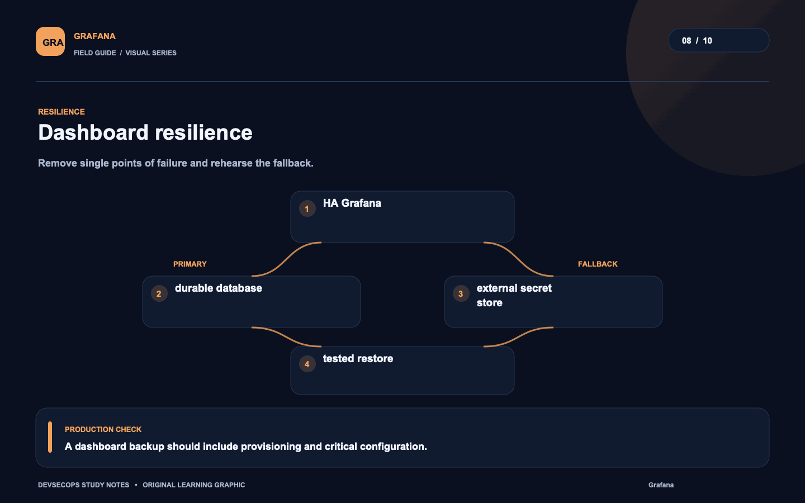
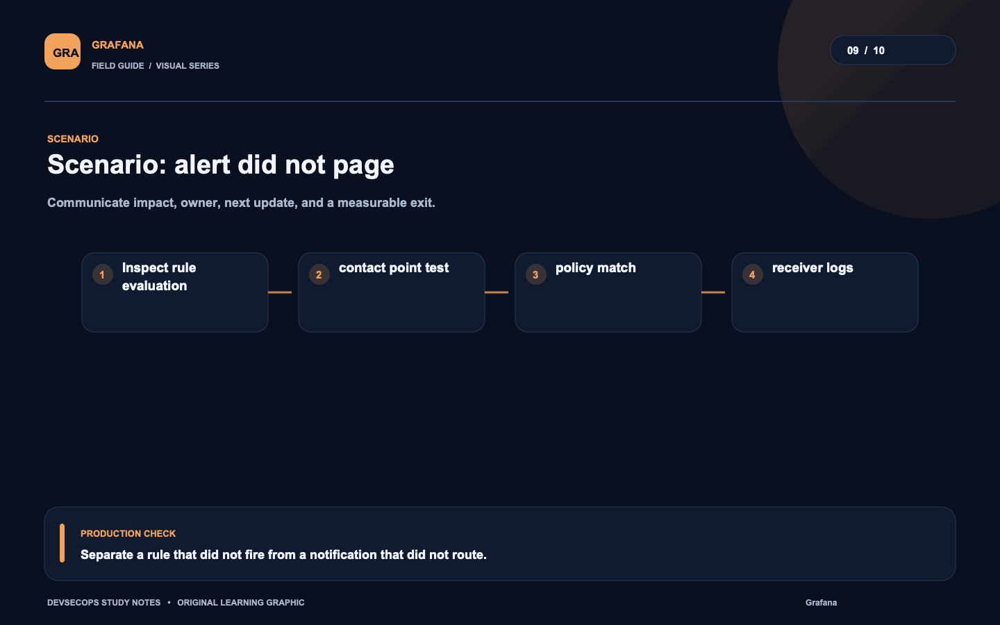
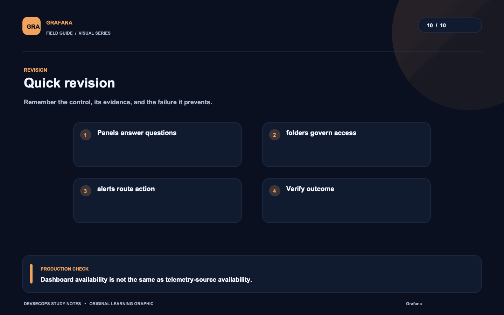

# Visual study cards

Ten original visuals for the [Grafana guide](../README.md). Open the SVG for a crisp, scalable version; use PNG for slides and quick viewing.

## 01. Dashboard path

[SVG source](01-dashboard-path.svg) · [PNG image](01-dashboard-path.png)

## 02. Dashboard lifecycle

[SVG source](02-dashboard-lifecycle.svg) · [PNG image](02-dashboard-lifecycle.png)

## 03. Access boundary

[SVG source](03-access-boundary.svg) · [PNG image](03-access-boundary.png)

## 04. Alert delivery

[SVG source](04-alert-delivery.svg) · [PNG image](04-alert-delivery.png)

## 05. Operational signal

[SVG source](05-operational-signal.svg) · [PNG image](05-operational-signal.png)

## 06. Panel diagnosis

[SVG source](06-panel-diagnosis.svg) · [PNG image](06-panel-diagnosis.png)

## 07. Change recovery

[SVG source](07-change-recovery.svg) · [PNG image](07-change-recovery.png)

## 08. Dashboard resilience

[SVG source](08-dashboard-resilience.svg) · [PNG image](08-dashboard-resilience.png)

## 09. Scenario: alert did not page

[SVG source](09-scenario-alert-did-not-page.svg) · [PNG image](09-scenario-alert-did-not-page.png)

## 10. Quick revision

[SVG source](10-quick-revision.svg) · [PNG image](10-quick-revision.png)
