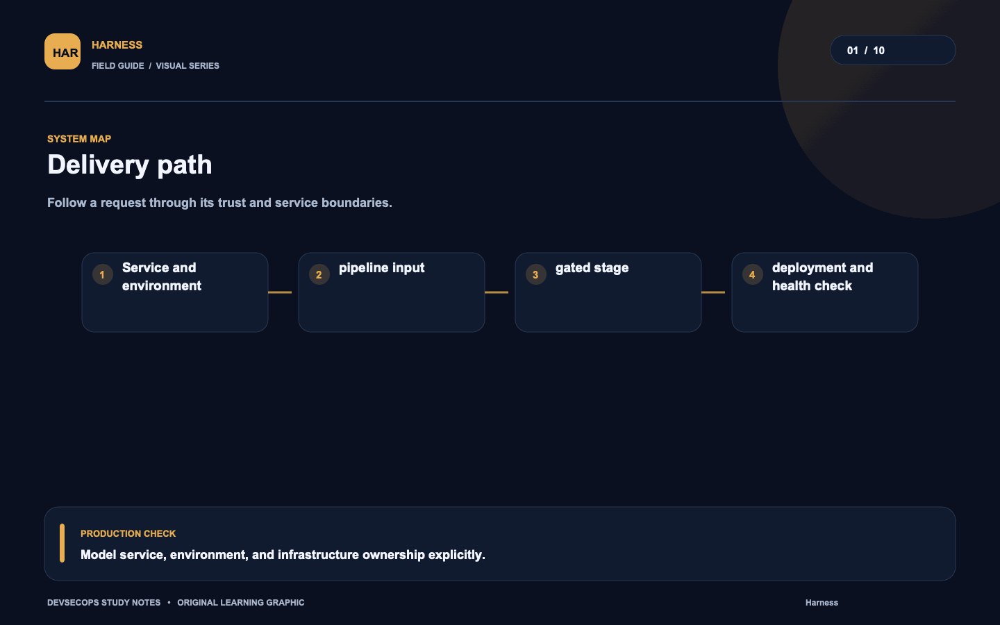
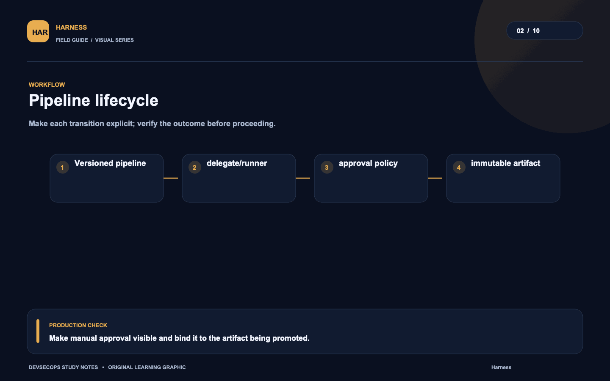
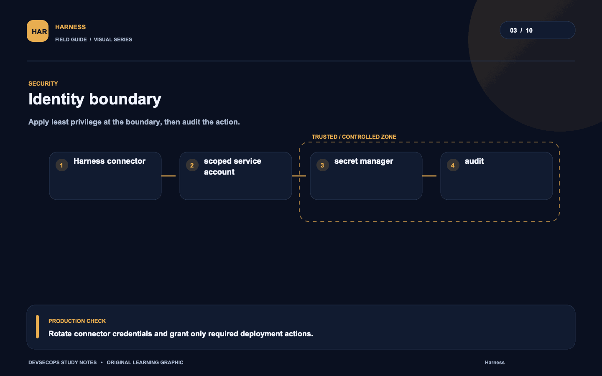
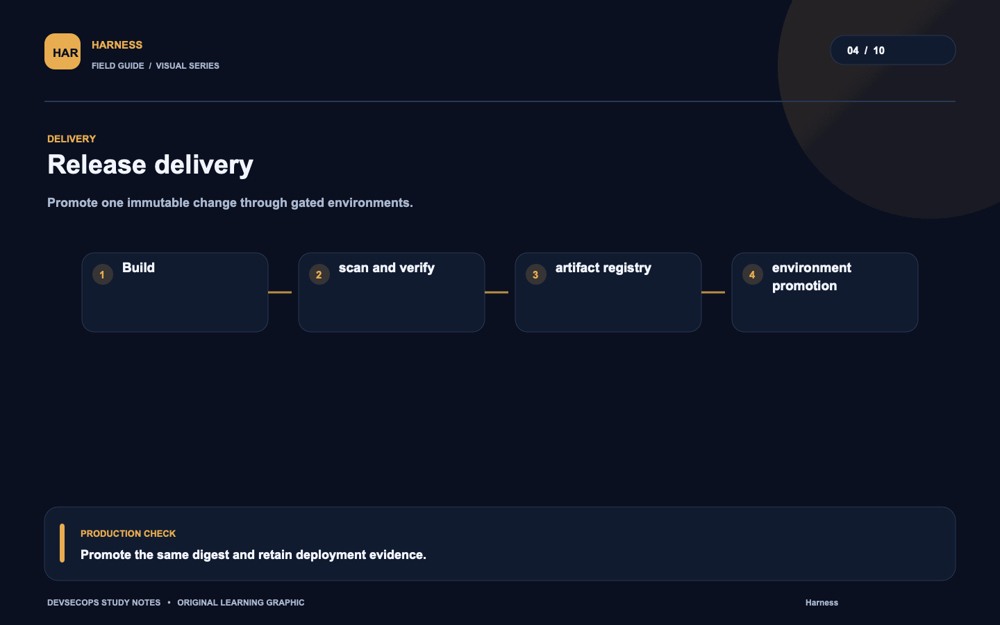
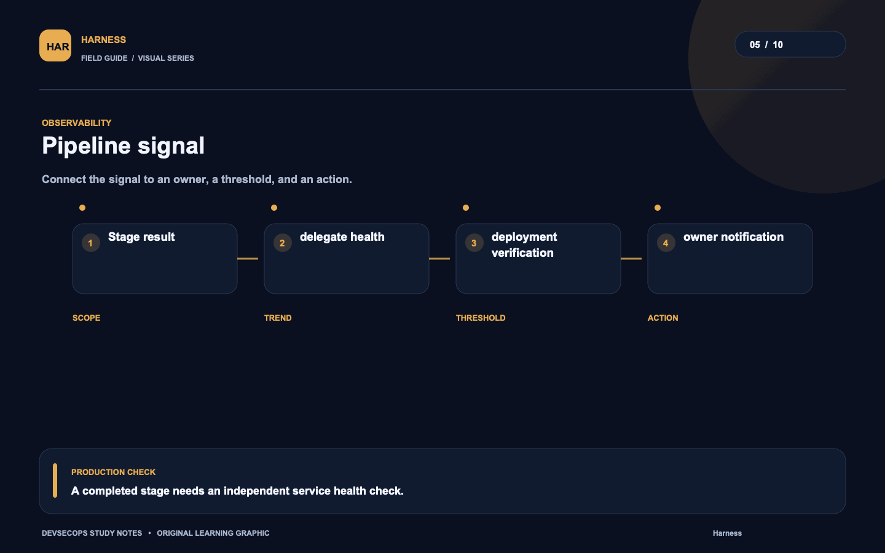
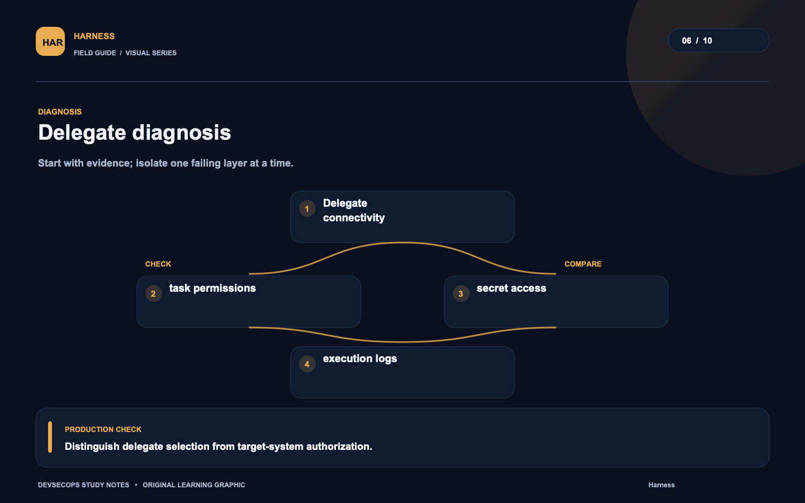
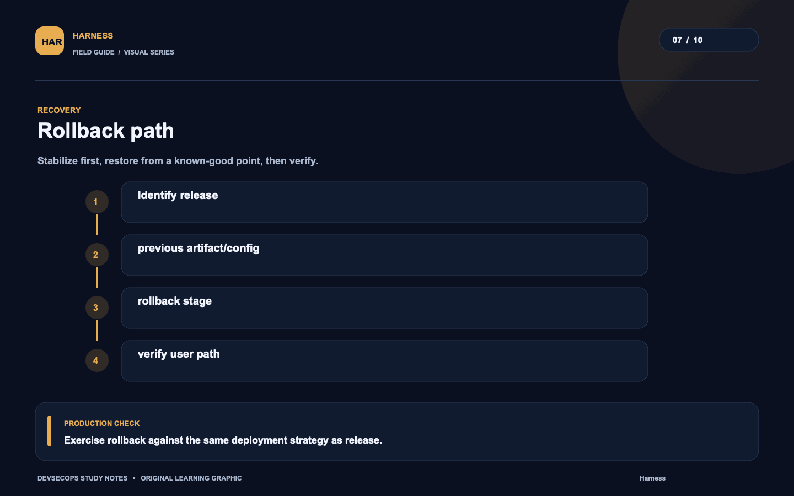
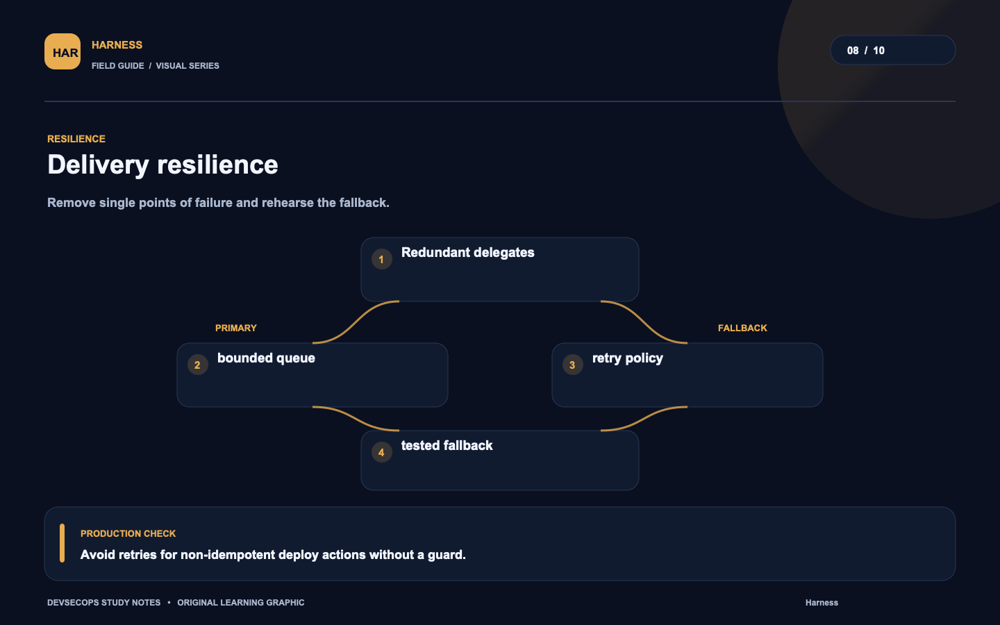
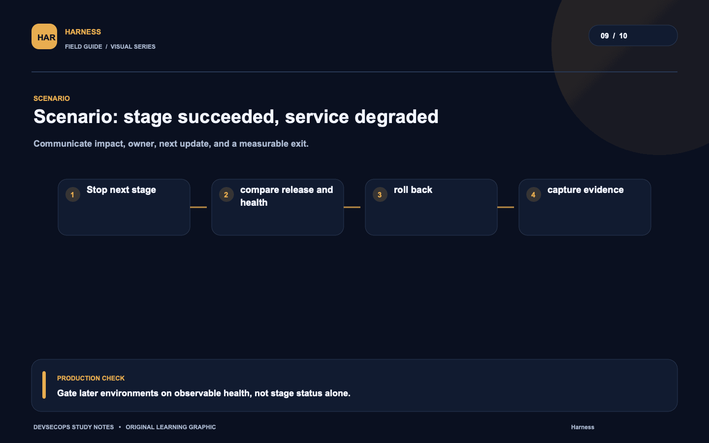
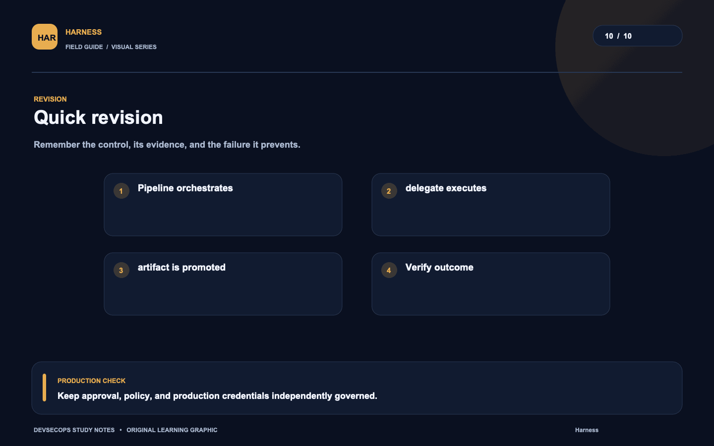

# Visual study cards

Ten original visuals for the [Harness guide](../README.md). Open the SVG for a crisp, scalable version; use PNG for slides and quick viewing.

## 01. Delivery path

[SVG source](01-delivery-path.svg) · [PNG image](01-delivery-path.png)

## 02. Pipeline lifecycle

[SVG source](02-pipeline-lifecycle.svg) · [PNG image](02-pipeline-lifecycle.png)

## 03. Identity boundary

[SVG source](03-identity-boundary.svg) · [PNG image](03-identity-boundary.png)

## 04. Release delivery

[SVG source](04-release-delivery.svg) · [PNG image](04-release-delivery.png)

## 05. Pipeline signal

[SVG source](05-pipeline-signal.svg) · [PNG image](05-pipeline-signal.png)

## 06. Delegate diagnosis

[SVG source](06-delegate-diagnosis.svg) · [PNG image](06-delegate-diagnosis.png)

## 07. Rollback path

[SVG source](07-rollback-path.svg) · [PNG image](07-rollback-path.png)

## 08. Delivery resilience

[SVG source](08-delivery-resilience.svg) · [PNG image](08-delivery-resilience.png)

## 09. Scenario: stage succeeded, service degraded

[SVG source](09-scenario-stage-succeeded-service-degraded.svg) · [PNG image](09-scenario-stage-succeeded-service-degraded.png)

## 10. Quick revision

[SVG source](10-quick-revision.svg) · [PNG image](10-quick-revision.png)
