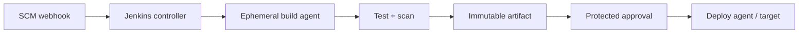

# Jenkins CI/CD

## Mental model

Jenkins is an extensible automation server. A controller coordinates jobs and stores configuration; agents execute workloads. A `Jenkinsfile` defines a Pipeline as code, making stages and steps reviewable and versionable. Plugins add capability but also increase maintenance and security responsibilities.

## Pipeline design

Use declarative pipelines with clear stages such as checkout, build, test, scan, package, and deploy. Keep reusable logic in shared libraries with review and versioning. Make builds reproducible, archive only needed artifacts, and promote one immutable artifact rather than rebuilding for each environment. Set timeouts, concurrency controls, and cleanup in `post` handling so failed or aborted jobs do not leak resources.

Separate untrusted pull-request builds from privileged release jobs. Do not expose credentials to arbitrary branch code. Use the credentials store with folder/job scope, short-lived tokens where possible, and masking as defense-in-depth—not as access control. Run agents with least privilege, isolate builds, patch controller/agents, and restrict script approvals and plugin installation.

## Operations

Back up controller configuration and build metadata according to recovery needs; test restoration. Monitor queue depth, executor utilization, build duration, agent connectivity, disk, and plugin health. Prefer ephemeral agents for isolation and clean workspaces between untrusted jobs. Pin/validate plugin upgrades in a test environment and remove unused plugins.

## Practice

Create a pipeline that tests a pull request, publishes a versioned artifact on a protected branch, and deploys only after approval. Demonstrate that a fork cannot read deployment credentials and that an interrupted build releases its resources.

## Further reading

[Jenkins documentation](https://www.jenkins.io/doc/)

## Topic roadmap and pipeline design

**Controller and agents:** controller stores configuration and schedules work; agents execute steps with their own OS/network/credentials. Labels route jobs but do not enforce isolation. Prefer ephemeral agents and distinct trust pools for untrusted PRs and protected releases.

**Pipeline topics:** declarative stages, scripted steps, shared libraries, credentials binding, artifacts/stashes, parallel stages, post actions, parameters, and approvals. Keep Jenkinsfiles under review; treat shared libraries and plugins as executable dependencies. Set timeouts and cleanup. Promote the same artifact across environments.

**Troubleshooting:** build queued—agent labels, executors, node offline state, and cloud capacity; checkout fails—credential scope, branch/ref, network and host keys; credential unavailable—folder/job scope and binding; controller unstable—disk, heap, plugin compatibility, queue, and thread/agent load.

**Revision:** controller orchestrates; agent executes; credential masking is not isolation; a trusted PR build differs from a fork; plugin count increases attack/upgrade surface; immutable artifacts make promotion and rollback auditable.

## Jenkinsfile example

See [`examples/Jenkinsfile`](examples/Jenkinsfile). It validates the notes repository with explicit timeouts and workspace cleanup; it does not pretend to build or deploy an application. Configure the controller to use isolated ephemeral agents. Add app-specific build, artifact allowlisting/scanning, and a separate protected deployment stage only after short-lived identity and environment approval are configured. The agent label must match your managed environment.

## End-to-end Jenkins process

See [`process.md`](process.md) for controller/agent setup, credential separation, pipeline creation, artifact promotion, production approval, recovery, and controller backup/upgrade operations.
