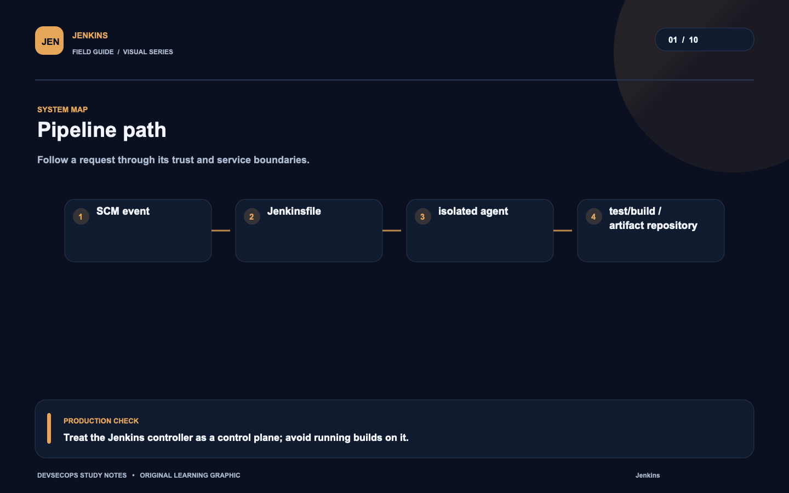
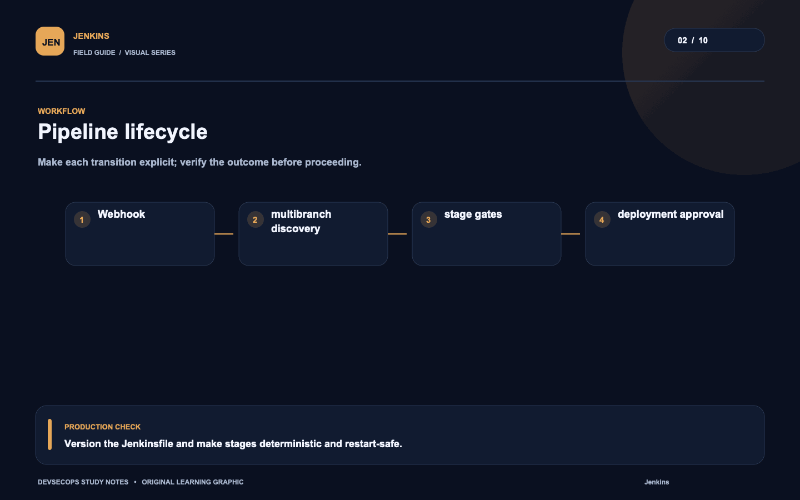
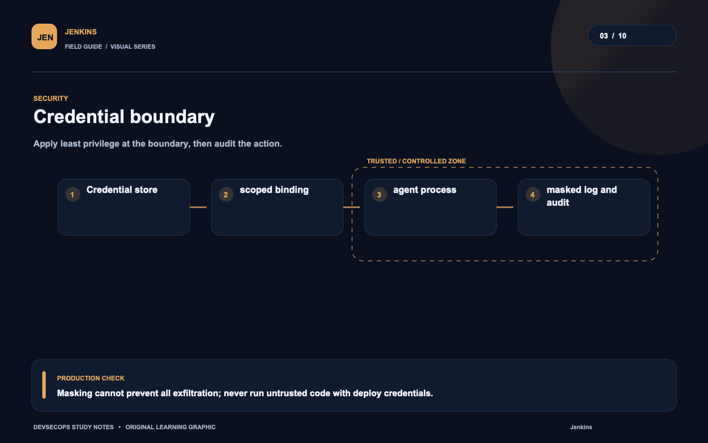
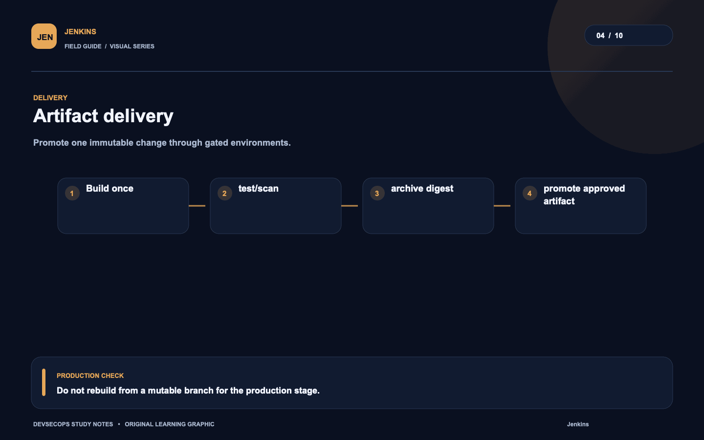
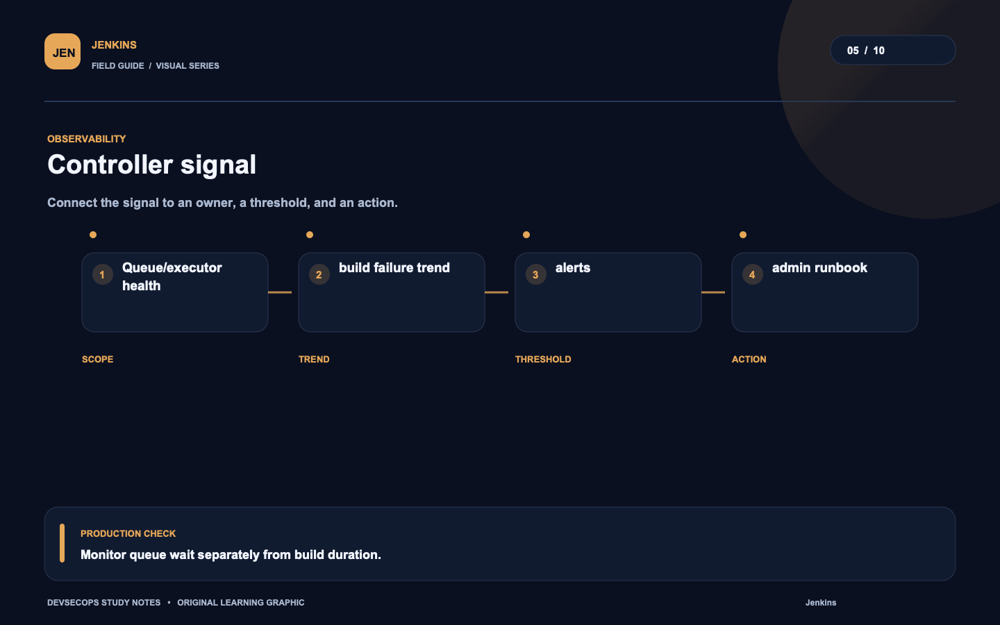
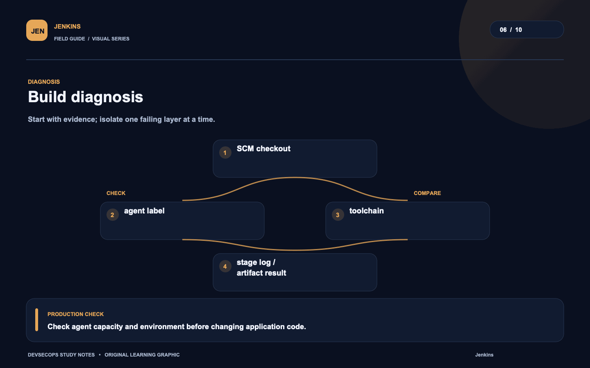
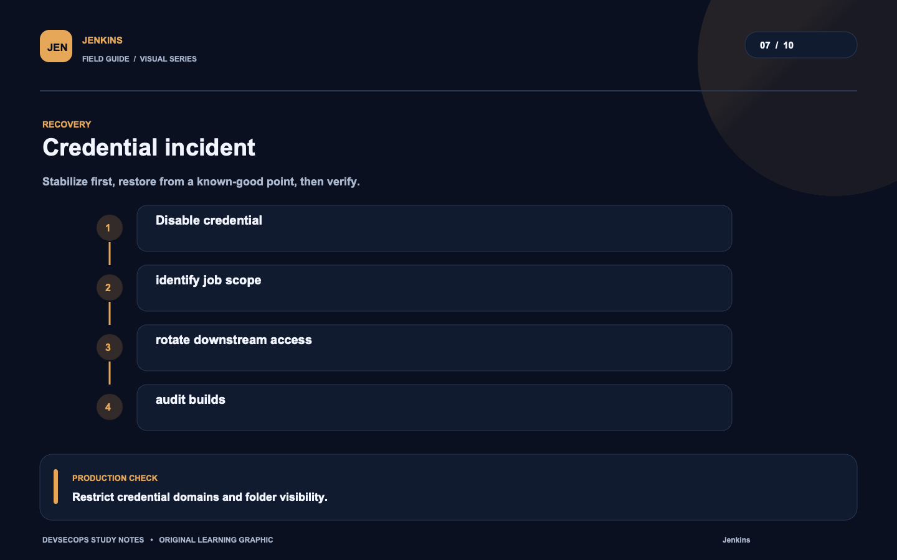
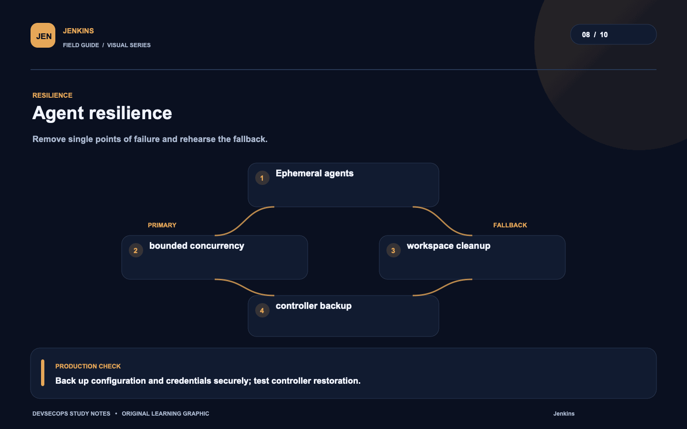
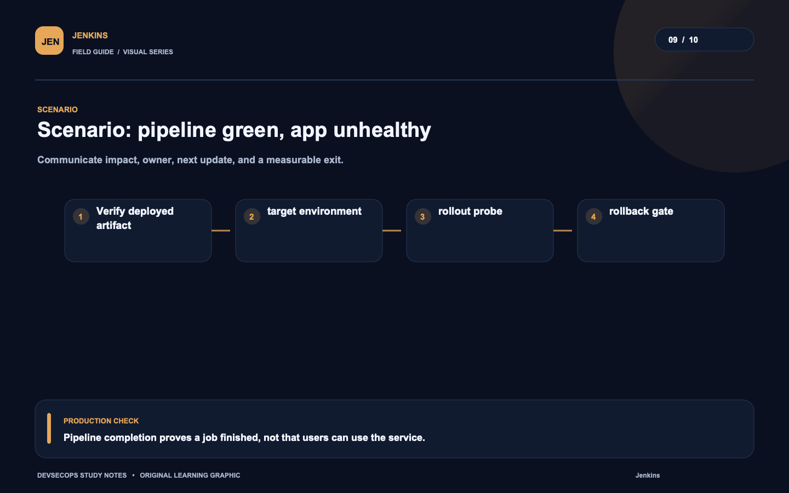
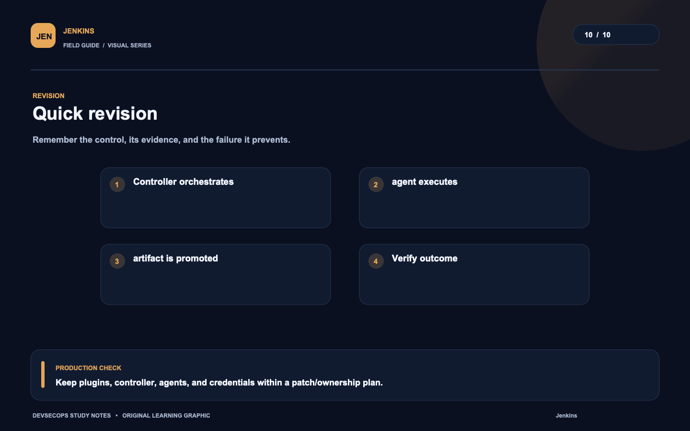

# Visual study cards

Ten original visuals for the [Jenkins guide](../README.md). Open the SVG for a crisp, scalable version; use PNG for slides and quick viewing.

## 01. Pipeline path

[SVG source](01-pipeline-path.svg) · [PNG image](01-pipeline-path.png)

## 02. Pipeline lifecycle

[SVG source](02-pipeline-lifecycle.svg) · [PNG image](02-pipeline-lifecycle.png)

## 03. Credential boundary

[SVG source](03-credential-boundary.svg) · [PNG image](03-credential-boundary.png)

## 04. Artifact delivery

[SVG source](04-artifact-delivery.svg) · [PNG image](04-artifact-delivery.png)

## 05. Controller signal

[SVG source](05-controller-signal.svg) · [PNG image](05-controller-signal.png)

## 06. Build diagnosis

[SVG source](06-build-diagnosis.svg) · [PNG image](06-build-diagnosis.png)

## 07. Credential incident

[SVG source](07-credential-incident.svg) · [PNG image](07-credential-incident.png)

## 08. Agent resilience

[SVG source](08-agent-resilience.svg) · [PNG image](08-agent-resilience.png)

## 09. Scenario: pipeline green, app unhealthy

[SVG source](09-scenario-pipeline-green-app-unhealthy.svg) · [PNG image](09-scenario-pipeline-green-app-unhealthy.png)

## 10. Quick revision

[SVG source](10-quick-revision.svg) · [PNG image](10-quick-revision.png)
