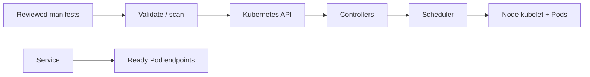

# Kubernetes

## Mental model

Kubernetes is a control plane that reconciles declared desired state. Controllers observe API objects and continually work toward the requested state. A Pod is the scheduling unit; Deployments manage replicated Pods, Services provide stable discovery, and Ingress/Gateway resources expose HTTP traffic through an implementation.

## Core objects and flow

Declare workloads with Deployments/StatefulSets/Jobs, configure probes and resource requests/limits, and inject configuration through ConfigMaps or Secrets. A Service selects Pods by labels. Namespaces organize resources but are not strong isolation alone. Storage is requested through PVCs and provisioned by storage classes. RBAC controls API actions; service accounts identify workloads.

Use declarative manifests and reviewed overlays/Helm/Kustomize. Understand `kubectl apply`, rollout status/history, events, logs, and `describe` output. Requests affect scheduling; limits constrain use. Liveness probes restart unhealthy containers, readiness gates traffic, and startup probes accommodate slow initialization—misconfigured probes can create outages.

## Security and reliability

Run as non-root, drop capabilities, use seccomp, read-only filesystems where feasible, and avoid privileged containers. Apply network policies with a tested CNI, least-privilege RBAC, admission controls, image provenance/scanning, and secret encryption/access controls. Set disruption budgets and topology spread for availability; still test backups, upgrades, and cluster recovery. Avoid deploying directly from a developer laptop to production.

## Practice

Deploy a small app with two replicas, probes, resource settings, internal Service, restrictive network policy, and a safe rolling update. Simulate a bad image and show how to identify and roll back the failed rollout.

## Further reading

[Kubernetes documentation](https://kubernetes.io/docs/) · [Security checklist](https://kubernetes.io/docs/concepts/security/)

## Topic roadmap and diagnostic flow

**Control plane:** API server validates requests; etcd stores cluster state; scheduler assigns unscheduled Pods; controllers reconcile desired state; kubelet runs workloads on nodes. Managed services operate some components, not application-level correctness.

**Workloads/network/storage:** Deployment/ReplicaSet for stateless replicas; StatefulSet for stable identity; DaemonSet per eligible node; Job/CronJob for finite tasks. Service selects endpoints; DNS supports discovery; Ingress/Gateway needs a controller. PVC binds storage. ConfigMaps are non-secret configuration; Secrets require RBAC and encryption/access protections.

**Example:** define two replicas, resource requests, readiness/startup probes, PodDisruptionBudget, topology spread, and a rolling update strategy. Use NetworkPolicy only after confirming the cluster CNI enforces it.

**Troubleshooting:** `Pending`—events, requests/quota, node selectors/taints and PVC; `CrashLoopBackOff`—previous logs, command/config/probe failures; Service has no endpoints—selector, Pod labels, readiness; `ImagePullBackOff`—image reference, registry auth, network; rollout stalls—events, readiness, capacity, and `kubectl rollout status/history`.

**Revision:** request schedules; limit caps; readiness gates traffic; liveness restarts; startup delays other probes; Service is stable discovery, not a process; namespace is organization, not sufficient isolation; reconcile manifests and avoid unmanaged production edits.

## Production manifest lab

See [`examples/secure-web/`](examples/secure-web/) for a Deployment, internal Service, PodDisruptionBudget, and default-deny NetworkPolicy, with run instructions and failure exercises. The sample assumes a specific port and health endpoint; adapt these to the application. NetworkPolicy enforcement depends on the cluster CNI, and a deny-all policy can break DNS/dependencies unless explicit rules are added.
