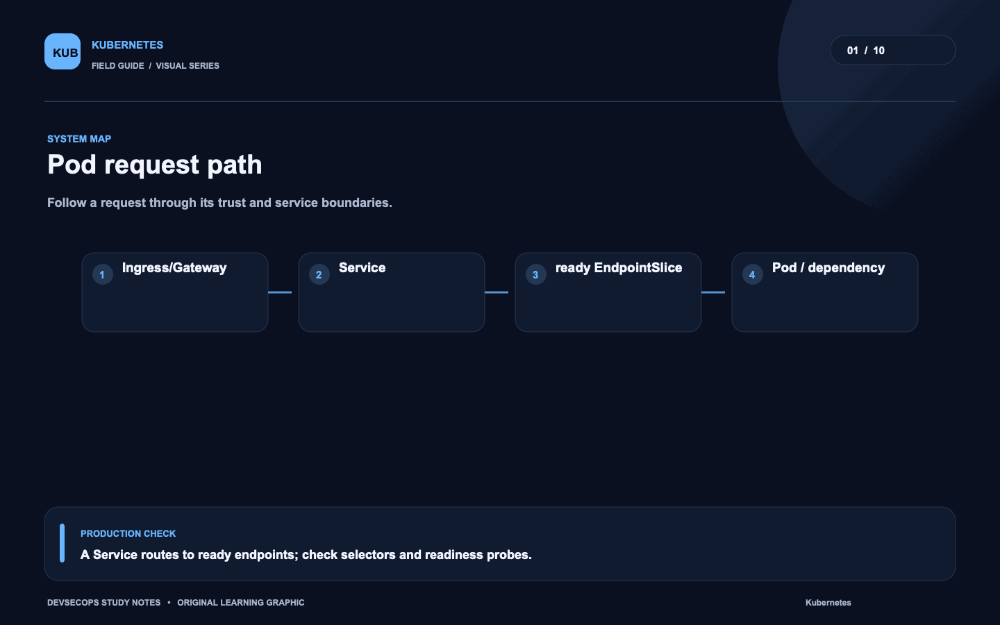
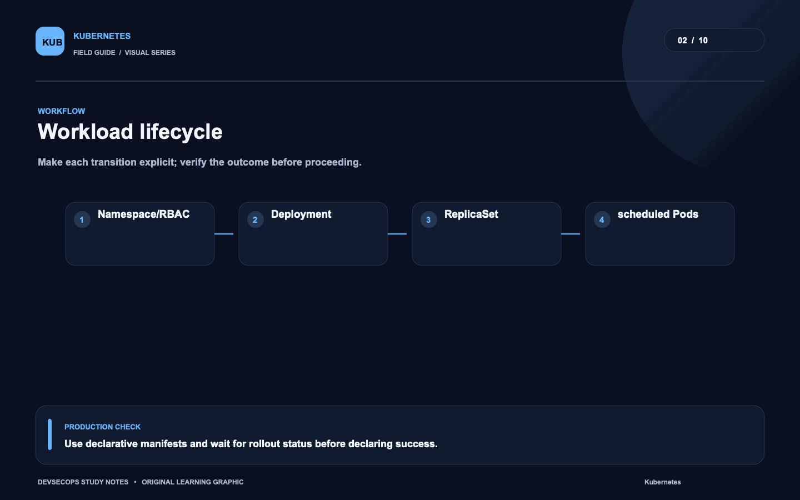
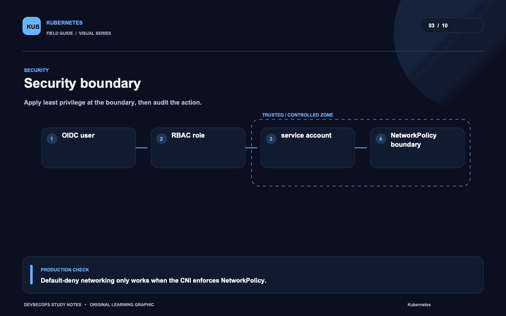
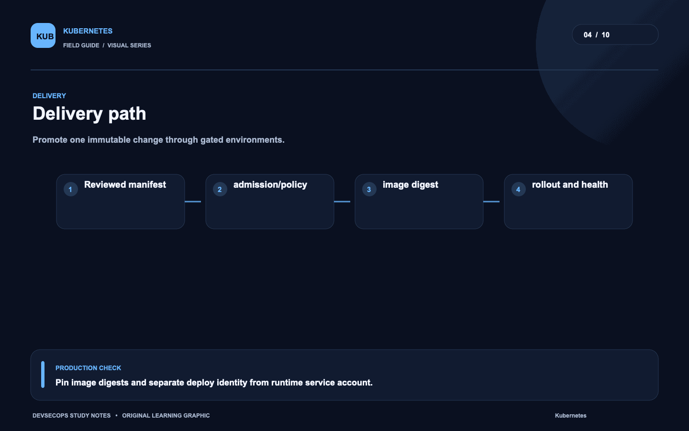
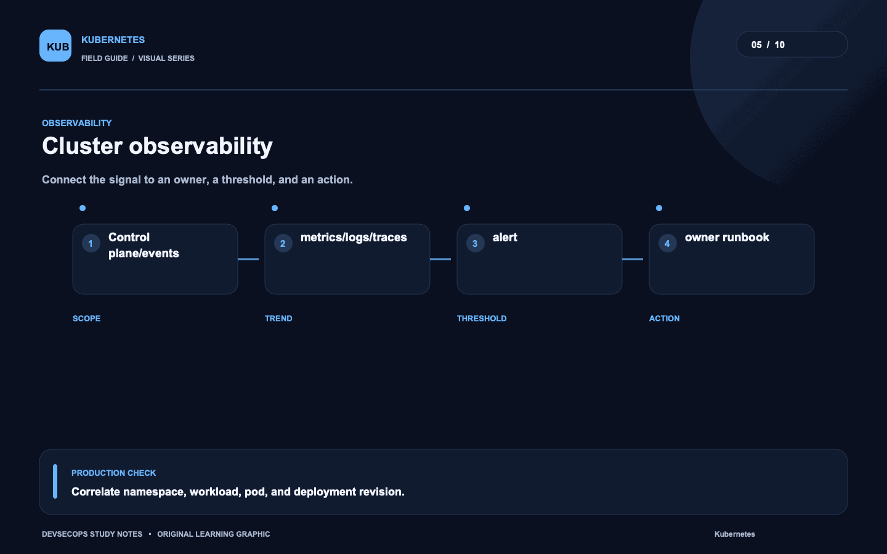
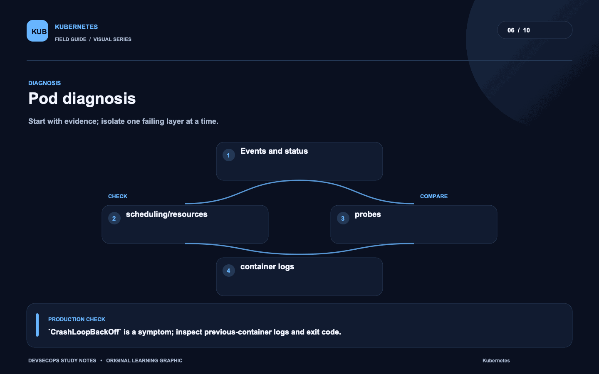
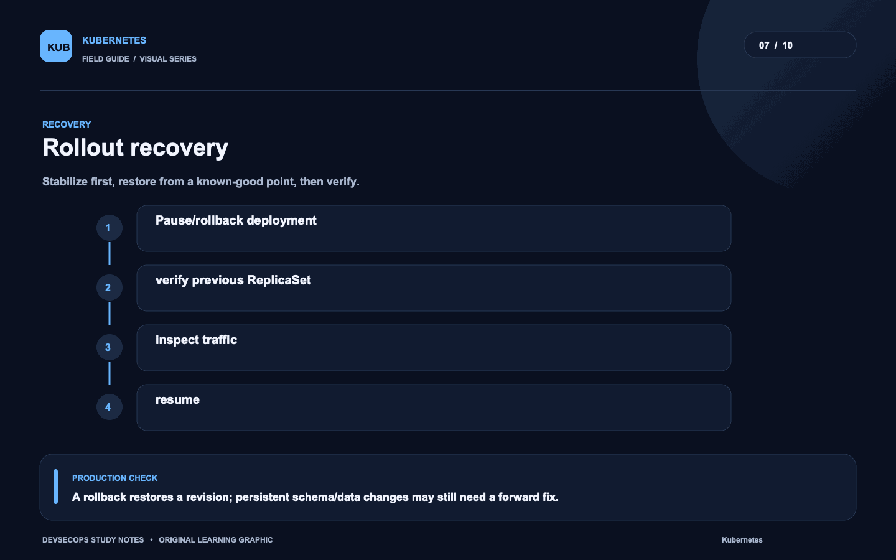
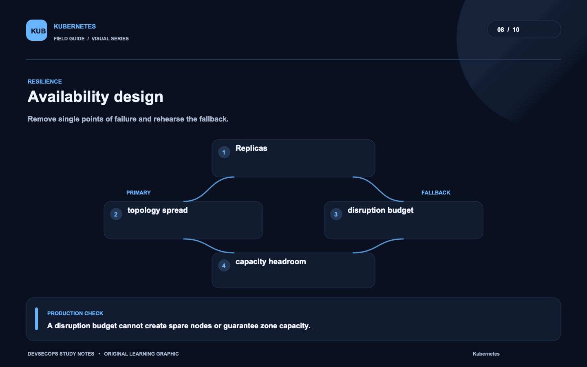
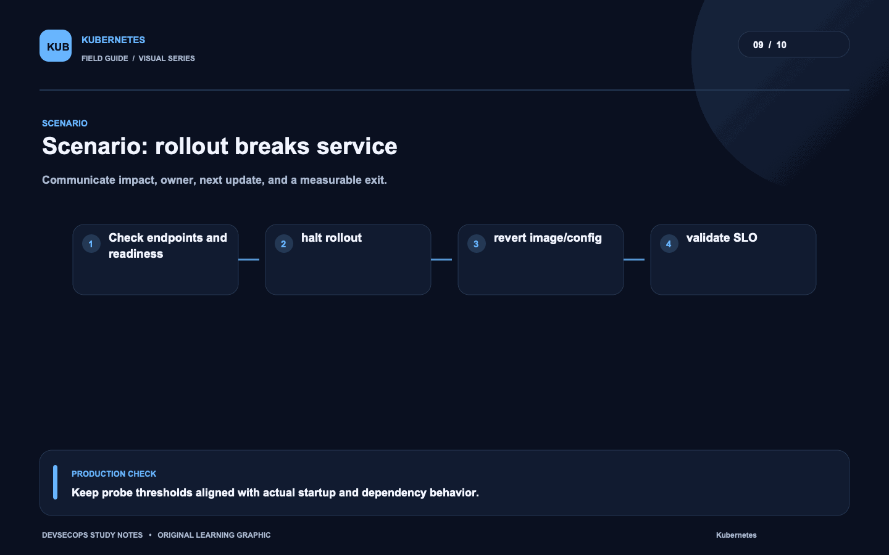
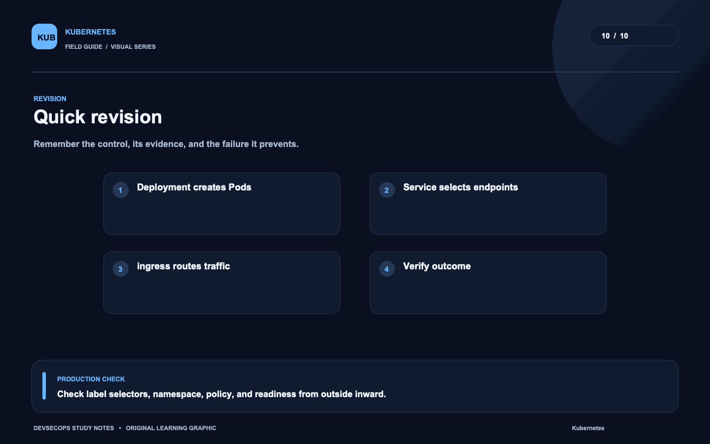

# Visual study cards

Ten original visuals for the [Kubernetes guide](../README.md). Open the SVG for a crisp, scalable version; use PNG for slides and quick viewing.

## 01. Pod request path

[SVG source](01-pod-request-path.svg) · [PNG image](01-pod-request-path.png)

## 02. Workload lifecycle

[SVG source](02-workload-lifecycle.svg) · [PNG image](02-workload-lifecycle.png)

## 03. Security boundary

[SVG source](03-security-boundary.svg) · [PNG image](03-security-boundary.png)

## 04. Delivery path

[SVG source](04-delivery-path.svg) · [PNG image](04-delivery-path.png)

## 05. Cluster observability

[SVG source](05-cluster-observability.svg) · [PNG image](05-cluster-observability.png)

## 06. Pod diagnosis

[SVG source](06-pod-diagnosis.svg) · [PNG image](06-pod-diagnosis.png)

## 07. Rollout recovery

[SVG source](07-rollout-recovery.svg) · [PNG image](07-rollout-recovery.png)

## 08. Availability design

[SVG source](08-availability-design.svg) · [PNG image](08-availability-design.png)

## 09. Scenario: rollout breaks service

[SVG source](09-scenario-rollout-breaks-service.svg) · [PNG image](09-scenario-rollout-breaks-service.png)

## 10. Quick revision

[SVG source](10-quick-revision.svg) · [PNG image](10-quick-revision.png)
