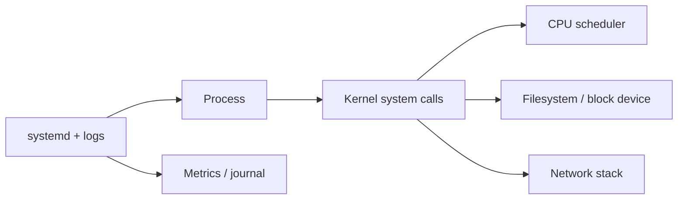

# Linux for DevOps engineers

## Mental model

Linux exposes processes and devices through a filesystem interface. Users/groups and permissions govern access; processes have IDs, environments, file descriptors, and resource limits. The kernel schedules work and mediates system calls. Containers use kernel isolation and resource controls rather than a separate kernel.

## Everyday diagnosis

- **Processes:** `ps`, `top`/`htop`, `pgrep`, `kill`; inspect signals and parent-child relationships before terminating.
- **Filesystems:** `df -h` checks free space by filesystem; `du -sh` estimates directory use; `find` searches by attributes. Check inode exhaustion as well as bytes.
- **Memory/CPU:** `free`, `vmstat`, `uptime`, and `/proc` help distinguish pressure, saturation, and load.
- **Networking:** `ip addr`, `ip route`, `ss -tulpn`, `dig`, and `curl -v` isolate DNS, route, listener, and application layers.
- **Logs/services:** `systemctl status` and `journalctl` inspect systemd units and logs. Confirm time range and service identity.

Use `sudo` narrowly; understand the effect of permissions, ownership, and umask before changing them recursively. SSH keys should be private, restricted, and rotated if exposed. Patch through the host's supported package manager and keep recovery access available.

## Troubleshooting sequence

Define the symptom and time window, compare a healthy host, inspect recent changes, then test from nearest layer outward: process, local listener, host firewall, network route, DNS, remote dependency. Capture evidence before restarting. Verify recovery and add a signal/alert to prevent repeat incidents.

## Practice

Diagnose a service that cannot bind to its port, one blocked by file permissions, and one with a full filesystem. Explain the evidence and choose the narrowest safe corrective action.

## Further reading

[Linux man-pages](https://man7.org/linux/man-pages/) · [systemd documentation](https://www.freedesktop.org/wiki/Software/systemd/)

## Topic roadmap and incident example

**Boot and services:** systemd units describe services, sockets, timers, and dependencies. `systemctl status` gives current state; `journalctl -u NAME --since ...` narrows logs. A service can be active while its endpoint is unhealthy—check process, listener, and application response separately.

**Processes and resources:** signals request actions (`TERM` graceful, `KILL` forceful); inspect process tree and open files before terminating. Load average is not CPU percent. Check memory pressure, I/O wait, cgroup limits, and disk/inode exhaustion. Permissions combine owner/group/mode, ACLs, capabilities, and mandatory controls.

**Network and storage:** resolve DNS, inspect routes and listeners, then test connectivity at each hop. Filesystems, mounts, inode availability, quotas, and permissions all affect writes. Use `ss`, `ip`, `dig`, `curl`, `df`, `du`, `find`, `lsof`, and logs based on the layer under test.

**Scenario:** disk alert. Identify the full filesystem with `df -h`; inspect inodes with `df -i`; find growth with targeted `du`/`find`; inspect deleted-but-open files; verify log rotation and retention. Do not blindly delete active data or reboot without capturing evidence.

**Troubleshooting:** connection refused usually means no listener or active rejection; timeout suggests path/filter/drop or unresponsive target; DNS failure precedes TCP; permission denied requires checking user, path traversal permissions, mount flags, ACLs, and SELinux/AppArmor.

**Revision:** process != service; load != CPU; free disk != free inodes; DNS, routing, firewall, listener, TLS, and app response are separate layers; collect evidence before restarting.

## End-to-end host administration process

Follow [`process.md`](process.md) for a repeatable host onboarding, service deployment, health verification, incident diagnosis, and decommission procedure.

## Visual study cards

Browse the [10 original visual study cards](visuals/README.md) as SVG or PNG, covering architecture, workflow, security, delivery, observability, troubleshooting, recovery, resilience, scenarios, and revision.
