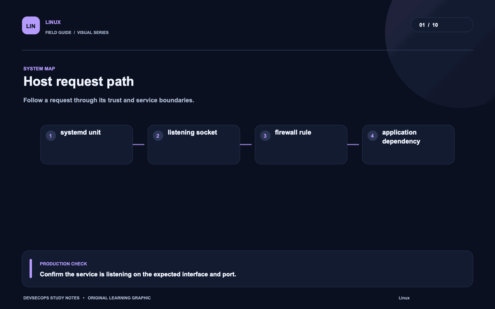
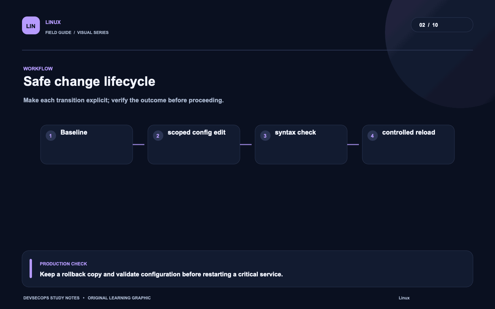
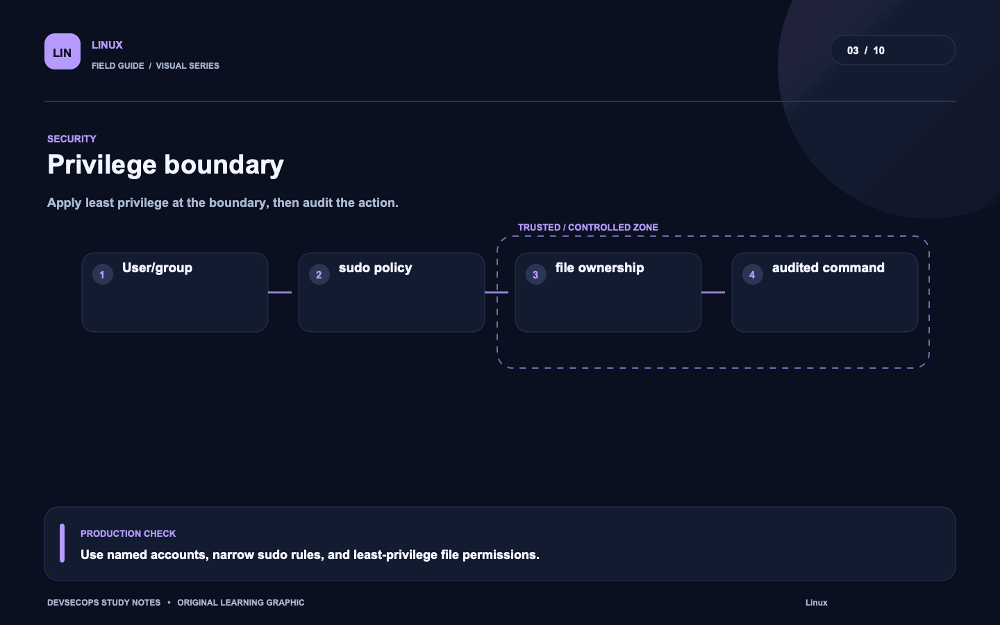
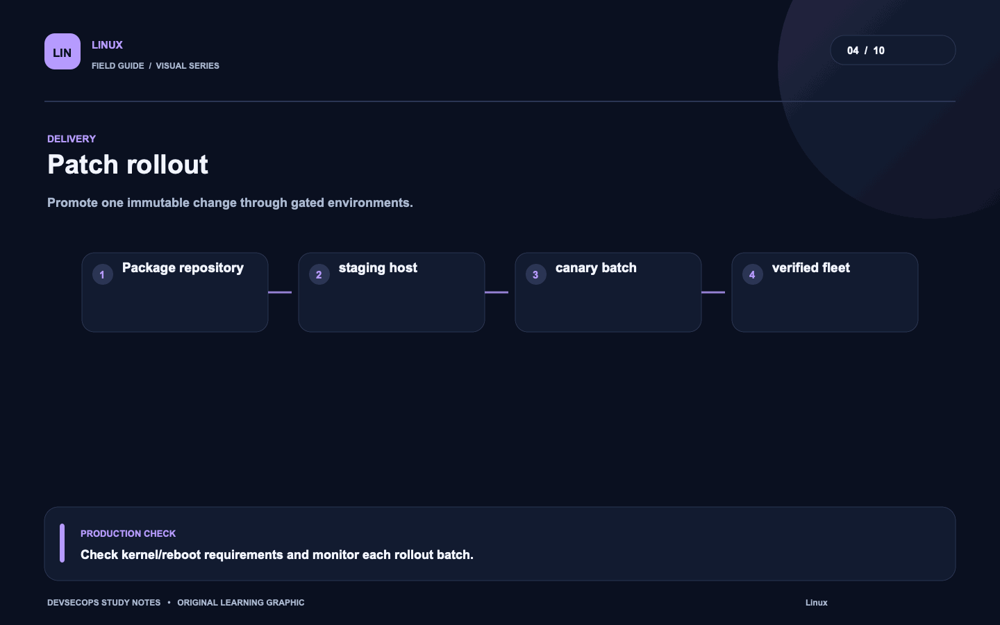
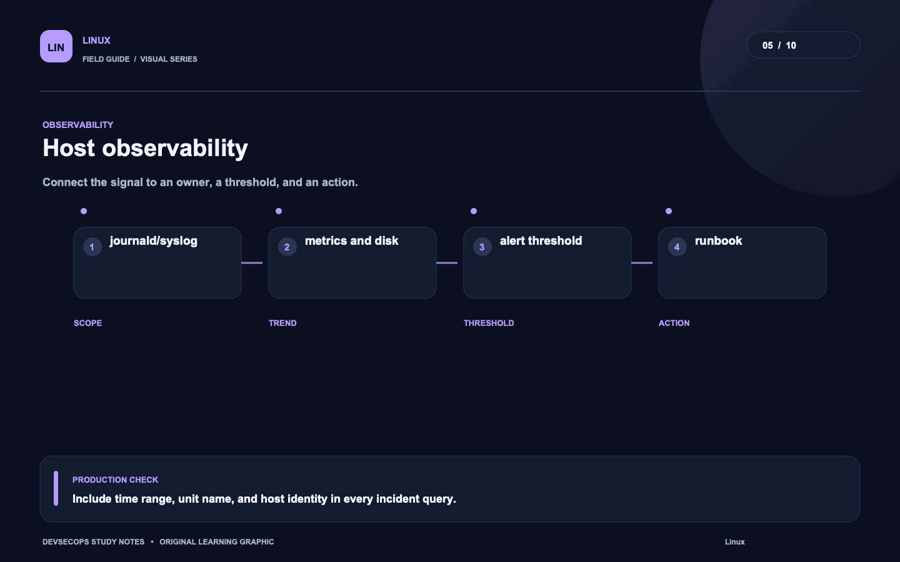
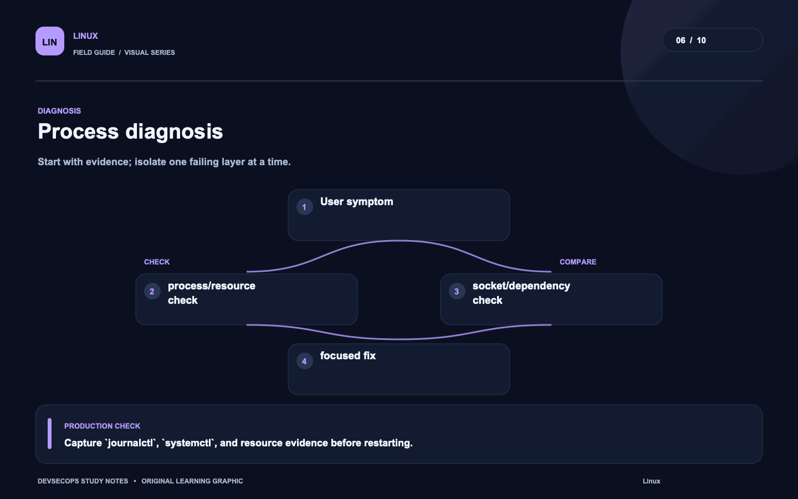
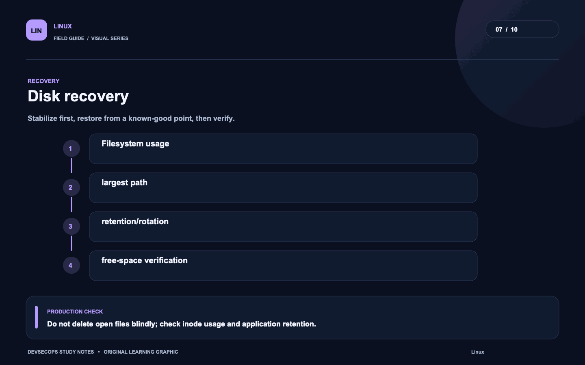
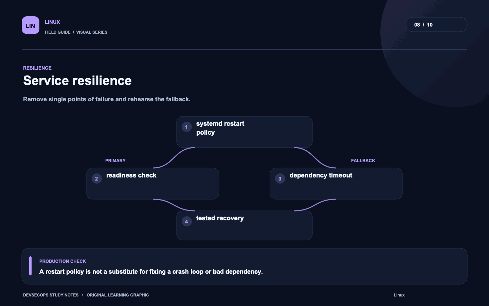
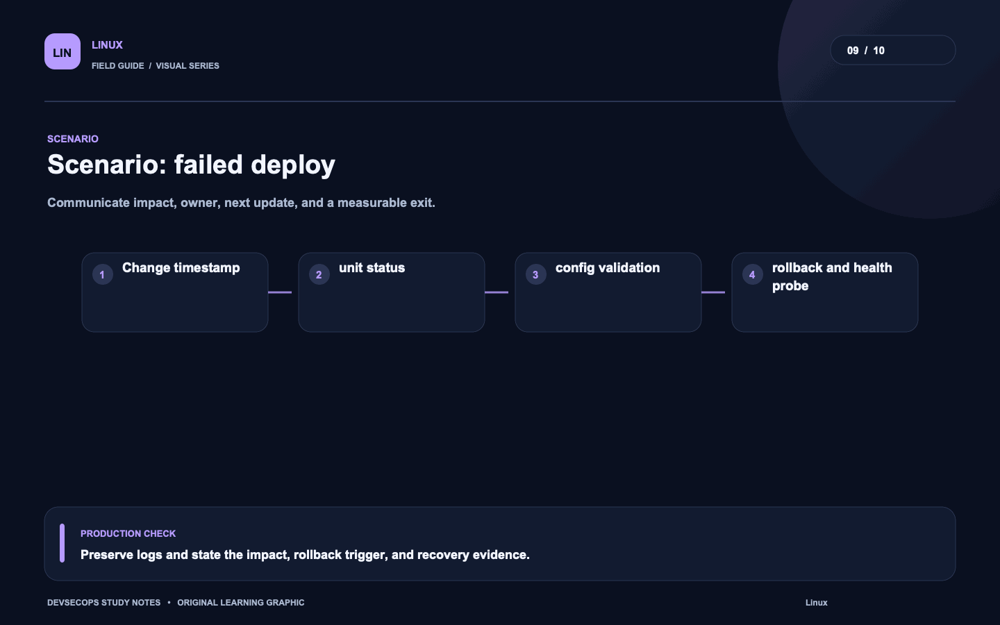
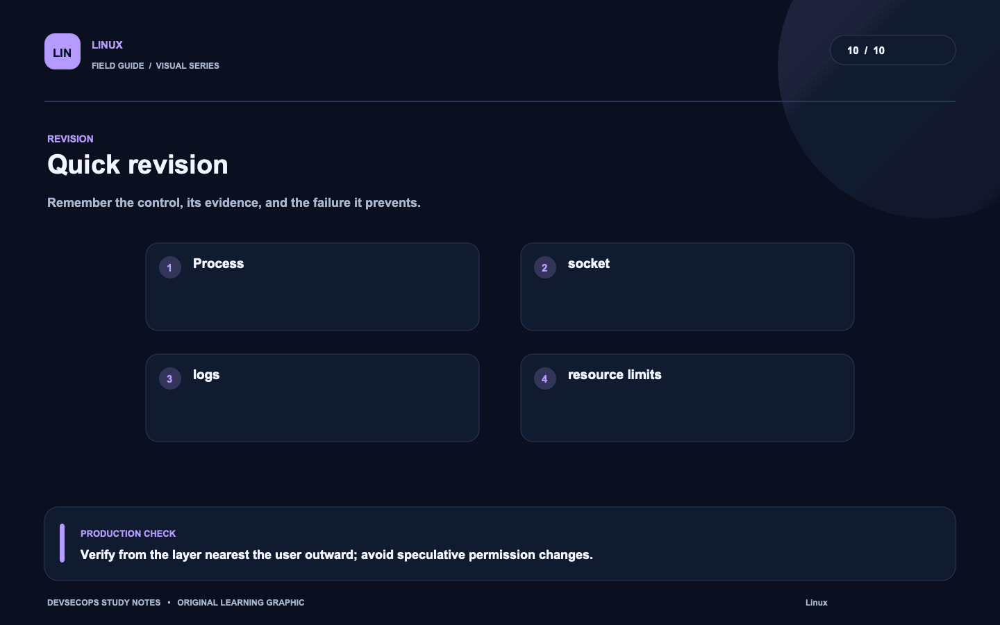

# Visual study cards

Ten original visuals for the [Linux guide](../README.md). Open the SVG for a crisp, scalable version; use PNG for slides and quick viewing.

## 01. Host request path

[SVG source](01-host-request-path.svg) · [PNG image](01-host-request-path.png)

## 02. Safe change lifecycle

[SVG source](02-safe-change-lifecycle.svg) · [PNG image](02-safe-change-lifecycle.png)

## 03. Privilege boundary

[SVG source](03-privilege-boundary.svg) · [PNG image](03-privilege-boundary.png)

## 04. Patch rollout

[SVG source](04-patch-rollout.svg) · [PNG image](04-patch-rollout.png)

## 05. Host observability

[SVG source](05-host-observability.svg) · [PNG image](05-host-observability.png)

## 06. Process diagnosis

[SVG source](06-process-diagnosis.svg) · [PNG image](06-process-diagnosis.png)

## 07. Disk recovery

[SVG source](07-disk-recovery.svg) · [PNG image](07-disk-recovery.png)

## 08. Service resilience

[SVG source](08-service-resilience.svg) · [PNG image](08-service-resilience.png)

## 09. Scenario: failed deploy

[SVG source](09-scenario-failed-deploy.svg) · [PNG image](09-scenario-failed-deploy.png)

## 10. Quick revision

[SVG source](10-quick-revision.svg) · [PNG image](10-quick-revision.png)
