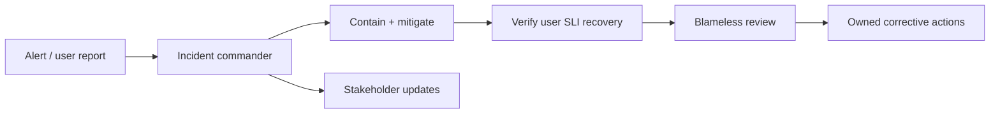

# Managerial and SRE interviews

## SRE foundations

Reliability is a user-visible property. Define SLIs (measures), SLOs (targets over a window), and—where useful—SLAs (external commitments). An error budget represents tolerated unreliability; use it to make explicit decisions about release risk and reliability work. Avoid treating 100% availability as a default target because it is costly and often unnecessary.

Discuss incident response as a system: detection, severity, clear incident command, communication, mitigation, recovery, and a blameless learning review. Prioritize safe mitigation before root-cause certainty. Follow-ups should have owners and measurable outcomes. Capacity planning, automation, toil reduction, change management, and disaster recovery are ongoing responsibilities.

## Managerial scenarios

For prioritization, state impact, urgency, dependencies, risk, and what will be deferred. For conflict, surface goals and evidence, listen, decide transparently, and revisit outcomes. For performance or team health, use timely specific feedback, clear expectations, support, and follow-through. Explain how you balance delivery, reliability, security, and people sustainability.

## Scenario response pattern

Clarify impact and scope; identify immediate safety/containment actions; assign roles and communication; use telemetry to form hypotheses; make reversible changes first; verify recovery against user-facing indicators; then review contributing factors and prevention.

## Practice

Respond to a regional dependency outage during a release. Explain whether to halt the rollout, how to protect users, what data informs the decision, who communicates, and how to restore service. Then define the post-incident actions and how success will be measured.

## Further reading

[Google SRE books](https://sre.google/books/) · [Incident management guide](https://sre.google/workbook/incident-response/)

## Topic roadmap and scenario diagram

**Reliability topics:** SLIs/SLOs/error budgets, availability math, latency percentiles, capacity and load shedding, toil, on-call, incident command, postmortems, change risk, dependency failure, backup/restore, and disaster recovery. State measurement windows and user impact; averages can hide tail latency.

**Managerial topics:** prioritization under constraints, team health, feedback, conflict, delegation, hiring/onboarding, career growth, cross-team influence, delivery forecasting, and balancing reliability/security with feature work. Explain decision criteria, communication, trade-offs, and follow-up—not just the outcome.

**Scenario—rising error rate during release:** declare scope and severity; appoint incident roles; pause/roll back if change correlation and risk justify it; protect data and preserve evidence; communicate cadence; verify recovery using the user-facing SLI; then conduct a blameless contributing-factor review with tracked actions.

**Troubleshooting an interview answer:** if the prompt is underspecified, ask about user impact and constraints; if many actions compete, state severity and risk criteria; if recovery is uncertain, prefer reversible containment and define a verification signal; if an SLO is proposed without measurement, identify the SLI and window first.

**Revision:** SLI measures; SLO target; SLA commitment; error budget informs risk; alert on actionable symptoms; postmortem blameless does not mean no accountability; every action has an owner, due date, and measurable verification.

## Repeatable SRE/managerial scenario process

See [`process.md`](process.md) for clarifying impact, forming an incident response, choosing reversible mitigation, communicating, validating recovery, and conducting a blameless review.
